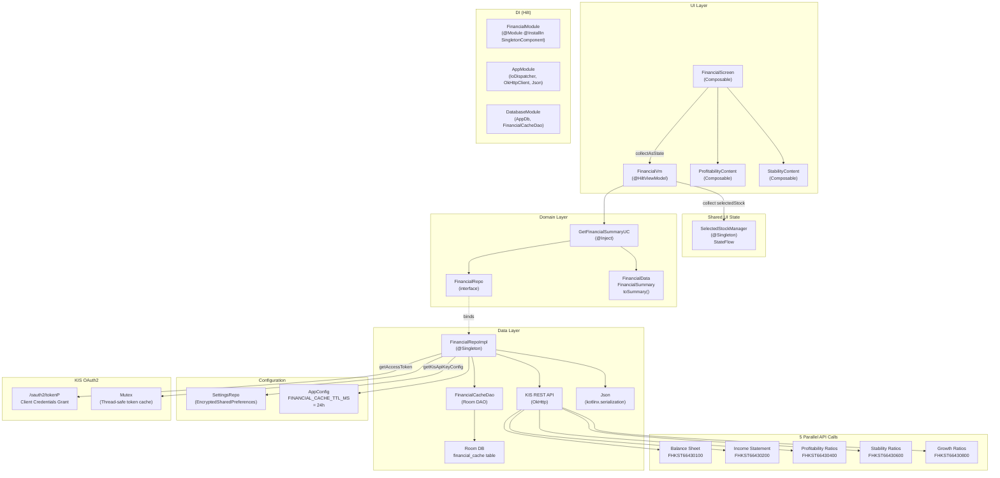
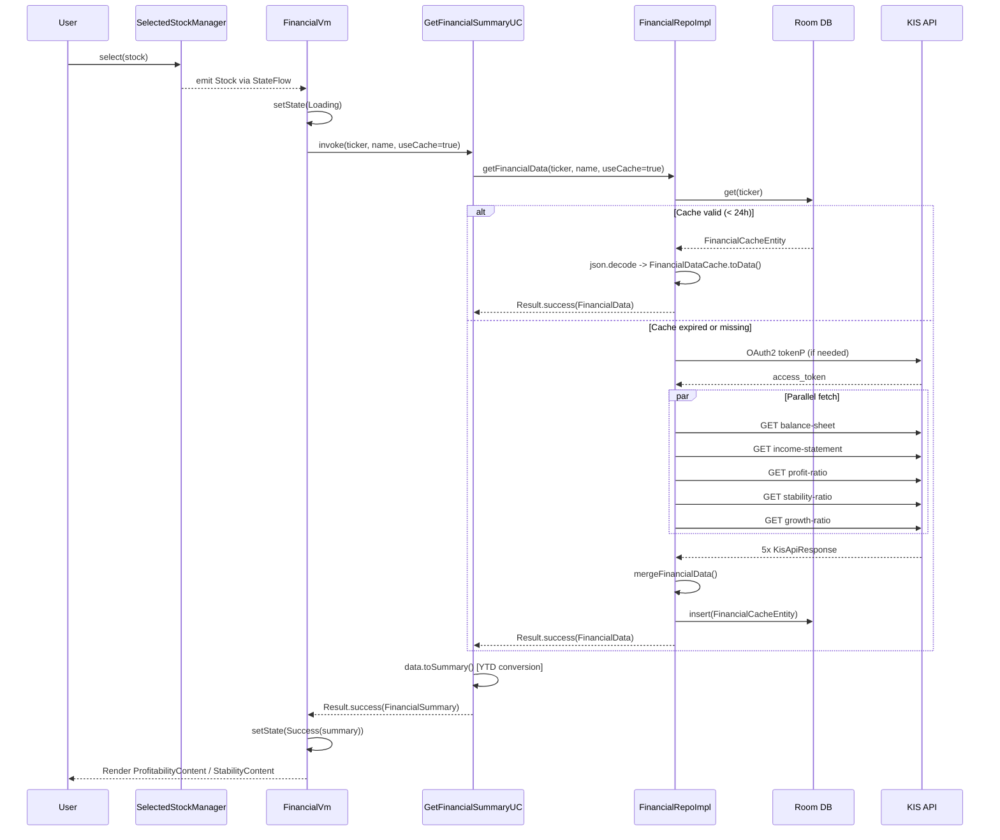

# MIGRATION SPEC: Financial Information Feature (재무정보)

**Document Version**: 1.0.0
**Date**: 2026-02-19
**Source Project**: StockApp — Korean Stock Analysis Android Application
**Target Audience**: Development team with no access to the original project
**Feature Scope**: Financial Information screen (Phase 7) — KIS API integration, balance sheet, income statement, profitability/stability ratios

---

## Table of Contents

1. [Feature Overview](#1-feature-overview)
2. [Architecture Diagram](#2-architecture-diagram)
3. [Complete File Manifest](#3-complete-file-manifest)
4. [Data Models](#4-data-models)
5. [API Contracts](#5-api-contracts)
6. [Business Logic](#6-business-logic)
7. [Dependencies](#7-dependencies)
8. [Dependency Injection Configuration](#8-dependency-injection-configuration)
9. [UI Components](#9-ui-components)
10. [Resources and Strings](#10-resources-and-strings)
11. [Migration Checklist](#11-migration-checklist)
12. [Edge Cases and Error Handling](#12-edge-cases-and-error-handling)

---

## 1. Feature Overview

### 1.1 Purpose

The Financial Information feature (재무정보) fetches, caches, and displays Korean stock financial statements and ratio data for individual stocks. It presents two distinct analysis dimensions:

- **Profitability (수익성)**: Income statement trends (revenue, operating profit, net income) plus growth rate charts
- **Stability (안정성)**: Balance sheet-derived ratios (debt ratio, current ratio, borrowing dependency) with color-coded evaluations

Data is sourced exclusively from the **KIS (Korea Investment and Securities) REST API**, which requires OAuth2 authentication. All data is cached locally via Room for 24 hours.

### 1.2 User Flow

```
Bottom Navigation "종목 분석" (Stock Analysis)
  └─ StockAnalysisScreen (HorizontalPager, 4 tabs)
       └─ Tab index 3: "재무정보" (Financial Info)
            └─ FinancialScreen
                 ├─ Sub-tab 0: 수익성 (Profitability)
                 │    └─ ProfitabilityContent
                 └─ Sub-tab 1: 안정성 (Stability)
                      └─ StabilityContent
```

The user first selects a stock in the Search tab (Tab 0). The selected stock propagates via `SelectedStockManager` (a Hilt Singleton) to `FinancialVm`, which automatically triggers data loading when the tab becomes active.

### 1.3 Entry Point and Deep Link

- **Navigation entry**: `Screen.StockAnalysis` in `nav/Nav.kt`, with `initialTab = 3` parameter to open directly on the financial tab
- **Deep link**: `stockapp://stock/{ticker}/financial`
  - The NavGraph intercepts this deep link, calls `SelectedStockManager.selectTicker(ticker)`, and navigates to `StockAnalysisScreen(initialTab = 3)`

### 1.4 Feature State Machine

The feature has five mutually exclusive states rendered by `FinancialScreen`:

| State | Trigger | Rendered Content |
|---|---|---|
| `NoStock` | No stock selected in `SelectedStockManager` | Placeholder text instructing user to search |
| `Loading` | Data fetch in progress | `CircularProgressIndicator` + Korean loading text |
| `NoApiKey` | KIS API keys not configured or invalid | Message directing user to settings screen |
| `Success` | Data fetched and non-empty | Two-tab layout with charts |
| `Error` | Fetch failed or empty response | `ErrorCard` with retry button |

### 1.5 Data Source

All financial data comes from **five separate KIS REST API endpoints** called in parallel:

| API | Korean Name | Transaction ID |
|---|---|---|
| Balance Sheet | 대차대조표 | `FHKST66430100` |
| Income Statement | 손익계산서 | `FHKST66430200` |
| Profitability Ratios | 수익성비율 | `FHKST66430400` |
| Stability Ratios | 안정성비율 | `FHKST66430600` |
| Growth Ratios | 성장성비율 | `FHKST66430800` |

KIS API requires an OAuth2 `client_credentials` token obtained from the `/oauth2/tokenP` endpoint. The token is cached in-memory for 23 hours with mutex-protected refresh logic.

---

## 2. Architecture Diagram



### 2.1 Data Flow Sequence



---

## 3. Complete File Manifest

### 3.1 Feature-Owned Files

All paths relative to `app/src/main/java/com/stockapp/`.

| File Path | Layer | Role |
|---|---|---|
| `feature/financial/ui/FinancialScreen.kt` | UI | Root screen composable: Scaffold, TopAppBar, state dispatch, tab selector, pull-to-refresh |
| `feature/financial/ui/FinancialVm.kt` | UI | HiltViewModel: state management, stock observation via SelectedStockManager, refresh/retry triggers |
| `feature/financial/ui/ProfitabilityContent.kt` | UI | Profitability sub-tab: income bar chart, growth line charts, asset growth line chart |
| `feature/financial/ui/StabilityContent.kt` | UI | Stability sub-tab: combined ratio chart, individual ratio charts, color-coded evaluation labels |
| `feature/financial/domain/model/FinancialModels.kt` | Domain | All domain models, cache models, `convertYtdToQuarterly()`, `FinancialData.toSummary()`, cache serialization |
| `feature/financial/domain/repo/FinancialRepo.kt` | Domain | Repository interface: `getFinancialData`, `refreshFinancialData`, `clearCache`, `clearExpiredCache` |
| `feature/financial/domain/usecase/GetFinancialSummaryUC.kt` | Domain | Use case: calls repo, maps `FinancialData` to `FinancialSummary`, logs diagnostics in DEBUG |
| `feature/financial/data/dto/FinancialDto.kt` | Data | All DTO classes with `@Serializable`, `toDomain()` mappers, `parseNumericLong()` utility |
| `feature/financial/data/repo/FinancialRepoImpl.kt` | Data | Singleton impl: OAuth2 token management, 5 parallel API calls, data merging, Room cache write |
| `feature/financial/di/FinancialModule.kt` | DI | Hilt module: binds `FinancialRepoImpl` to `FinancialRepo` as `@Singleton` |

### 3.2 Shared / Core Dependencies

| File Path | Role |
|---|---|
| `core/db/dao/FinancialCacheDao.kt` | Room DAO for `financial_cache` table |
| `core/db/entity/StockEntity.kt` | Contains `FinancialCacheEntity` definition (in same file as other entities) |
| `core/state/SelectedStockManager.kt` | Singleton `StateFlow<Stock?>` for cross-tab stock selection |
| `core/config/AppConfig.kt` | Defines `FINANCIAL_CACHE_TTL_MS` (24 hours in milliseconds) |
| `core/di/AppModule.kt` | Provides `@IoDispatcher` (Dispatchers.IO), `OkHttpClient` singleton, `Json` singleton |
| `core/ui/component/ErrorCard.kt` | Reusable Material3 card: warning icon, error code label, message, retry button |
| `core/ui/component/chart/CustomMarkerView.kt` | MPAndroidChart marker views: `IncomeBarMarkerView`, `GrowthRateMarkerView`, `StabilityRatioMarkerView`, `SingleRatioMarkerView` |
| `core/ui/component/chart/ChartUtils.kt` | Chart setup extensions: `setupCommonChartProperties()`, `setupMarkerOffsets()` |
| `core/theme/ThemeToggleButton.kt` | Dark/light mode toggle icon button for TopAppBar |
| `feature/settings/domain/repo/SettingsRepo.kt` | Interface providing `getKisApiKeyConfig(): Flow<KisApiKeyConfig>` |
| `feature/settings/domain/model/ApiKeyConfig.kt` | `KisApiKeyConfig` data class and `InvestmentMode` enum |
| `feature/search/domain/model/Stock.kt` | `Stock(ticker, name, market)` domain model |
| `nav/Nav.kt` | Contains `Screen.StockAnalysis` sealed class definition |
| `nav/NavGraph.kt` | Navigation routing with `stockapp://stock/{ticker}/financial` deep link handler |
| `feature/stockanalysis/ui/StockAnalysisScreen.kt` | Parent container with `HorizontalPager` (4 tabs); FinancialScreen is at index 3 |
| `res/layout/chart_marker_view.xml` | XML layout for MPAndroidChart custom markers |

---

## 4. Data Models

### 4.1 Room Entity — `FinancialCacheEntity`

**File**: `core/db/entity/StockEntity.kt`
**Table**: `financial_cache`

```kotlin
@Entity(tableName = "financial_cache")
data class FinancialCacheEntity(
    @PrimaryKey val ticker: String,         // 6-digit Korean stock code (e.g., "005930")
    val name: String,                       // Stock display name (e.g., "삼성전자")
    val data: String,                       // JSON-serialized FinancialDataCache
    val cachedAt: Long = System.currentTimeMillis()  // Unix epoch milliseconds
)
```

**Sample record**:

```
ticker   : "005930"
name     : "삼성전자"
data     : "{\"ticker\":\"005930\",\"name\":\"삼성전자\",\"periods\":[\"202303\",\"202306\",...],\"balanceSheets\":[...],\"incomeStatements\":[...],\"profitabilityRatios\":[...],\"stabilityRatios\":[...],\"growthRatios\":[...]}"
cachedAt : 1708334400000
```

### 4.2 Domain Enum — `FinancialTab`

```kotlin
enum class FinancialTab(val label: String) {
    PROFITABILITY("수익성"),   // ordinal = 0
    STABILITY("안정성")        // ordinal = 1
}
```

### 4.3 Domain Model — `FinancialPeriod`

**Purpose**: Represents a KIS settlement period (`stac_yymm`) with parsed year and quarter information.

```kotlin
data class FinancialPeriod(
    val yearMonth: String,  // Raw YYYYMM string (e.g., "202312")
    val year: Int,          // Parsed year (e.g., 2023)
    val quarter: Int        // 1 = March, 2 = June, 3 = September, 4 = December, 0 = annual/unknown
)
```

**Factory method**:

```kotlin
companion object {
    fun fromYearMonth(ym: String): FinancialPeriod {
        val year = ym.substring(0, 4).toIntOrNull() ?: 0
        val month = ym.substring(4, 6).toIntOrNull() ?: 0
        val quarter = when (month) {
            3 -> 1; 6 -> 2; 9 -> 3; 12 -> 4; else -> 0
        }
        return FinancialPeriod(ym, year, quarter)
    }
}
```

**Display method**:

```kotlin
fun toDisplayString(short: Boolean = false): String {
    // short = true  -> "23.12"
    // short = false -> "2023.12"
    val y = if (short) yearMonth.substring(2, 4) else yearMonth.substring(0, 4)
    val m = yearMonth.substring(4, 6)
    return "$y.$m"
}
```

### 4.4 Domain Model — `BalanceSheet` (대차대조표)

```kotlin
data class BalanceSheet(
    val period: FinancialPeriod,
    val currentAssets: Long?,        // 유동자산 — KIS field: cras
    val fixedAssets: Long?,          // 고정자산 — KIS field: fxas
    val totalAssets: Long?,          // 자산총계 — KIS field: total_aset
    val currentLiabilities: Long?,   // 유동부채 — KIS field: flow_lblt
    val fixedLiabilities: Long?,     // 고정부채 — KIS field: fix_lblt
    val totalLiabilities: Long?,     // 부채총계 — KIS field: total_lblt
    val capital: Long?,              // 자본금 — KIS field: cpfn
    val capitalSurplus: Long?,       // 자본잉여금 — KIS field: cfp_surp
    val retainedEarnings: Long?,     // 이익잉여금 — KIS field: rere
    val totalEquity: Long?           // 자본총계 — KIS field: total_cptl
)
```

All monetary values are in **억원** (100 million KRW) as returned by the KIS API.

### 4.5 Domain Model — `IncomeStatement` (손익계산서)

```kotlin
data class IncomeStatement(
    val period: FinancialPeriod,
    val revenue: Long?,              // 매출액 — KIS field: sale_account
    val costOfSales: Long?,          // 매출원가 — KIS field: sale_cost
    val grossProfit: Long?,          // 매출총이익 — KIS field: sale_totl_prfi
    val operatingProfit: Long?,      // 영업이익 — KIS field: bsop_prti
    val ordinaryProfit: Long?,       // 경상이익 — KIS field: op_prfi
    val netIncome: Long?             // 당기순이익 — KIS field: thtr_ntin
)
```

**Critical note**: KIS returns income statement values as **cumulative YTD (Year-to-Date)** for quarterly periods. Raw values must be converted to standalone quarterly values before display. See Section 6.1.

### 4.6 Domain Model — `ProfitabilityRatios` (수익성비율)

```kotlin
data class ProfitabilityRatios(
    val period: FinancialPeriod,
    val operatingMargin: Double?,    // 영업이익률 (%) — KIS field: bsop_prfi_rate
    val netMargin: Double?,          // 순이익률 (%) — KIS field: ntin_rate
    val roe: Double?,                // 자기자본이익률 ROE (%) — KIS field: roe_val
    val roa: Double?                 // 총자산이익률 ROA (%) — KIS field: roa_val
)
```

### 4.7 Domain Model — `StabilityRatios` (안정성비율)

```kotlin
data class StabilityRatios(
    val period: FinancialPeriod,
    val debtRatio: Double?,               // 부채비율 (%) — KIS field: lblt_rate
    val currentRatio: Double?,            // 유동비율 (%) — KIS field: crnt_rate
    val quickRatio: Double?,              // 당좌비율 (%) — KIS field: quck_rate
    val borrowingDependency: Double?,     // 차입금의존도 (%) — KIS field: bram_depn
    val interestCoverageRatio: Double?    // 이자보상비율 (%) — KIS field: inte_cvrg_rate
)
```

### 4.8 Domain Model — `GrowthRatios` (성장성비율)

```kotlin
data class GrowthRatios(
    val period: FinancialPeriod,
    val revenueGrowth: Double?,           // 매출액증가율 (%) — KIS field: grs
    val operatingProfitGrowth: Double?,   // 영업이익증가율 (%) — KIS field: bsop_prfi_inrt
    val netIncomeGrowth: Double?,         // 순이익증가율 (%) — KIS field: ntin_inrt
    val equityGrowth: Double?,            // 자기자본증가율 (%) — KIS fields: equt_inrt OR cptl_ntin_rate
    val totalAssetsGrowth: Double?        // 총자산증가율 (%) — KIS fields: totl_aset_inrt OR total_aset_inrt
)
```

**Important**: Two fields in this model have alternative API field names. See Section 6.7.

### 4.9 Domain Model — `FinancialRatios` (재무비율)

```kotlin
data class FinancialRatios(
    val period: FinancialPeriod,
    val eps: Double?,            // 주당순이익 EPS
    val bps: Double?,            // 주당순자산 BPS
    val per: Double?,            // 주가수익비율 PER (not populated from API response)
    val pbr: Double?,            // 주가순자산비율 PBR (not populated from API response)
    val roe: Double?,            // 자기자본이익률 ROE
    val reserveRatio: Double?    // 유보율
)
```

### 4.10 Domain Model — `OtherMajorRatios` (기타주요비율)

```kotlin
data class OtherMajorRatios(
    val period: FinancialPeriod,
    val per: Double?,
    val pbr: Double?,
    val pcr: Double?,
    val psr: Double?,
    val evEbitda: Double?
)
```

### 4.11 Aggregate Model — `FinancialData`

The merged output from all five API calls, keyed by `stac_yymm` (YYYYMM string).

```kotlin
data class FinancialData(
    val ticker: String,
    val name: String,
    val periods: List<String>,                              // Sorted YYYYMM list
    val balanceSheets: Map<String, BalanceSheet>,           // key: YYYYMM
    val incomeStatements: Map<String, IncomeStatement>,     // key: YYYYMM
    val profitabilityRatios: Map<String, ProfitabilityRatios>, // key: YYYYMM
    val stabilityRatios: Map<String, StabilityRatios>,      // key: YYYYMM
    val growthRatios: Map<String, GrowthRatios>,            // key: YYYYMM
    val financialRatios: Map<String, FinancialRatios>,      // always emptyMap() in current impl
    val otherMajorRatios: Map<String, OtherMajorRatios>    // always emptyMap() in current impl
)
```

**Sample data** (for ticker "005930", Samsung Electronics):

```
ticker  : "005930"
name    : "삼성전자"
periods : ["202303", "202306", "202309", "202312", "202403", "202406", "202409", "202412"]
balanceSheets["202312"] : BalanceSheet(
    period = FinancialPeriod("202312", 2023, 4),
    totalAssets = 4554630,   // 억원
    totalLiabilities = 920630,
    totalEquity = 3634000
)
incomeStatements["202309"] : IncomeStatement(
    period = FinancialPeriod("202309", 2023, 3),
    revenue = 671700,        // YTD (Q1+Q2+Q3) in 억원 — must be converted before display
    operatingProfit = 16700,
    netIncome = 19200
)
```

### 4.12 UI-Ready Model — `FinancialSummary`

Produced by `FinancialData.toSummary()`. All lists are parallel and indexed by period position (oldest first).

```kotlin
data class FinancialSummary(
    val ticker: String,
    val name: String,
    val periods: List<String>,           // ["202303", "202306", ...] sorted oldest-first
    val displayPeriods: List<String>,    // ["23.03", "23.06", ...] short format for chart labels

    // --- Profitability tab (수익성 탭) ---
    // Standalone quarterly values after YTD conversion, unit: 억원
    val revenues: List<Long>,
    val operatingProfits: List<Long>,
    val netIncomes: List<Long>,

    // Growth rates in percent
    val revenueGrowthRates: List<Double>,
    val operatingProfitGrowthRates: List<Double>,
    val netIncomeGrowthRates: List<Double>,
    val equityGrowthRates: List<Double>,
    val totalAssetsGrowthRates: List<Double>,

    // --- Stability tab (안정성 탭) ---
    // All in percent
    val debtRatios: List<Double>,
    val currentRatios: List<Double>,
    val borrowingDependencies: List<Double>
)
```

**Computed properties** (on FinancialSummary):

| Property | Type | Description |
|---|---|---|
| `latestRevenue` | `Long?` | `revenues.lastOrNull()` |
| `latestOperatingProfit` | `Long?` | `operatingProfits.lastOrNull()` |
| `latestNetIncome` | `Long?` | `netIncomes.lastOrNull()` |
| `latestDebtRatio` | `Double?` | `debtRatios.lastOrNull()` |
| `latestCurrentRatio` | `Double?` | `currentRatios.lastOrNull()` |
| `hasProfitabilityData` | `Boolean` | `revenues`, `operatingProfits`, or `netIncomes` has any non-zero value |
| `hasGrowthData` | `Boolean` | Any of the three income growth rate lists has a non-zero value |
| `hasAssetGrowthData` | `Boolean` | `equityGrowthRates` or `totalAssetsGrowthRates` has any non-zero value |
| `hasStabilityData` | `Boolean` | Any of the three stability ratio lists has a non-zero value |

### 4.13 UI State — `FinancialState`

```kotlin
sealed class FinancialState {
    data object NoStock : FinancialState()
    data object Loading : FinancialState()
    data object NoApiKey : FinancialState()
    data class Success(val summary: FinancialSummary) : FinancialState()
    data class Error(val message: String) : FinancialState()
}
```

### 4.14 Cache Serialization Models

These `@Serializable` classes exist for JSON round-trip storage in Room. They are structurally equivalent to the domain models but flatten the `FinancialPeriod` into a plain `yearMonth: String`.

| Cache Class | Mirrors |
|---|---|
| `FinancialDataCache` | `FinancialData` |
| `BalanceSheetCache` | `BalanceSheet` |
| `IncomeStatementCache` | `IncomeStatement` |
| `ProfitabilityRatiosCache` | `ProfitabilityRatios` |
| `StabilityRatiosCache` | `StabilityRatios` |
| `GrowthRatiosCache` | `GrowthRatios` |

**Conversion functions** (defined in `FinancialModels.kt`):
- `FinancialData.toCache(): FinancialDataCache`
- `FinancialDataCache.toData(): FinancialData`

### 4.15 Configuration Model — `KisApiKeyConfig`

```kotlin
data class KisApiKeyConfig(
    val appKey: String = "",
    val appSecret: String = "",
    val investmentMode: InvestmentMode = InvestmentMode.MOCK
) {
    fun isValid(): Boolean = appKey.isNotBlank() && appSecret.isNotBlank()

    fun getBaseUrl(): String = when (investmentMode) {
        InvestmentMode.MOCK -> "https://openapivts.koreainvestment.com:29443"
        InvestmentMode.PRODUCTION -> "https://openapi.koreainvestment.com:9443"
    }
}

enum class InvestmentMode(val displayName: String, val description: String) {
    MOCK("모의투자", "테스트용 모의투자 환경"),
    PRODUCTION("실전투자", "실제 거래가 이루어지는 환경")
}
```

---

## 5. API Contracts

### 5.1 OAuth2 Token Endpoint

**URL**: `{baseUrl}/oauth2/tokenP`
**Method**: POST
**Content-Type**: `application/json`

**Request body**:
```json
{
  "grant_type": "client_credentials",
  "appkey": "{appKey}",
  "appsecret": "{appSecret}"
}
```

**Success response** (HTTP 200):
```json
{
  "access_token": "eyJ0eXAiOiJKV1QiLCJhbGciOi...",
  "token_type": "Bearer",
  "expires_in": 86400,
  "scope": "..."
}
```

**Failure response** (HTTP 400/401):
```json
{
  "error": "invalid_client",
  "error_description": "..."
}
```

**Token caching rules**:
- Cache in-memory for **23 hours** (not the API-specified 24 hours — 1 hour buffer)
- Mutex-protected to prevent concurrent refresh
- Invalidated when `baseUrl` changes (i.e., when `InvestmentMode` changes in settings)
- Validity check: `cachedToken != null && tokenBaseUrl == currentBaseUrl && currentTime < tokenExpiresAt - 60_000`

### 5.2 Common Request Headers (All 5 Financial Endpoints)

All five financial API calls share the same header pattern:

```
content-type:  application/json; charset=utf-8
authorization: Bearer {accessToken}
appkey:        {appKey}
appsecret:     {appSecret}
tr_id:         {transactionId}    -- endpoint-specific, see below
```

### 5.3 Common Query Parameters (All 5 Financial Endpoints)

```
FID_DIV_CLS_CODE      = 1          -- Quarterly data
FID_COND_MRKT_DIV_CODE= J          -- KOSPI / KOSDAQ market
FID_INPUT_ISCD        = {ticker}   -- 6-digit stock code (e.g., 005930)
```

### 5.4 Common Response Envelope

```json
{
  "rt_cd": "0",          // "0" = success, anything else = error
  "msg_cd": "MEND...",
  "msg1": "정상처리 되었습니다.",
  "output": [ ... ],     // Primary data array (some endpoints use "output1")
  "output1": [ ... ]     // Alternative data field; see KisApiResponse.actualOutput
}
```

**Error response**:
```json
{
  "rt_cd": "7",
  "msg_cd": "EGW00123",
  "msg1": "유효하지 않은 토큰입니다.",
  "output": null
}
```

**Handling**: If `rt_cd != "0"`, throw `Exception("API error: ${msgCd} - ${msg1}")`.

### 5.5 Endpoint 1 — Balance Sheet (대차대조표)

**URL**: `GET {baseUrl}/uapi/domestic-stock/v1/finance/balance-sheet`
**tr_id**: `FHKST66430100`

**Response field mapping**:

| JSON Field | Domain Field | Korean Name | Type |
|---|---|---|---|
| `stac_yymm` | `period.yearMonth` | 결산년월 | String (YYYYMM) |
| `cras` | `currentAssets` | 유동자산 | Numeric string (억원) |
| `fxas` | `fixedAssets` | 고정자산 | Numeric string (억원) |
| `total_aset` | `totalAssets` | 자산총계 | Numeric string (억원) |
| `flow_lblt` | `currentLiabilities` | 유동부채 | Numeric string (억원) |
| `fix_lblt` | `fixedLiabilities` | 고정부채 | Numeric string (억원) |
| `total_lblt` | `totalLiabilities` | 부채총계 | Numeric string (억원) |
| `cpfn` | `capital` | 자본금 | Numeric string (억원) |
| `cfp_surp` | `capitalSurplus` | 자본잉여금 | Numeric string (억원) |
| `rere` | `retainedEarnings` | 이익잉여금 | Numeric string (억원) |
| `total_cptl` | `totalEquity` | 자본총계 | Numeric string (억원) |

**Sample response item**:
```json
{
  "stac_yymm": "202312",
  "cras": "1987650",
  "fxas": "2566980",
  "total_aset": "4554630",
  "flow_lblt": "773620",
  "fix_lblt": "147010",
  "total_lblt": "920630",
  "cpfn": "7780",
  "cfp_surp": "441250",
  "rere": "2874360",
  "total_cptl": "3634000"
}
```

### 5.6 Endpoint 2 — Income Statement (손익계산서)

**URL**: `GET {baseUrl}/uapi/domestic-stock/v1/finance/income-statement`
**tr_id**: `FHKST66430200`

**Response field mapping**:

| JSON Field | Domain Field | Korean Name | Type |
|---|---|---|---|
| `stac_yymm` | `period.yearMonth` | 결산년월 | String (YYYYMM) |
| `sale_account` | `revenue` | 매출액 | Numeric string (억원, YTD) |
| `sale_cost` | `costOfSales` | 매출원가 | Numeric string (억원, YTD) |
| `sale_totl_prfi` | `grossProfit` | 매출총이익 | Numeric string (억원, YTD) |
| `bsop_prti` | `operatingProfit` | 영업이익 | Numeric string (억원, YTD) |
| `op_prfi` | `ordinaryProfit` | 경상이익 | Numeric string (억원, YTD) |
| `spec_prfi` | _(not mapped)_ | 특별이익 | Numeric string |
| `spec_loss` | _(not mapped)_ | 특별손실 | Numeric string |
| `thtr_ntin` | `netIncome` | 당기순이익 | Numeric string (억원, YTD) |

**Critical**: All values are cumulative YTD. Q2 value = Q1 + Q2 actual. Must subtract prior quarter to get standalone. See Section 6.1.

**Sample response item**:
```json
{
  "stac_yymm": "202309",
  "sale_account": "671700",
  "sale_cost": "523100",
  "sale_totl_prfi": "148600",
  "bsop_prti": "16700",
  "op_prfi": "14300",
  "spec_prfi": "0",
  "spec_loss": "0",
  "thtr_ntin": "19200"
}
```

### 5.7 Endpoint 3 — Profitability Ratios (수익성비율)

**URL**: `GET {baseUrl}/uapi/domestic-stock/v1/finance/profit-ratio`
**tr_id**: `FHKST66430400`

| JSON Field | Domain Field | Korean Name |
|---|---|---|
| `stac_yymm` | `period.yearMonth` | 결산년월 |
| `bsop_prfi_rate` | `operatingMargin` | 영업이익률 (%) |
| `ntin_rate` | `netMargin` | 순이익률 (%) |
| `roe_val` | `roe` | 자기자본이익률 ROE (%) |
| `roa_val` | `roa` | 총자산이익률 ROA (%) |
| `grs` | _(not mapped)_ | 매출총이익률 |

**Sample response item**:
```json
{
  "stac_yymm": "202312",
  "bsop_prfi_rate": "2.80",
  "ntin_rate": "5.54",
  "roe_val": "4.24",
  "roa_val": "3.33",
  "grs": "18.22"
}
```

### 5.8 Endpoint 4 — Stability Ratios (안정성비율)

**URL**: `GET {baseUrl}/uapi/domestic-stock/v1/finance/stability-ratio`
**tr_id**: `FHKST66430600`

| JSON Field | Domain Field | Korean Name |
|---|---|---|
| `stac_yymm` | `period.yearMonth` | 결산년월 |
| `lblt_rate` | `debtRatio` | 부채비율 (%) |
| `crnt_rate` | `currentRatio` | 유동비율 (%) |
| `quck_rate` | `quickRatio` | 당좌비율 (%) |
| `bram_depn` | `borrowingDependency` | 차입금의존도 (%) |
| `rsrv_rate` | _(not mapped in StabilityRatios)_ | 유보율 |
| `inte_cvrg_rate` | `interestCoverageRatio` | 이자보상비율 |

**Sample response item**:
```json
{
  "stac_yymm": "202312",
  "lblt_rate": "25.33",
  "crnt_rate": "256.80",
  "quck_rate": "219.00",
  "bram_depn": "11.45",
  "rsrv_rate": "37212.00",
  "inte_cvrg_rate": "5.20"
}
```

### 5.9 Endpoint 5 — Growth Ratios (성장성비율)

**URL**: `GET {baseUrl}/uapi/domestic-stock/v1/finance/growth-ratio`
**tr_id**: `FHKST66430800`

| JSON Field | Domain Field | Korean Name | Notes |
|---|---|---|---|
| `stac_yymm` | `period.yearMonth` | 결산년월 | |
| `grs` | `revenueGrowth` | 매출액증가율 (%) | |
| `bsop_prfi_inrt` | `operatingProfitGrowth` | 영업이익증가율 (%) | |
| `ntin_inrt` | `netIncomeGrowth` | 순이익증가율 (%) | |
| `equt_inrt` | `equityGrowth` (primary) | 자기자본증가율 (%) | Try first |
| `cptl_ntin_rate` | `equityGrowth` (fallback) | 자기자본증가율 (%) | Use if equt_inrt absent |
| `totl_aset_inrt` | `totalAssetsGrowth` (primary) | 총자산증가율 (%) | Try first |
| `total_aset_inrt` | `totalAssetsGrowth` (fallback) | 총자산증가율 (%) | Use if totl_aset_inrt absent |

**Field name ambiguity**: KIS API documentation and actual API responses sometimes use different field names for equity growth and total assets growth. Both field names must be declared in the DTO with `@SerialName` and a null-coalescing fallback applied in `toDomain()`.

**Sample response item**:
```json
{
  "stac_yymm": "202312",
  "grs": "-14.33",
  "bsop_prfi_inrt": "-84.86",
  "ntin_inrt": "-72.05",
  "equt_inrt": "2.14",
  "totl_aset_inrt": "0.60"
}
```

### 5.10 Additional tr_id Constants (Not Used in Current Implementation)

These are defined in `FinancialRepoImpl` companion object for reference but are not called:

| tr_id | Description |
|---|---|
| `FHKST66430300` | Financial Ratios (재무비율) |
| `FHKST66430500` | Other Major Ratios (기타주요비율) |

---

## 6. Business Logic

### 6.1 YTD-to-Quarterly Conversion (`convertYtdToQuarterly`)

**Location**: Private function in `FinancialModels.kt`
**Signature**:
```kotlin
private fun convertYtdToQuarterly(
    periods: List<String>,   // sorted YYYYMM strings, oldest first
    ytdValues: List<Long>    // parallel list of YTD values
): List<Long>
```

**Purpose**: The KIS income statement API returns cumulative Year-to-Date values:
- Q1 (March, month=3): `1월~3월` cumulative
- Q2 (June, month=6): `1월~6월` cumulative = Q1 actual + Q2 actual
- Q3 (September, month=9): `1월~9월` cumulative
- Q4 (December, month=12): Full year cumulative

This function converts them to standalone quarterly values:
- Q1 standalone = Q1 YTD (no subtraction needed)
- Q2 standalone = Q2 YTD - Q1 YTD
- Q3 standalone = Q3 YTD - Q2 YTD
- Q4 standalone = Q4 YTD - Q3 YTD

**Algorithm** (pseudocode):

```
result = []
prevYtdByYear = {}   // Map<Int(year), Pair<Int(lastQuarter), Long(lastYtdValue)>>

for each (period, ytdValue) in zip(periods, ytdValues):
    fp = FinancialPeriod.fromYearMonth(period)
    year = fp.year
    quarter = fp.quarter   // 1..4 or 0 for annual

    standalone = when (quarter):
        1 -> ytdValue                                     // Q1: use raw YTD as-is
        2, 3, 4 ->
            prev = prevYtdByYear[year]
            if prev != null:
                if quarter - prev.first > 1:
                    Log.w("Non-consecutive quarters")     // warn but continue
                ytdValue - prev.second                    // subtract prior quarter YTD
            else:
                Log.w("Missing previous quarter")         // warn, use YTD as-is
                ytdValue
        else (0) -> ytdValue                              // annual data: use as-is

    result.add(standalone)
    if quarter in 1..4:
        prevYtdByYear[year] = (quarter, ytdValue)

return result
```

**Precondition**: The `periods` list must be sorted oldest-first before calling this function. `FinancialData.toSummary()` calls `periods.sorted()` before invoking this function.

**Edge case — missing Q1**: If Q2 data exists but Q1 does not, the Q2 entry has no prior YTD to subtract. The raw Q2 YTD value is used with a warning log. This produces an overstated Q2 but does not crash.

**Edge case — non-consecutive quarters**: If Q1 and Q3 exist but Q2 is missing, the gap is logged but Q3 is still calculated as `Q3_YTD - Q1_YTD` (which equals `Q2_actual + Q3_actual`). The implementation does not attempt further correction.

### 6.2 Data Merging (`mergeFinancialData`)

**Location**: `FinancialRepoImpl.kt`
**Signature**:
```kotlin
private fun mergeFinancialData(
    ticker: String,
    name: String,
    balanceSheets: List<BalanceSheet>,
    incomeStatements: List<IncomeStatement>,
    profitRatios: List<ProfitabilityRatios>,
    stabilityRatios: List<StabilityRatios>,
    growthRatios: List<GrowthRatios>
): FinancialData
```

**Steps**:
1. Build `allPeriods: MutableSet<String>` by iterating `period.yearMonth` from all five input lists
2. Call `allPeriods.sorted()` to produce a deterministic, chronologically ordered period list
3. Build each domain map with `list.associateBy { it.period.yearMonth }`
4. Return `FinancialData` with `financialRatios = emptyMap()` and `otherMajorRatios = emptyMap()`

**Result**: A single unified `FinancialData` where a given period key (`YYYYMM`) may have entries in some maps and be absent from others — this is handled transparently by the `toSummary()` function using `map[period] ?: defaultValue` patterns.

### 6.3 Domain Transformation (`FinancialData.toSummary`)

**Location**: Extension function in `FinancialModels.kt`
**Signature**:
```kotlin
fun FinancialData.toSummary(): FinancialSummary
```

**Steps**:
1. `sortedPeriods = periods.sorted()` — ensures oldest-first ordering
2. Extract raw YTD values for `revenue`, `operatingProfit`, `netIncome` from `incomeStatements` map (`0L` default for missing periods)
3. Call `convertYtdToQuarterly(sortedPeriods, rawRevenues)` and equivalents for operating profit and net income
4. Map growth rates: `sortedPeriods.map { growthRatios[it]?.revenueGrowth ?: 0.0 }` (repeat for all 5 growth fields)
5. Map stability ratios: `sortedPeriods.map { stabilityRatios[it]?.debtRatio ?: 0.0 }` (repeat for 3 fields)
6. Generate `displayPeriods`: `sortedPeriods.map { FinancialPeriod.fromYearMonth(it).toDisplayString(short = true) }`

### 6.4 Stability Evaluation Logic

Used in `StabilityContent.kt` to assign color and label to each ratio value.

**Debt Ratio (부채비율)**:

| Condition | Label | Color |
|---|---|---|
| `debtRatio < 100.0` | "양호" | Green (#4CAF50) |
| `debtRatio < 200.0` | "보통" | Orange (#FF9800) |
| `debtRatio >= 200.0` | "주의" | Red (#F44336) |

**Current Ratio (유동비율)**:

| Condition | Label | Color |
|---|---|---|
| `currentRatio >= 200.0` | "양호" | Green (#4CAF50) |
| `currentRatio >= 100.0` | "보통" | Orange (#FF9800) |
| `currentRatio < 100.0` | "주의" | Red (#F44336) |

**Borrowing Dependency (차입금의존도)**:

| Condition | Label | Color |
|---|---|---|
| `borrowingDependency < 30.0` | "양호" | Green (#4CAF50) |
| `borrowingDependency < 50.0` | "보통" | Orange (#FF9800) |
| `borrowingDependency >= 50.0` | "주의" | Red (#F44336) |

### 6.5 Number Formatting Functions

**`formatNumber(value: Long): String`** — for bar chart labels:

```
value >= 10_000L -> "${value / 10_000}.${(value % 10_000) / 1_000}만억"
value >= 1_000L  -> "${value / 1_000}.${(value % 1_000) / 100}천억"
else             -> "${value}억"
```

**`formatPercent(value: Double): String`**:
```kotlin
"${"%.1f".format(value)}%"
```

**`formatFinancialValue(value: Long): String`** — for marker views (chart tooltips):
```
value >= 10_000L -> "${value / 10_000}.${(value % 10_000) / 1_000}조"
value >= 1_000L  -> "${value / 1_000}.${(value % 1_000) / 100}천억"
else             -> "${value}억"
```

### 6.6 Numeric Parsing (`parseNumericLong`)

**Location**: Private function in `FinancialDto.kt`
**Signature**:
```kotlin
private fun parseNumericLong(value: String?): Long?
```

**Algorithm**:
1. If `value.isNullOrBlank()` → return `null`
2. `cleaned = value.trim().replace(",", "").replace(" ", "")`
3. `return cleaned.toDoubleOrNull()?.toLong() ?: cleaned.toLongOrNull()`

**Handled input formats**:
- Plain number: `"214837590000000"` → `214837590000000L`
- With commas: `"214,837,590,000,000"` → `214837590000000L`
- With decimal: `"214837590000000.00"` → `214837590000000L`
- With spaces: `" 214837590000000 "` → `214837590000000L`
- Empty: `""` → `null`
- Null: `null` → `null`

The double-parse step handles values like `"16700.00"` that KIS occasionally returns.

### 6.7 OAuth2 Token Management

**Location**: `FinancialRepoImpl.getAccessToken()`
**Thread safety**: `Mutex` (`tokenMutex`) wraps the entire check-and-refresh block

**In-memory state**:
```kotlin
private var cachedToken: String? = null
private var tokenExpiresAt: Long = 0        // epoch ms
private var tokenBaseUrl: String? = null    // baseUrl at time of token fetch
private val tokenMutex = Mutex()
```

**Validity check** (inside mutex):
```kotlin
if (cachedToken != null &&
    tokenBaseUrl == baseUrl &&
    System.currentTimeMillis() < tokenExpiresAt - 60_000) {
    return cachedToken!!
}
```

**Token refresh** (when invalid):
1. POST to `{baseUrl}/oauth2/tokenP` with `client_credentials` body
2. Parse JSON response for `access_token`
3. Set `cachedToken = token`, `tokenExpiresAt = now + 23h`, `tokenBaseUrl = baseUrl`

**Token invalidation triggers**:
- App process restart (in-memory only — no persistence)
- `baseUrl` changes (user switches between MOCK and PRODUCTION investment modes)
- Token within 60 seconds of expiry

### 6.8 Cache Read/Write Logic

**Cache TTL**: `AppConfig.FINANCIAL_CACHE_TTL_MS` = 24 hours (86,400,000 ms)

**Read path** (`getFinancialData` with `useCache = true`):
1. `financialCacheDao.get(ticker)` — returns `FinancialCacheEntity?`
2. If entity is not null and `!isCacheExpired(cachedAt)`:
   - Try `json.decodeFromString<FinancialDataCache>(cached.data)`
   - On parse failure: log warning, fall through to API fetch
   - On success: return `cacheData.toData().copy(name = name)`
3. If null or expired: call `refreshFinancialData(ticker, name)`

**Cache expiry check**:
```kotlin
private fun isCacheExpired(cachedAt: Long): Boolean {
    return System.currentTimeMillis() - cachedAt > AppConfig.FINANCIAL_CACHE_TTL_MS
}
```

**Write path** (after successful API fetch):
```kotlin
val cacheEntity = FinancialCacheEntity(
    ticker = ticker,
    name = name,
    data = json.encodeToString(FinancialDataCache.serializer(), data.toCache())
)
financialCacheDao.insert(cacheEntity)  // OnConflictStrategy.REPLACE
```

### 6.9 Parallel API Fetch Pattern

**Location**: `FinancialRepoImpl.refreshFinancialData()`

```kotlin
val (balanceSheets, incomeStatements, profitRatios, stabilityRatios, growthRatios) =
    coroutineScope {
        val balanceSheetDeferred = async { fetchBalanceSheet(ticker, config) }
        val incomeStatementDeferred = async { fetchIncomeStatement(ticker, config) }
        val profitRatioDeferred = async { fetchProfitabilityRatios(ticker, config) }
        val stabilityRatioDeferred = async { fetchStabilityRatios(ticker, config) }
        val growthRatioDeferred = async { fetchGrowthRatios(ticker, config) }

        FetchResults(
            balanceSheetDeferred.await(),
            incomeStatementDeferred.await(),
            profitRatioDeferred.await(),
            stabilityRatioDeferred.await(),
            growthRatioDeferred.await()
        )
    }
```

All five `async` blocks run concurrently within the `coroutineScope`. Individual API failures return `emptyList()` rather than propagating — the overall fetch succeeds even if some endpoints fail.

### 6.10 Generic Fetch Helper (`fetchFinancialData`)

**Signature**:
```kotlin
private suspend inline fun <reified D, T> fetchFinancialData(
    ticker: String,
    config: KisApiConfig,
    endpoint: String,
    trId: String,
    dataTypeLabel: String,
    crossinline mapper: (D) -> T?
): List<T>
```

**Behavior**:
1. Calls `callKisApi<List<D>>(config, endpoint, trId, params)` where `params` are the fixed query parameters from Section 5.3
2. Applies `mapper` via `mapNotNull` to convert DTOs to domain objects
3. On `CancellationException`: rethrows (never swallow cancellation)
4. On any other exception: logs warning with `dataTypeLabel`, returns `emptyList()`

---

## 7. Dependencies

### 7.1 External Libraries

| Library | Artifact | Version | Purpose |
|---|---|---|---|
| Kotlin Standard Library | `org.jetbrains.kotlin:kotlin-stdlib` | 2.1.0 | Language runtime |
| Jetpack Compose BOM | `androidx.compose:compose-bom` | 2024.12.01 | UI framework bill of materials |
| Compose Material3 | `androidx.compose.material3:material3` | (from BOM) | UI components: Scaffold, TabRow, Card, etc. |
| Compose Foundation | `androidx.compose.foundation:foundation` | (from BOM) | Layout primitives |
| Compose UI | `androidx.compose.ui:ui` | (from BOM) | Core Compose runtime |
| Hilt Android | `com.google.dagger:hilt-android` | 2.54 | Dependency injection |
| Hilt Navigation Compose | `androidx.hilt:hilt-navigation-compose` | 1.2.0 | `hiltViewModel()` in composables |
| Room Runtime | `androidx.room:room-runtime` | 2.8.3 | Local SQLite database |
| Room KTX | `androidx.room:room-ktx` | 2.8.3 | Coroutine extensions for Room |
| OkHttp | `com.squareup.okhttp3:okhttp` | 4.12.0 | HTTP client for KIS API calls |
| Kotlinx Serialization JSON | `org.jetbrains.kotlinx:kotlinx-serialization-json` | 1.7.1 | JSON serialization for DTOs and cache |
| MPAndroidChart | `com.github.PhilJay:MPAndroidChart` | v3.1.0 | Bar and line charts in profitability/stability views |

### 7.2 Gradle Configuration Notes

```groovy
// build.gradle (app level)
plugins {
    id 'com.google.dagger.hilt.android'
    id 'kotlin-kapt'
    id 'kotlinx-serialization'
}

// JitPack repository required for MPAndroidChart
repositories {
    maven { url 'https://jitpack.io' }
}
```

MPAndroidChart requires the JitPack Maven repository to be declared in `settings.gradle` or `build.gradle` (project level).

### 7.3 Kotlin Serialization Plugin

The `kotlinx-serialization` Gradle plugin must be applied. The `Json` instance is configured with:
```kotlin
Json {
    ignoreUnknownKeys = true
    isLenient = true  // optional but recommended for KIS API responses
}
```

`ignoreUnknownKeys = true` is mandatory because KIS API responses contain undocumented fields that vary across endpoints.

---

## 8. Dependency Injection Configuration

### 8.1 Feature Module — `FinancialModule`

**File**: `feature/financial/di/FinancialModule.kt`

```kotlin
@Module
@InstallIn(SingletonComponent::class)
abstract class FinancialModule {

    @Binds
    @Singleton
    abstract fun bindFinancialRepo(impl: FinancialRepoImpl): FinancialRepo
}
```

This is an abstract Hilt module. It binds the interface `FinancialRepo` to the concrete implementation `FinancialRepoImpl` at singleton scope.

### 8.2 App Module — `AppModule` (shared)

Provides dependencies consumed by `FinancialRepoImpl`:

```kotlin
@Module
@InstallIn(SingletonComponent::class)
object AppModule {

    @IoDispatcher
    @Provides
    @Singleton
    fun provideIoDispatcher(): CoroutineDispatcher = Dispatchers.IO

    @Provides
    @Singleton
    fun provideOkHttpClient(): OkHttpClient = OkHttpClient.Builder()
        // configure timeouts etc.
        .build()

    @Provides
    @Singleton
    fun provideJson(): Json = Json {
        ignoreUnknownKeys = true
    }
}
```

`@IoDispatcher` is a custom qualifier annotation:
```kotlin
@Qualifier
@Retention(AnnotationRetention.BINARY)
annotation class IoDispatcher
```

### 8.3 Database Module — `DatabaseModule` (shared)

```kotlin
@Module
@InstallIn(SingletonComponent::class)
object DatabaseModule {

    @Provides
    @Singleton
    fun provideAppDatabase(@ApplicationContext context: Context): AppDb =
        Room.databaseBuilder(context, AppDb::class.java, "app_database")
            .addMigrations(/* migration list */)
            .build()

    @Provides
    @Singleton
    fun provideFinancialCacheDao(db: AppDb): FinancialCacheDao = db.financialCacheDao()
}
```

### 8.4 Constructor Injection Graph

**`FinancialRepoImpl`** dependencies:

```kotlin
@Singleton
class FinancialRepoImpl @Inject constructor(
    private val financialCacheDao: FinancialCacheDao,    // from DatabaseModule
    private val settingsRepo: SettingsRepo,               // from SettingsModule
    private val json: Json,                               // from AppModule
    private val httpClient: OkHttpClient,                 // from AppModule
    @IoDispatcher private val ioDispatcher: CoroutineDispatcher  // from AppModule
) : FinancialRepo
```

**`GetFinancialSummaryUC`** dependencies:

```kotlin
class GetFinancialSummaryUC @Inject constructor(
    private val repo: FinancialRepo   // bound by FinancialModule
)
```

**`FinancialVm`** dependencies:

```kotlin
@HiltViewModel
class FinancialVm @Inject constructor(
    private val selectedStockManager: SelectedStockManager,  // @Singleton, no module needed
    private val getFinancialSummaryUC: GetFinancialSummaryUC  // @Inject constructor
) : ViewModel()
```

**`SelectedStockManager`** — self-provides via `@Singleton @Inject constructor()` with no external deps.

### 8.5 ViewModel Instantiation in Composable

```kotlin
@Composable
fun FinancialScreen(
    viewModel: FinancialVm = hiltViewModel()
) { ... }
```

`hiltViewModel()` from `androidx.hilt:hilt-navigation-compose` automatically scopes the ViewModel to the NavBackStackEntry and injects Hilt-managed dependencies.

---

## 9. UI Components

### 9.1 `FinancialScreen` (Root Composable)

**File**: `feature/financial/ui/FinancialScreen.kt`
**Annotation**: `@OptIn(ExperimentalMaterial3Api::class)`

**Structure**:
```
Scaffold
├── TopAppBar
│   ├── title: "{stockName} 재무정보" (or just "재무정보" when no stock loaded)
│   └── actions:
│       ├── IconButton(Refresh) — only shown in Success state
│       └── ThemeToggleButton
└── content (paddingValues):
    ├── [NoStock] Box(center) → Text("종목을 선택해주세요.\n검색 화면에서...")
    ├── [Loading] Box(center) → Column { CircularProgressIndicator; Text("재무정보를 불러오는 중...") }
    ├── [NoApiKey] Box(center) → Text("API 키가 설정되지 않았습니다.\n설정 화면에서...")
    ├── [Success] Column
    │   ├── TabRow (FinancialTab.entries)
    │   │   ├── Tab("수익성")
    │   │   └── Tab("안정성")
    │   └── PullToRefreshBox
    │       ├── [PROFITABILITY] ProfitabilityContent(summary)
    │       └── [STABILITY] StabilityContent(summary)
    └── [Error] Box(center, padding=16dp) → ErrorCard(code="ERROR", message, onRetry)
```

**State collection**:
```kotlin
val state by viewModel.state.collectAsState()
val selectedTab by viewModel.selectedTab.collectAsState()
val isRefreshing by viewModel.isRefreshing.collectAsState()
```

### 9.2 `FinancialVm` — ViewModel

**File**: `feature/financial/ui/FinancialVm.kt`

**Public StateFlows**:

| Flow | Type | Initial | Purpose |
|---|---|---|---|
| `state` | `StateFlow<FinancialState>` | `NoStock` | Primary UI state |
| `selectedTab` | `StateFlow<FinancialTab>` | `PROFITABILITY` | Current sub-tab selection |
| `isRefreshing` | `StateFlow<Boolean>` | `false` | Pull-to-refresh indicator |

**Public functions**:

| Function | Signature | Description |
|---|---|---|
| `selectTab` | `fun selectTab(tab: FinancialTab)` | Sets `_selectedTab.value = tab` |
| `refresh` | `fun refresh()` | Sets `isRefreshing = true`, calls `loadFinancialData(useCache=false)`, sets `isRefreshing = false` |
| `retry` | `fun retry()` | Calls `loadFinancialData(useCache=false)` without changing `isRefreshing` |

**Private `loadFinancialData` function**:

```kotlin
private fun loadFinancialData(ticker: String, name: String, useCache: Boolean) {
    viewModelScope.launch {
        _state.value = FinancialState.Loading
        val result = if (useCache) {
            getFinancialSummaryUC(ticker, name, useCache = true)
        } else {
            getFinancialSummaryUC.refresh(ticker, name)
        }
        _state.value = result.fold(
            onSuccess = { summary ->
                if (summary.periods.isEmpty()) FinancialState.Error("재무정보를 찾을 수 없습니다.")
                else FinancialState.Success(summary)
            },
            onFailure = { error ->
                when {
                    error.message?.contains("API key") == true -> FinancialState.NoApiKey
                    error.message?.contains("network", ignoreCase = true) == true ->
                        FinancialState.Error("네트워크 연결을 확인해주세요.")
                    else -> FinancialState.Error(error.message ?: "알 수 없는 오류가 발생했습니다.")
                }
            }
        )
    }
}
```

**`init` block** — observes SelectedStockManager:
```kotlin
init {
    viewModelScope.launch {
        selectedStockManager.selectedStock.collect { stock ->
            if (stock != null) {
                currentTicker = stock.ticker
                currentName = stock.name
                loadFinancialData(stock.ticker, stock.name, useCache = true)
            } else {
                currentTicker = null
                currentName = null
                _state.value = FinancialState.NoStock
            }
        }
    }
}
```

### 9.3 `ProfitabilityContent` (수익성 탭)

**File**: `feature/financial/ui/ProfitabilityContent.kt`
**Parameter**: `summary: FinancialSummary`, `modifier: Modifier`

**Layout**: `Column` with `verticalScroll`, 16dp spacing between children

**Child components** (in order):

1. **SummaryCard** — displays latest values
   - 매출액: `formatNumber(summary.latestRevenue ?: 0L)` 억원
   - 영업이익: `formatNumber(summary.latestOperatingProfit ?: 0L)` 억원
   - 당기순이익: `formatNumber(summary.latestNetIncome ?: 0L)` 억원

2. **ChartCard "손익 추이"** — stacked bar chart (280dp height)
   - Shown only if `summary.hasProfitabilityData`
   - Three BarDataSets (stacked):
     - 매출액: color `#4CAF50` (Green)
     - 영업이익: color `#2196F3` (Blue)
     - 당기순이익: color `#FF9800` (Orange)
   - X-axis labels: `summary.displayPeriods`
   - Marker: `IncomeBarMarkerView` (shows formatted value on bar tap)

3. **ChartCard "성장률 추이"** — line chart (250dp height)
   - Shown only if `summary.hasGrowthData`
   - Three LineDataSets:
     - 매출액 증가율: Green
     - 영업이익 증가율: Blue
     - 순이익 증가율: Orange
   - Y-axis: percent (%) values
   - Marker: `GrowthRateMarkerView`

4. **ChartCard "자산 성장률"** — line chart (250dp height)
   - Shown only if `summary.hasAssetGrowthData`
   - Two LineDataSets:
     - 자기자본 증가율: Purple (#9C27B0)
     - 총자산 증가율: Cyan (#00BCD4)

5. **Empty state** — centered text if all data flags are false

### 9.4 `StabilityContent` (안정성 탭)

**File**: `feature/financial/ui/StabilityContent.kt`
**Parameter**: `summary: FinancialSummary`, `modifier: Modifier`

**Layout**: `Column` with `verticalScroll`, 16dp spacing

**Child components** (in order):

1. **StabilitySummaryCard** — latest values with evaluation badges
   - 부채비율: `formatPercent(summary.latestDebtRatio ?: 0.0)` + evaluation label
   - 유동비율: `formatPercent(summary.latestCurrentRatio ?: 0.0)` + evaluation label
   - 차입금 의존도: `formatPercent(summary.borrowingDependencies.lastOrNull() ?: 0.0)` + evaluation label

2. **ChartCard "안정성 지표 추이"** — combined line chart (280dp height)
   - Shown only if `summary.hasStabilityData`
   - Three LineDataSets:
     - 부채비율: Red (#F44336)
     - 유동비율: Green (#4CAF50)
     - 차입금의존도: Orange (#FF9800)
   - Marker: `StabilityRatioMarkerView`

3. **ChartCard "부채비율"** — individual line chart (220dp height), filled
   - Shown only if any `debtRatios` are non-zero
   - Color: Red (#F44336), fill enabled
   - Marker: `SingleRatioMarkerView`

4. **ChartCard "유동비율"** — individual line chart (220dp height), filled
   - Color: Green (#4CAF50), fill enabled

5. **ChartCard "차입금 의존도"** — individual line chart (220dp height), filled
   - Color: Orange (#FF9800), fill enabled

6. **Empty state** — centered text if `!summary.hasStabilityData`

### 9.5 Chart Color Reference

| Usage | Color Name | Hex | Applies To |
|---|---|---|---|
| Revenue / 매출액 | Green | `#4CAF50` | Bar chart, growth line |
| Operating profit / 영업이익 | Blue | `#2196F3` | Bar chart, growth line |
| Net income / 당기순이익 | Orange | `#FF9800` | Bar chart, growth line |
| Debt ratio / 부채비율 | Red | `#F44336` | Stability charts |
| Current ratio / 유동비율 | Green | `#4CAF50` | Stability charts |
| Borrowing dependency / 차입금의존도 | Orange | `#FF9800` | Stability charts |
| Equity growth / 자기자본증가율 | Purple | `#9C27B0` | Asset growth chart |
| Total assets growth / 총자산증가율 | Cyan | `#00BCD4` | Asset growth chart |

### 9.6 `ErrorCard` Composable (shared)

**File**: `core/ui/component/ErrorCard.kt`
**Signature**:
```kotlin
@Composable
fun ErrorCard(
    code: String,
    message: String,
    onRetry: (() -> Unit)? = null,
    onDismiss: (() -> Unit)? = null,
    modifier: Modifier = Modifier
)
```

In `FinancialScreen`, called as:
```kotlin
ErrorCard(
    code = "ERROR",
    message = currentState.message,
    onRetry = { viewModel.retry() }
)
```

Renders: warning icon, `[ERROR]` label, message text, "다시 시도" TextButton.

### 9.7 `FinancialCacheDao` — Room DAO

**File**: `core/db/dao/FinancialCacheDao.kt`

```kotlin
@Dao
interface FinancialCacheDao {
    @Query("SELECT * FROM financial_cache WHERE ticker = :ticker")
    suspend fun get(ticker: String): FinancialCacheEntity?

    @Query("SELECT * FROM financial_cache")
    suspend fun getAllOnce(): List<FinancialCacheEntity>

    @Query("SELECT * FROM financial_cache WHERE cachedAt BETWEEN :startMs AND :endMs")
    suspend fun getInDateRange(startMs: Long, endMs: Long): List<FinancialCacheEntity>

    @Insert(onConflict = OnConflictStrategy.REPLACE)
    suspend fun insert(cache: FinancialCacheEntity)

    @Query("DELETE FROM financial_cache WHERE ticker = :ticker")
    suspend fun delete(ticker: String)

    @Query("DELETE FROM financial_cache WHERE cachedAt < :threshold")
    suspend fun deleteExpired(threshold: Long)

    @Query("DELETE FROM financial_cache")
    suspend fun deleteAll()
}
```

The `insert` with `REPLACE` strategy means that re-fetching the same ticker overwrites the previous cache entry in place.

---

## 10. Resources and Strings

### 10.1 Chart Marker Layout

**File**: `res/layout/chart_marker_view.xml`

```xml
<LinearLayout xmlns:android="http://schemas.android.com/apk/res/android"
    android:layout_width="wrap_content"
    android:layout_height="wrap_content"
    android:orientation="vertical"
    android:padding="8dp"
    android:background="@drawable/chart_marker_background">

    <TextView
        android:id="@+id/tvContent"
        android:layout_width="wrap_content"
        android:layout_height="wrap_content"
        android:textColor="#FFFFFF"
        android:textSize="12sp" />
</LinearLayout>
```

The `chart_marker_background` drawable should be a rounded rectangle with semi-transparent dark fill, sufficient contrast for the white text.

### 10.2 Hardcoded String Inventory

All user-visible strings are hardcoded in Korean directly in the Kotlin composable files (no `strings.xml` resources used for these). A target project that requires externalized strings must extract these manually.

**Screen title variants**:
- `"재무정보"` — default TopAppBar title
- `"${stockName} 재무정보"` — when stock is loaded

**TopAppBar actions**:
- `"새로고침"` — Refresh icon contentDescription

**State messages**:
- `"종목을 선택해주세요.\n검색 화면에서 종목을 검색하고 선택하세요."` — NoStock
- `"재무정보를 불러오는 중..."` — Loading
- `"API 키가 설정되지 않았습니다.\n설정 화면에서 API 키를 입력해주세요."` — NoApiKey

**Tab labels**:
- `"수익성"` — FinancialTab.PROFITABILITY
- `"안정성"` — FinancialTab.STABILITY

**Chart card titles**:
- `"손익 추이"` — Income statement bar chart
- `"성장률 추이"` — Growth rate line chart
- `"자산 성장률"` — Asset growth line chart
- `"안정성 지표 추이"` — Combined stability chart
- `"부채비율"` — Individual debt ratio chart
- `"유동비율"` — Individual current ratio chart
- `"차입금 의존도"` — Individual borrowing dependency chart

**Data field labels**:
- `"매출액"`, `"영업이익"`, `"당기순이익"`
- `"매출액 증가율"`, `"영업이익 증가율"`, `"순이익 증가율"`
- `"자기자본 증가율"`, `"총자산 증가율"`
- `"부채비율"`, `"유동비율"`, `"차입금 의존도"`

**Stability evaluation labels**:
- `"양호"` — good
- `"보통"` — normal
- `"주의"` — caution

**Error messages**:
- `"재무정보를 찾을 수 없습니다."` — empty periods after successful fetch
- `"네트워크 연결을 확인해주세요."` — network error
- `"알 수 없는 오류가 발생했습니다."` — generic error fallback
- `"다시 시도"` — ErrorCard retry button

**Exception messages** (from `FinancialRepoImpl`):
- `"KIS API key not configured. 설정에서 KIS API 키를 입력해주세요."` — triggers `NoApiKey` state

### 10.3 Chart Units

Chart subtitles / axis labels use the following unit strings:
- `"억원"` — for income statement monetary values
- `"%"` — for all ratio and growth rate values

---

## 11. Migration Checklist

The following steps are ordered by dependency. Each step must be completed before the next begins unless indicated as parallel.

### Phase 1 — Foundation

- [ ] **S-001** Set up Room database (`AppDb`) with migration support. Define `FinancialCacheEntity` in the entity list. Register `FinancialCacheDao` in the database class.
- [ ] **S-002** Create `FinancialCacheDao` with all seven queries (get, getAllOnce, getInDateRange, insert, delete, deleteExpired, deleteAll).
- [ ] **S-003** Add `financial_cache` table to Room schema version (increment version, add migration).

### Phase 2 — Configuration Infrastructure

- [ ] **S-004** Implement `InvestmentMode` enum with `MOCK` and `PRODUCTION` values.
- [ ] **S-005** Implement `KisApiKeyConfig` data class with `isValid()` and `getBaseUrl()` methods.
- [ ] **S-006** Implement `SettingsRepo` interface with `getKisApiKeyConfig(): Flow<KisApiKeyConfig>`.
- [ ] **S-007** Implement `SettingsRepo` backing store using `EncryptedSharedPreferences`. Ensure KIS appKey and appSecret are persisted under distinct keys from Kiwoom keys.

### Phase 3 — Stock Selection Shared State

- [ ] **S-008** Implement `Stock` data class and `Market` enum.
- [ ] **S-009** Implement `SelectedStockManager` as a Hilt `@Singleton` with `select(Stock)`, `selectTicker(ticker, name?)`, `clear()`, and `hasSelection()` functions.

### Phase 4 — Domain Models

- [ ] **S-010** Create `FinancialTab` enum with `PROFITABILITY` and `STABILITY` entries.
- [ ] **S-011** Create `FinancialPeriod` data class with `fromYearMonth()` factory and `toDisplayString()` method.
- [ ] **S-012** Create all six financial statement domain data classes: `BalanceSheet`, `IncomeStatement`, `ProfitabilityRatios`, `StabilityRatios`, `GrowthRatios`, `FinancialRatios`, `OtherMajorRatios`.
- [ ] **S-013** Create `FinancialData` aggregate model.
- [ ] **S-014** Create `FinancialSummary` UI-ready model with all computed properties.
- [ ] **S-015** Implement `convertYtdToQuarterly()` private function.
- [ ] **S-016** Implement `FinancialData.toSummary()` extension function.
- [ ] **S-017** Create all six `@Serializable` cache models (`FinancialDataCache`, etc.).
- [ ] **S-018** Implement `FinancialData.toCache()` and `FinancialDataCache.toData()` conversion functions.

### Phase 5 — Data Transfer Objects

- [ ] **S-019** Implement `parseNumericLong()` utility function.
- [ ] **S-020** Create `KisApiResponse<T>` generic DTO with `actualOutput` property.
- [ ] **S-021** Create all five DTO classes: `BalanceSheetDto`, `IncomeStatementDto`, `ProfitabilityRatiosDto`, `StabilityRatiosDto`, `GrowthRatiosDto`.
- [ ] **S-022** Implement `toDomain()` on each DTO, including dual-field-name handling for `GrowthRatiosDto`.
- [ ] **S-023** Create `FinancialRatiosDto` and `OtherMajorRatiosDto` (currently unused but required for completeness).

### Phase 6 — Repository

- [ ] **S-024** Create `FinancialRepo` interface with four methods: `getFinancialData`, `refreshFinancialData`, `clearCache`, `clearExpiredCache`.
- [ ] **S-025** Implement `FinancialRepoImpl` with constructor injection of `FinancialCacheDao`, `SettingsRepo`, `Json`, `OkHttpClient`, `@IoDispatcher CoroutineDispatcher`.
- [ ] **S-026** Implement OAuth2 token management in `FinancialRepoImpl`: in-memory cache, mutex, baseUrl-aware invalidation.
- [ ] **S-027** Implement `callKisApi<T>()` generic helper with header construction, response parsing, and error checking.
- [ ] **S-028** Implement `fetchFinancialData<D, T>()` generic suspend helper with CancellationException propagation and per-endpoint fallback to `emptyList()`.
- [ ] **S-029** Implement the five specific fetch functions (balance sheet, income statement, profitability, stability, growth).
- [ ] **S-030** Implement `mergeFinancialData()` to collect periods from all five result lists and produce `FinancialData`.
- [ ] **S-031** Implement `getFinancialData()` with cache-first logic and `refreshFinancialData()` with parallel fetch, cache write, and `CancellationException` rethrow.

### Phase 7 — Dependency Injection

- [ ] **S-032** Create `@IoDispatcher` qualifier annotation.
- [ ] **S-033** Add `provideIoDispatcher()`, `provideOkHttpClient()`, `provideJson()` to `AppModule`.
- [ ] **S-034** Add `provideFinancialCacheDao(db)` to `DatabaseModule`.
- [ ] **S-035** Create `FinancialModule` with `@Binds @Singleton` binding of `FinancialRepoImpl` to `FinancialRepo`.

### Phase 8 — Use Case

- [ ] **S-036** Implement `GetFinancialSummaryUC` with `invoke()` operator (cache path) and `refresh()` method (force-refresh path). Include DEBUG-only diagnostic logging.

### Phase 9 — Charts and Utilities

- [ ] **S-037** Add MPAndroidChart dependency (JitPack).
- [ ] **S-038** Create `chart_marker_view.xml` layout with `tvContent` TextView.
- [ ] **S-039** Implement `IncomeBarMarkerView`, `GrowthRateMarkerView`, `StabilityRatioMarkerView`, `SingleRatioMarkerView` extending MPAndroidChart `MarkerView`.
- [ ] **S-040** Implement `ChartUtils.kt` with `setupCommonChartProperties()` and `setupMarkerOffsets()` extensions.
- [ ] **S-041** Implement `formatNumber()`, `formatPercent()`, `formatFinancialValue()` formatting utilities.

### Phase 10 — UI

- [ ] **S-042** Implement `StabilityContent` composable with all chart cards, summary card, evaluation logic, and empty state.
- [ ] **S-043** Implement `ProfitabilityContent` composable with bar chart, two line charts, summary card, and empty state.
- [ ] **S-044** Implement `FinancialVm` with state flows, `init` stock observation, `loadFinancialData()`, `refresh()`, `retry()`, `selectTab()`.
- [ ] **S-045** Implement `FinancialScreen` with Scaffold, TopAppBar (conditional refresh button, theme toggle), state-based content dispatch, TabRow, PullToRefreshBox.

### Phase 11 — Navigation Integration

- [ ] **S-046** Define `Screen.StockAnalysis` route in `Nav.kt` with `initialTab` parameter.
- [ ] **S-047** Add `FinancialScreen` as tab index 3 inside `StockAnalysisScreen`'s `HorizontalPager`.
- [ ] **S-048** Register deep link `stockapp://stock/{ticker}/financial` in `NavGraph.kt`. On match: call `SelectedStockManager.selectTicker(ticker)` and navigate to `StockAnalysisScreen(initialTab = 3)`.

### Phase 12 — Testing and Validation

- [ ] **S-049** Test OAuth2 token lifecycle: initial fetch, cache hit, expiry buffer, mode-switch invalidation.
- [ ] **S-050** Test YTD-to-quarterly conversion with: normal sequential quarters, missing Q1, non-consecutive quarters, annual data.
- [ ] **S-051** Test cache read (valid), cache read (expired), cache parse failure fallback.
- [ ] **S-052** Test state machine transitions: NoStock → Loading → Success, Loading → NoApiKey, Loading → Error.
- [ ] **S-053** Test individual API failure (one of five returns error) — verify other data still loads.
- [ ] **S-054** Test empty periods after successful fetch → `Error("재무정보를 찾을 수 없습니다.")`.
- [ ] **S-055** Test deep link navigation and `SelectedStockManager` pre-selection.

---

## 12. Edge Cases and Error Handling

### 12.1 No Stock Selected

**Trigger**: `SelectedStockManager.selectedStock` emits `null` (app start, or user clears selection)
**State**: `FinancialState.NoStock`
**Rendered**: Centered text `"종목을 선택해주세요.\n검색 화면에서 종목을 검색하고 선택하세요."`
**Note**: The TopAppBar refresh button is hidden; no API call is made.

### 12.2 KIS API Key Not Configured

**Trigger**: `KisApiKeyConfig.isValid()` returns `false` inside `getKisApiConfig()`
**Exception thrown**: `IllegalStateException("KIS API key not configured. 설정에서 KIS API 키를 입력해주세요.")`
**State mapping** (in `FinancialVm.loadFinancialData`):
```kotlin
error.message?.contains("API key") == true -> FinancialState.NoApiKey
```
**Rendered**: Centered text `"API 키가 설정되지 않았습니다.\n설정 화면에서 API 키를 입력해주세요."`
**Note**: The error message must contain the substring `"API key"` (case-sensitive) for this mapping to trigger. The exact exception message is: `"KIS API key not configured. 설정에서 KIS API 키를 입력해주세요."`.

### 12.3 Network Error

**Trigger**: `OkHttpClient.newCall(request).execute()` throws `IOException` or response is non-2xx
**State mapping**:
```kotlin
error.message?.contains("network") == true ||
error.message?.contains("Network") == true -> FinancialState.Error("네트워크 연결을 확인해주세요.")
```
**Note**: This substring match is case-sensitive for the two checked variants. OkHttp's `IOException` messages typically contain "network" or "Network" but this is not guaranteed across all failure modes. Consider checking for `java.io.IOException` type in addition to message content for robustness.

### 12.4 Empty Data After Successful Fetch

**Trigger**: All five APIs return empty lists, so `allPeriods` set is empty, `FinancialData.periods` is empty, `FinancialSummary.periods` is empty.
**State mapping** (in `FinancialVm`):
```kotlin
if (summary.periods.isEmpty()) FinancialState.Error("재무정보를 찾을 수 없습니다.")
```
**Common cause**: Ticker does not have KIS financial data (e.g., KOSDAQ startups with no reported financials, non-standard securities).

### 12.5 Cache JSON Parse Failure

**Trigger**: `json.decodeFromString<FinancialDataCache>(cached.data)` throws an exception (e.g., schema mismatch after an app update)
**Handling**:
```kotlin
} catch (e: Exception) {
    Log.w(TAG, "Failed to parse cached data for $ticker, fetching from API", e)
    refreshFinancialData(ticker, name)
}
```
The stale/corrupted cache entry is not deleted proactively — it is silently overwritten on the next successful API fetch (due to `OnConflictStrategy.REPLACE`).

### 12.6 Missing Prior Quarter in YTD Conversion

**Trigger**: Income statement periods list contains Q2 (June) but not Q1 (March)
**Handling**: Raw Q2 YTD value is used as-is:
```kotlin
Log.w(TAG, "Missing previous quarter for ${periods[i]} (Q$quarter). Using YTD value.")
ytdValue   // returned without subtraction
```
**Impact**: The displayed Q2 bar will show a value that includes both Q1 and Q2 actual. Subsequent quarters are calculated correctly relative to the Q2 YTD once the Q2 entry is stored as the new `prevYtdByYear[year]`.

### 12.7 Non-Consecutive Quarters

**Trigger**: Periods jump from Q1 to Q3 (e.g., `["202303", "202309"]`), skipping Q2.
**Handling**: Warning is logged; Q3 is calculated as `Q3_YTD - Q1_YTD` (combining Q2 actual + Q3 actual into a single bar):
```kotlin
Log.w(TAG, "Non-consecutive quarters: Q$prevQuarter -> Q$quarter for year $year")
ytdValue - prevYtd   // Q3_YTD - Q1_YTD = Q2_actual + Q3_actual
```
**Impact**: The Q3 bar is overstated if Q2 is missing. This is a data quality issue upstream (KIS returning incomplete history).

### 12.8 OAuth2 Token Race Condition

**Trigger**: Multiple coroutines simultaneously detect an expired/absent token and all attempt to fetch a new one.
**Handling**: `tokenMutex.withLock { }` serializes access. The second coroutine to acquire the mutex will find the token already refreshed and return the cached value without making an additional HTTP call.

### 12.9 Investment Mode Change (Token Invalidation)

**Trigger**: User switches from `MOCK` to `PRODUCTION` or vice versa in settings while financial data is loaded.
**Handling**: `tokenBaseUrl` is stored alongside the cached token. Before reuse, `tokenBaseUrl == currentBaseUrl` is checked. A mismatch forces a fresh token fetch against the new base URL.
**Implication**: Callers must pass the current `baseUrl` into `getAccessToken()` on every call, not assume a cached base URL.

### 12.10 Individual API Endpoint Failure

**Trigger**: One of the five `async { fetchXxx(...) }` blocks throws an exception.
**Handling**: The `fetchFinancialData<D, T>` generic helper catches all non-`CancellationException` exceptions and returns `emptyList<T>()`.
**Impact**: `mergeFinancialData()` receives empty lists for the failing endpoint but still produces a valid `FinancialData`. Charts for data types sourced exclusively from the failed endpoint will not appear (guarded by `hasProfitabilityData`, `hasGrowthData`, etc.). Other charts render normally.

### 12.11 CancellationException Propagation

**Requirement**: `CancellationException` must never be caught as a generic `Exception`. It must always be rethrown.
**Implementation**: Every `catch` block in the data layer has an explicit guard:
```kotlin
} catch (e: CancellationException) {
    throw e
} catch (e: Exception) {
    // handle
}
```
This is critical for structured concurrency: if the `viewModelScope` is cancelled (e.g., user navigates away), all child coroutines must receive and propagate the cancellation signal.

### 12.12 Alternative Field Names in Growth API

**Trigger**: KIS API documentation specifies `cptl_ntin_rate` for equity growth and `total_aset_inrt` for total assets growth, but actual API responses may use `equt_inrt` and `totl_aset_inrt` respectively.
**Handling**: `GrowthRatiosDto` declares all four field names with `@SerialName`. `toDomain()` applies null-coalescing:
```kotlin
equityGrowth = equtInrt?.toDoubleOrNull() ?: cptlNtinRate?.toDoubleOrNull()
totalAssetsGrowth = totlAsetInrt?.toDoubleOrNull() ?: totalAsetInrt?.toDoubleOrNull()
```
If neither field is present in the API response, the domain model field is `null` (mapped to `0.0` in `toSummary()`).

### 12.13 KIS API Response Code Check

**Trigger**: KIS returns HTTP 200 but with `rt_cd != "0"` in the response body.
**Handling**:
```kotlin
if (apiResponse.rtCd != "0") {
    throw Exception("API error: ${apiResponse.msgCd} - ${apiResponse.msg1}")
}
```
This exception propagates as a generic error and is caught by the `fetchFinancialData` wrapper, resulting in `emptyList()` for that endpoint.

### 12.14 Output Field Name Ambiguity (`output` vs `output1`)

**Trigger**: Some KIS financial endpoints use the JSON key `"output"` for the data array; others use `"output1"`.
**Handling**: `KisApiResponse<T>` declares both fields:
```kotlin
val output: T? = null
val output1: T? = null

val actualOutput: T? get() = output ?: output1
```
The consuming code always calls `apiResponse.actualOutput` to resolve the ambiguity.

---

*End of Migration Specification*

*For questions about this document, cross-reference Section numbers when citing requirements. All file paths in Section 3 are relative to `app/src/main/java/com/stockapp/` unless otherwise noted.*
