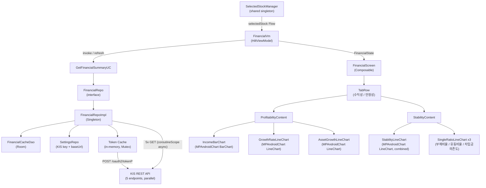

# Financial Information Feature - Porting Specification

**Document version**: 1.0
**Source project**: StockApp (Android, Kotlin)
**Target audience**: Developers porting the feature to a new platform with no access to the original codebase
**Last verified against source**: 2026-02-23

---

## Table of Contents

1. [Feature Overview](#1-feature-overview)
2. [Architecture Diagram](#2-architecture-diagram)
3. [File Manifest](#3-file-manifest)
4. [KIS API Contracts](#4-kis-api-contracts)
5. [Domain Models](#5-domain-models)
6. [Data Transfer Objects (DTOs)](#6-data-transfer-objects-dtos)
7. [Cache Layer](#7-cache-layer)
8. [Core Algorithms](#8-core-algorithms)
9. [Repository Layer](#9-repository-layer)
10. [Use Case Layer](#10-use-case-layer)
11. [ViewModel and UI State](#11-viewmodel-and-ui-state)
12. [UI Components and Chart Specifications](#12-ui-components-and-chart-specifications)
13. [Stability Evaluation Logic](#13-stability-evaluation-logic)
14. [Number Formatting](#14-number-formatting)
15. [Dependency Injection](#15-dependency-injection)
16. [Error Handling Reference](#16-error-handling-reference)
17. [Sample Data](#17-sample-data)
18. [Edge Cases](#18-edge-cases)

---

## 1. Feature Overview

The Financial Information feature displays quarterly financial data for a selected Korean stock (KRX-listed equity). It is accessed from the Stock Analysis screen as one of four internal tabs.

### 1.1 Tabs

| Tab index | Label (Korean) | Label (English) | Content |
|-----------|---------------|-----------------|---------|
| 0 | 수익성 | Profitability | Income statement bar chart, growth rate line charts |
| 1 | 안정성 | Stability | Stability ratio line charts |

### 1.2 Behavior Summary

- Data source: KIS (Korea Investment and Securities) REST API exclusively. No KRX data is used for this feature.
- An active KIS API key (`appKey` + `appSecret`) is required. If not configured, the screen renders a `NoApiKey` state.
- On stock selection, the system attempts to load from Room cache (24 h TTL). On cache miss or pull-to-refresh, it calls all five KIS API endpoints in parallel.
- The income statement returns cumulative YTD (year-to-date) values. The feature converts these to standalone quarterly values before display (see Section 8).
- All five API responses are merged by settlement year-month (`stac_yymm`) to produce a unified list of periods.
- Charts render using MPAndroidChart. Periods are sorted oldest-first on the x-axis.

### 1.3 User Interactions

| Interaction | Effect |
|-------------|--------|
| Tab switch (수익성 / 안정성) | Swap chart content; no re-fetch |
| Pull-to-refresh | Force re-fetch from API, bypass cache |
| Refresh icon (top-right) | Same as pull-to-refresh |
| Retry button (error state) | Re-fetch from API, bypass cache |
| Stock change (external) | Automatic load with cache |

---

## 2. Architecture Diagram



---

## 3. File Manifest

All paths are relative to `app/src/main/java/com/stockapp/`.

| File | Role |
|------|------|
| `feature/financial/domain/model/FinancialModels.kt` | All domain data classes, enums, cache serialization classes, `toSummary()`, `convertYtdToQuarterly()` |
| `feature/financial/domain/repo/FinancialRepo.kt` | Repository interface |
| `feature/financial/domain/usecase/GetFinancialSummaryUC.kt` | Use case (fetch + map to summary) |
| `feature/financial/data/dto/FinancialDto.kt` | KIS API response DTOs + `parseNumericLong()` |
| `feature/financial/data/repo/FinancialRepoImpl.kt` | Repository implementation (KIS calls, cache, token management) |
| `feature/financial/ui/FinancialVm.kt` | ViewModel + `FinancialState` sealed class |
| `feature/financial/ui/FinancialScreen.kt` | Root composable, scaffold, tab row, state routing |
| `feature/financial/ui/ProfitabilityContent.kt` | 수익성 tab composable + 3 charts + `formatNumber()` |
| `feature/financial/ui/StabilityContent.kt` | 안정성 tab composable + 4 charts + evaluation logic + `formatPercent()` |
| `feature/financial/di/FinancialModule.kt` | Hilt module binding `FinancialRepo` to `FinancialRepoImpl` |
| `core/db/dao/FinancialCacheDao.kt` | Room DAO for `financial_cache` table |
| `core/db/AppDb.kt` | Room database; contains `MIGRATION_7_8` that creates `financial_cache` |
| `core/api/KisApiClient.kt` | Shared KIS client used by ETF feature; provides token management with retry |
| `core/config/AppConfig.kt` | `FINANCIAL_CACHE_TTL_MS = 24 * 60 * 60 * 1000L` |

> Note: `FinancialRepoImpl` does NOT use `KisApiClient`. It manages its own OkHttp calls and its own in-memory token cache with a `Mutex`. The shared `KisApiClient` is used only by the ETF feature.

---

## 4. KIS API Contracts

### 4.1 Base URLs

| Investment mode | Base URL |
|-----------------|----------|
| Mock (모의투자) | `https://openapivts.koreainvestment.com:29443` |
| Production (실전투자) | `https://openapi.koreainvestment.com:9443` |

The base URL is determined from `SettingsRepo.getKisApiKeyConfig()`. The token cache key is scoped per `baseUrl` so that mode switching triggers a fresh token fetch.

### 4.2 Authentication: OAuth2 Token

**Endpoint**: `POST {baseUrl}/oauth2/tokenP`

**Request headers**:
```
Content-Type: application/json
```

**Request body** (JSON):
```json
{
  "grant_type": "client_credentials",
  "appkey": "<appKey>",
  "appsecret": "<appSecret>"
}
```

**Response body** (JSON):
```json
{
  "access_token": "eyJ...",
  "token_type": "Bearer",
  "expires_in": 86400,
  "access_token_token_expired": "2026-02-24 10:30:00"
}
```

**Token caching rules** (as implemented in `FinancialRepoImpl`):
- Cached in-memory fields: `cachedToken: String?`, `tokenExpiresAt: Long`, `tokenBaseUrl: String?`
- Cache is valid when: `cachedToken != null AND tokenBaseUrl == currentBaseUrl AND currentTimeMs < tokenExpiresAt - 60_000`
- On cache miss: fetch new token, set `tokenExpiresAt = currentTimeMs + 23 * 60 * 60 * 1000` (23 hours)
- Thread-safety: all reads and writes guarded by `Mutex` (`tokenMutex`)
- On auth error during a data call: invalidate cache and retry once

### 4.3 Financial Data Endpoints

All five endpoints share these characteristics:

**Method**: `GET`

**Query parameters** (appended as URL query string, not URL-encoded):
```
FID_DIV_CLS_CODE=1
FID_COND_MRKT_DIV_CODE=J
FID_INPUT_ISCD={ticker}
```

**Request headers**:
```
content-type: application/json; charset=utf-8
authorization: Bearer {access_token}
appkey: {appKey}
appsecret: {appSecret}
tr_id: {trId}
```

**Response wrapper** (applies to all five endpoints):
```json
{
  "rt_cd": "0",
  "msg_cd": "MCA00000",
  "msg1": "정상처리 되었습니다.",
  "output": [ ... ]
}
```

> Some KIS endpoints return data under the key `"output"`, others under `"output1"`. The `KisApiResponse` wrapper handles both (see Section 6.1).

**Success condition**: `rt_cd == "0"`

**Error condition**: any other `rt_cd` value; throw `Exception("API error: {msgCd} - {msg1}")`

#### 4.3.1 Balance Sheet (대차대조표)

| Property | Value |
|----------|-------|
| tr_id | `FHKST66430100` |
| Path | `/uapi/domestic-stock/v1/finance/balance-sheet` |
| Response array key | `output` or `output1` |

Response item fields:

| JSON field | Korean name | Domain field |
|------------|-------------|--------------|
| `stac_yymm` | 결산년월 | `period.yearMonth` |
| `cras` | 유동자산 | `currentAssets` |
| `fxas` | 고정자산 | `fixedAssets` |
| `total_aset` | 자산총계 | `totalAssets` |
| `flow_lblt` | 유동부채 | `currentLiabilities` |
| `fix_lblt` | 고정부채 | `fixedLiabilities` |
| `total_lblt` | 부채총계 | `totalLiabilities` |
| `cpfn` | 자본금 | `capital` |
| `cfp_surp` | 자본잉여금 | `capitalSurplus` |
| `rere` | 이익잉여금 | `retainedEarnings` |
| `total_cptl` | 자본총계 | `totalEquity` |

All values are strings; parse with `parseNumericLong()` (see Section 6.2).

#### 4.3.2 Income Statement (손익계산서)

| Property | Value |
|----------|-------|
| tr_id | `FHKST66430200` |
| Path | `/uapi/domestic-stock/v1/finance/income-statement` |

Response item fields:

| JSON field | Korean name | Domain field |
|------------|-------------|--------------|
| `stac_yymm` | 결산년월 | `period.yearMonth` |
| `sale_account` | 매출액 | `revenue` |
| `sale_cost` | 매출원가 | `costOfSales` |
| `sale_totl_prfi` | 매출총이익 | `grossProfit` |
| `bsop_prti` | 영업이익 | `operatingProfit` |
| `op_prfi` | 경상이익 | `ordinaryProfit` |
| `spec_prfi` | 특별이익 | (parsed but not stored in domain model) |
| `spec_loss` | 특별손실 | (parsed but not stored in domain model) |
| `thtr_ntin` | 당기순이익 | `netIncome` |

**CRITICAL**: Values are cumulative YTD. Must be converted to standalone quarterly before display. See Section 8.

#### 4.3.3 Profitability Ratios (수익성비율)

| Property | Value |
|----------|-------|
| tr_id | `FHKST66430400` |
| Path | `/uapi/domestic-stock/v1/finance/profit-ratio` |

Response item fields:

| JSON field | Korean name | Domain field |
|------------|-------------|--------------|
| `stac_yymm` | 결산년월 | `period.yearMonth` |
| `bsop_prfi_rate` | 영업이익률 | `operatingMargin` |
| `ntin_rate` | 순이익률 | `netMargin` |
| `roe_val` | ROE | `roe` |
| `roa_val` | ROA | `roa` |
| `grs` | 매출총이익률 | (parsed but not mapped to `ProfitabilityRatios` fields shown in UI) |

All values are strings; parse with `.toDoubleOrNull()` (no comma cleaning required for ratio fields).

> Note: `FHKST66430300` (재무비율) and `FHKST66430500` (기타주요비율) are defined as constants in `FinancialRepoImpl` but are NOT fetched in the current implementation. The parallel fetch only calls endpoints 100, 200, 400, 600, and 800.

#### 4.3.4 Stability Ratios (안정성비율)

| Property | Value |
|----------|-------|
| tr_id | `FHKST66430600` |
| Path | `/uapi/domestic-stock/v1/finance/stability-ratio` |

Response item fields:

| JSON field | Korean name | Domain field |
|------------|-------------|--------------|
| `stac_yymm` | 결산년월 | `period.yearMonth` |
| `lblt_rate` | 부채비율 | `debtRatio` |
| `crnt_rate` | 유동비율 | `currentRatio` |
| `quck_rate` | 당좌비율 | `quickRatio` |
| `bram_depn` | 차입금의존도 | `borrowingDependency` |
| `rsrv_rate` | 유보율 | (parsed but not stored in domain model) |
| `inte_cvrg_rate` | 이자보상비율 | `interestCoverageRatio` |

#### 4.3.5 Growth Ratios (성장성비율)

| Property | Value |
|----------|-------|
| tr_id | `FHKST66430800` |
| Path | `/uapi/domestic-stock/v1/finance/growth-ratio` |

Response item fields:

| JSON field | Korean name | Domain field | Notes |
|------------|-------------|--------------|-------|
| `stac_yymm` | 결산년월 | `period.yearMonth` | |
| `grs` | 매출액증가율 | `revenueGrowth` | |
| `bsop_prfi_inrt` | 영업이익증가율 | `operatingProfitGrowth` | |
| `ntin_inrt` | 순이익증가율 | `netIncomeGrowth` | |
| `equt_inrt` | 자기자본증가율 (actual API) | `equityGrowth` | Primary field name |
| `cptl_ntin_rate` | 자기자본증가율 (doc spec) | `equityGrowth` | Fallback if `equt_inrt` is null |
| `totl_aset_inrt` | 총자산증가율 (actual API) | `totalAssetsGrowth` | Primary field name |
| `total_aset_inrt` | 총자산증가율 (doc spec) | `totalAssetsGrowth` | Fallback if `totl_aset_inrt` is null |

**Field name discrepancy**: The KIS API documentation uses different field names from what the live API actually returns for equity growth and total assets growth. Both variants must be declared in the DTO and the first non-null value wins.

---

## 5. Domain Models

All classes in `feature/financial/domain/model/FinancialModels.kt`.

### 5.1 FinancialTab (enum)

```kotlin
enum class FinancialTab(val label: String) {
    PROFITABILITY("수익성"),   // ordinal 0
    STABILITY("안정성")        // ordinal 1
}
```

### 5.2 FinancialPeriod

```kotlin
data class FinancialPeriod(
    val yearMonth: String,  // "YYYYMM" e.g. "202312"
    val year: Int,          // 2023
    val quarter: Int        // 1-4 for Q1-Q4, 0 for annual
)
```

**`toDisplayString(short: Boolean)`**

| Input `yearMonth` | `short = false` | `short = true` |
|-------------------|-----------------|----------------|
| `"202312"` | `"2023.12"` | `"23.12"` |
| `"202303"` | `"2023.03"` | `"23.03"` |

Implementation: if `short`, take `yearMonth[2..3]`, else take `yearMonth[0..3]`; append `.` and `yearMonth[4..5]`.

**`FinancialPeriod.fromYearMonth(ym: String)`**

```
year  = ym.substring(0, 4).toIntOrNull() ?: 0
month = ym.substring(4, 6).toIntOrNull() ?: 0
quarter = when (month) {
    3  -> 1
    6  -> 2
    9  -> 3
    12 -> 4
    else -> 0   // annual or unknown
}
```

### 5.3 BalanceSheet

```kotlin
data class BalanceSheet(
    val period: FinancialPeriod,
    val currentAssets: Long?,        // 유동자산
    val fixedAssets: Long?,          // 고정자산
    val totalAssets: Long?,          // 자산총계
    val currentLiabilities: Long?,   // 유동부채
    val fixedLiabilities: Long?,     // 고정부채
    val totalLiabilities: Long?,     // 부채총계
    val capital: Long?,              // 자본금
    val capitalSurplus: Long?,       // 자본잉여금
    val retainedEarnings: Long?,     // 이익잉여금
    val totalEquity: Long?           // 자본총계
)
```

Units: all `Long` fields are in KRW (원). The KIS balance sheet API returns raw won values as strings.

### 5.4 IncomeStatement

```kotlin
data class IncomeStatement(
    val period: FinancialPeriod,
    val revenue: Long?,          // 매출액 (YTD cumulative, 억원)
    val costOfSales: Long?,      // 매출원가
    val grossProfit: Long?,      // 매출총이익
    val operatingProfit: Long?,  // 영업이익 (YTD cumulative, 억원)
    val ordinaryProfit: Long?,   // 경상이익
    val netIncome: Long?         // 당기순이익 (YTD cumulative, 억원)
)
```

Units: 억원 (100 million KRW). The KIS income statement returns values already in 억원 units; no unit conversion is performed.

### 5.5 ProfitabilityRatios

```kotlin
data class ProfitabilityRatios(
    val period: FinancialPeriod,
    val operatingMargin: Double?,  // 영업이익률 (%)
    val netMargin: Double?,        // 순이익률 (%)
    val roe: Double?,              // 자기자본이익률 ROE (%)
    val roa: Double?               // 총자산이익률 ROA (%)
)
```

### 5.6 StabilityRatios

```kotlin
data class StabilityRatios(
    val period: FinancialPeriod,
    val debtRatio: Double?,            // 부채비율 (%)
    val currentRatio: Double?,         // 유동비율 (%)
    val quickRatio: Double?,           // 당좌비율 (%)
    val borrowingDependency: Double?,  // 차입금의존도 (%)
    val interestCoverageRatio: Double? // 이자보상비율
)
```

### 5.7 GrowthRatios

```kotlin
data class GrowthRatios(
    val period: FinancialPeriod,
    val revenueGrowth: Double?,         // 매출액증가율 (%)
    val operatingProfitGrowth: Double?, // 영업이익증가율 (%)
    val netIncomeGrowth: Double?,       // 순이익증가율 (%)
    val equityGrowth: Double?,          // 자기자본증가율 (%)
    val totalAssetsGrowth: Double?      // 총자산증가율 (%)
)
```

### 5.8 FinancialData

The merged result of all five API responses, keyed by `yearMonth`.

```kotlin
data class FinancialData(
    val ticker: String,
    val name: String,
    val periods: List<String>,                         // unsorted union of all stac_yymm values
    val balanceSheets: Map<String, BalanceSheet>,      // key = "YYYYMM"
    val incomeStatements: Map<String, IncomeStatement>,
    val profitabilityRatios: Map<String, ProfitabilityRatios>,
    val stabilityRatios: Map<String, StabilityRatios>,
    val growthRatios: Map<String, GrowthRatios>,
    val financialRatios: Map<String, FinancialRatios>,      // always emptyMap() in current impl
    val otherMajorRatios: Map<String, OtherMajorRatios>     // always emptyMap() in current impl
)
```

### 5.9 FinancialSummary

The UI-ready projection computed by `FinancialData.toSummary()`. All list fields are parallel-indexed and sorted oldest-first.

```kotlin
data class FinancialSummary(
    val ticker: String,
    val name: String,
    val periods: List<String>,        // sorted oldest-first e.g. ["202303","202306","202309","202312"]
    val displayPeriods: List<String>, // short display e.g. ["23.03","23.06","23.09","23.12"]

    // Profitability tab - income statement (standalone quarterly, 억원)
    val revenues: List<Long>,
    val operatingProfits: List<Long>,
    val netIncomes: List<Long>,

    // Profitability tab - growth rates (%)
    val revenueGrowthRates: List<Double>,
    val operatingProfitGrowthRates: List<Double>,
    val netIncomeGrowthRates: List<Double>,
    val equityGrowthRates: List<Double>,
    val totalAssetsGrowthRates: List<Double>,

    // Stability tab (%)
    val debtRatios: List<Double>,
    val currentRatios: List<Double>,
    val borrowingDependencies: List<Double>
)
```

**Computed properties** (used for conditional chart rendering):

| Property | Returns `true` when |
|----------|---------------------|
| `hasProfitabilityData` | Any value in `revenues`, `operatingProfits`, or `netIncomes` is non-zero |
| `hasGrowthData` | Any value in `revenueGrowthRates`, `operatingProfitGrowthRates`, or `netIncomeGrowthRates` is non-zero |
| `hasAssetGrowthData` | Any value in `equityGrowthRates` or `totalAssetsGrowthRates` is non-zero |
| `hasStabilityData` | Any value in `debtRatios`, `currentRatios`, or `borrowingDependencies` is non-zero |

**Latest-value convenience properties**:

```kotlin
val latestRevenue: Long?         = revenues.lastOrNull()
val latestOperatingProfit: Long? = operatingProfits.lastOrNull()
val latestNetIncome: Long?       = netIncomes.lastOrNull()
val latestDebtRatio: Double?     = debtRatios.lastOrNull()
val latestCurrentRatio: Double?  = currentRatios.lastOrNull()
```

---

## 6. Data Transfer Objects (DTOs)

All DTOs in `feature/financial/data/dto/FinancialDto.kt`. Each has a `toDomain()` function that returns `null` when `stacYymm` is absent.

### 6.1 KisApiResponse Wrapper

```kotlin
@Serializable
data class KisApiResponse<T>(
    @SerialName("rt_cd") val rtCd: String = "",
    @SerialName("msg_cd") val msgCd: String = "",
    @SerialName("msg1") val msg1: String = "",
    val output: T? = null,
    @SerialName("output1") val output1: T? = null
) {
    val actualOutput: T?
        get() = output ?: output1
}
```

Usage pattern: after verifying `rtCd == "0"`, call `apiResponse.actualOutput` to get the data list.

### 6.2 Numeric String Parser

```kotlin
private fun parseNumericLong(value: String?): Long? {
    if (value.isNullOrBlank()) return null
    val cleaned = value
        .trim()
        .replace(",", "")
        .replace(" ", "")
    return cleaned.toDoubleOrNull()?.toLong() ?: cleaned.toLongOrNull()
}
```

This handles all observed KIS API formats:

| Input string | Result |
|--------------|--------|
| `"214837590000000"` | `214837590000000L` |
| `"214,837,590,000,000"` | `214837590000000L` |
| `"214837590000000.00"` | `214837590000000L` |
| `" 214837590000000 "` | `214837590000000L` |
| `""` | `null` |
| `null` | `null` |

### 6.3 DTO Summary Table

| DTO class | Maps to | Numeric parser |
|-----------|---------|----------------|
| `BalanceSheetDto` | `BalanceSheet` | `parseNumericLong()` for all Long fields |
| `IncomeStatementDto` | `IncomeStatement` | `parseNumericLong()` for all Long fields |
| `ProfitabilityRatiosDto` | `ProfitabilityRatios` | `.toDoubleOrNull()` for all Double fields |
| `StabilityRatiosDto` | `StabilityRatios` | `.toDoubleOrNull()` for all Double fields |
| `GrowthRatiosDto` | `GrowthRatios` | `.toDoubleOrNull()` for all Double fields |

---

## 7. Cache Layer

### 7.1 Room Entity

Table name: `financial_cache`
Added in: Room database migration 7 to 8 (`MIGRATION_7_8` in `AppDb.kt`)

```sql
CREATE TABLE IF NOT EXISTS `financial_cache` (
    `ticker`   TEXT    NOT NULL,
    `name`     TEXT    NOT NULL,
    `data`     TEXT    NOT NULL,   -- JSON-serialized FinancialDataCache
    `cachedAt` INTEGER NOT NULL,   -- epoch milliseconds (System.currentTimeMillis())
    PRIMARY KEY(`ticker`)
)
```

The `data` column stores the full `FinancialDataCache` object serialized to JSON using `kotlinx.serialization`. The schema uses `OnConflictStrategy.REPLACE` so repeated inserts for the same ticker overwrite the previous entry.

### 7.2 FinancialCacheDao

```kotlin
interface FinancialCacheDao {
    suspend fun get(ticker: String): FinancialCacheEntity?
    suspend fun getAllOnce(): List<FinancialCacheEntity>
    suspend fun getInDateRange(startMs: Long, endMs: Long): List<FinancialCacheEntity>
    suspend fun insert(cache: FinancialCacheEntity)
    suspend fun delete(ticker: String)
    suspend fun deleteExpired(threshold: Long)  // DELETE WHERE cachedAt < threshold
    suspend fun deleteAll()
}
```

### 7.3 Cache TTL

```
FINANCIAL_CACHE_TTL_MS = 24 * 60 * 60 * 1000  // 86,400,000 ms
```

Defined in `AppConfig.kt`. Cache expiry check:

```kotlin
fun isCacheExpired(cachedAt: Long): Boolean {
    return System.currentTimeMillis() - cachedAt > AppConfig.FINANCIAL_CACHE_TTL_MS
}
```

### 7.4 FinancialDataCache (Serializable)

The serializable form stored in the `data` column. It is a flat representation of `FinancialData` with all maps converted to lists for serialization compatibility.

```kotlin
@Serializable
data class FinancialDataCache(
    val ticker: String,
    val name: String,
    val periods: List<String>,
    val balanceSheets: List<BalanceSheetCache>,
    val incomeStatements: List<IncomeStatementCache>,
    val profitabilityRatios: List<ProfitabilityRatiosCache>,
    val stabilityRatios: List<StabilityRatiosCache>,
    val growthRatios: List<GrowthRatiosCache>
)
```

Each `*Cache` class is also `@Serializable` and carries a `yearMonth: String` primary key field, plus all the nullable value fields matching the corresponding domain class (all values remain nullable to handle partial API responses gracefully).

### 7.5 Cache Conversion Functions

| Function | Direction |
|----------|-----------|
| `FinancialData.toCache(): FinancialDataCache` | Domain to cache (maps -> lists) |
| `FinancialDataCache.toData(): FinancialData` | Cache to domain (lists -> maps); sets `financialRatios` and `otherMajorRatios` to `emptyMap()` |

---

## 8. Core Algorithms

### 8.1 YTD-to-Quarterly Conversion

**Function signature**:
```kotlin
private fun convertYtdToQuarterly(
    periods: List<String>,    // sorted oldest-first (YYYYMM)
    ytdValues: List<Long>     // parallel list of cumulative YTD values
): List<Long>
```

**Pre-condition**: `periods` MUST be sorted oldest-first before calling. The caller (`FinancialData.toSummary()`) applies `periods.sorted()` before calling.

**Business logic**:

KIS income statement API returns cumulative YTD values for quarterly periods:
- Q1 (month 03) = revenue for January through March
- Q2 (month 06) = revenue for January through June
- Q3 (month 09) = revenue for January through September
- Q4 (month 12) = revenue for full year

The algorithm converts to standalone quarterly values:

```
For each period i (in sorted order):
  quarter = FinancialPeriod.fromYearMonth(periods[i]).quarter

  if quarter == 1:
    standaloneValue = ytdValues[i]            // Q1 is its own YTD

  else if quarter in 2..4:
    prevYtd = prevYtdByYear[year]?.second
    if prevYtd != null:
      standaloneValue = ytdValues[i] - prevYtd
      (log warning if gap > 1 quarter)
    else:
      standaloneValue = ytdValues[i]          // no prior quarter available; use as-is
      (log warning)

  else (quarter == 0, annual):
    standaloneValue = ytdValues[i]            // no conversion

  if quarter in 1..4:
    prevYtdByYear[year] = (quarter, ytdValues[i])
```

**Example** (Samsung Electronics 005930):

| Period | YTD Revenue | Quarter | Standalone |
|--------|-------------|---------|------------|
| 202303 | 63,754억 | Q1 | 63,754억 |
| 202306 | 120,138억 | Q2 | 56,384억 (120,138 - 63,754) |
| 202309 | 183,451억 | Q3 | 63,313억 (183,451 - 120,138) |
| 202312 | 258,935억 | Q4 | 75,484억 (258,935 - 183,451) |

**Edge cases handled**:
- Non-consecutive quarters (e.g., Q1 present, Q2 absent, Q3 present): Q3 is computed against Q1 YTD (two-quarter subtraction). A warning is logged.
- Q2+ with no prior quarter in `prevYtdByYear`: use YTD value as-is. A warning is logged.
- Annual data (quarter == 0): passed through unchanged.
- Empty input: returns empty list immediately.

### 8.2 FinancialData.toSummary()

**Function signature**:
```kotlin
fun FinancialData.toSummary(): FinancialSummary
```

**Algorithm**:

```
1. sortedPeriods = periods.sorted()   // lexicographic = chronological for "YYYYMM"

2. Extract raw (YTD) income statement values for each sorted period:
     rawRevenues         = sortedPeriods.map { incomeStatements[it]?.revenue ?: 0L }
     rawOperatingProfits = sortedPeriods.map { incomeStatements[it]?.operatingProfit ?: 0L }
     rawNetIncomes       = sortedPeriods.map { incomeStatements[it]?.netIncome ?: 0L }

3. Convert YTD to standalone quarterly:
     quarterlyRevenues         = convertYtdToQuarterly(sortedPeriods, rawRevenues)
     quarterlyOperatingProfits = convertYtdToQuarterly(sortedPeriods, rawOperatingProfits)
     quarterlyNetIncomes       = convertYtdToQuarterly(sortedPeriods, rawNetIncomes)

4. Extract growth rates directly (already standalone % values from KIS API):
     revenueGrowthRates         = sortedPeriods.map { growthRatios[it]?.revenueGrowth ?: 0.0 }
     operatingProfitGrowthRates = sortedPeriods.map { growthRatios[it]?.operatingProfitGrowth ?: 0.0 }
     netIncomeGrowthRates       = sortedPeriods.map { growthRatios[it]?.netIncomeGrowth ?: 0.0 }
     equityGrowthRates          = sortedPeriods.map { growthRatios[it]?.equityGrowth ?: 0.0 }
     totalAssetsGrowthRates     = sortedPeriods.map { growthRatios[it]?.totalAssetsGrowth ?: 0.0 }

5. Extract stability ratios directly (already % values from KIS API):
     debtRatios             = sortedPeriods.map { stabilityRatios[it]?.debtRatio ?: 0.0 }
     currentRatios          = sortedPeriods.map { stabilityRatios[it]?.currentRatio ?: 0.0 }
     borrowingDependencies  = sortedPeriods.map { stabilityRatios[it]?.borrowingDependency ?: 0.0 }

6. displayPeriods = sortedPeriods.map { FinancialPeriod.fromYearMonth(it).toDisplayString(short = true) }

7. Return FinancialSummary with all computed lists.
```

---

## 9. Repository Layer

### 9.1 FinancialRepo Interface

```kotlin
interface FinancialRepo {
    suspend fun getFinancialData(
        ticker: String,
        name: String,
        useCache: Boolean = true
    ): Result<FinancialData>

    suspend fun refreshFinancialData(
        ticker: String,
        name: String
    ): Result<FinancialData>

    suspend fun clearCache(ticker: String)
    suspend fun clearExpiredCache()
}
```

### 9.2 FinancialRepoImpl

**Class annotations**: `@Singleton`
**Dispatcher**: `@IoDispatcher` (injected `CoroutineDispatcher` for IO operations)

#### 9.2.1 getFinancialData

```
Input:  ticker: String, name: String, useCache: Boolean
Output: Result<FinancialData>

Algorithm:
  if useCache:
    cached = financialCacheDao.get(ticker)
    if cached != null AND !isCacheExpired(cached.cachedAt):
      try:
        return Result.success(json.decodeFromString<FinancialDataCache>(cached.data).toData().copy(name = name))
      catch Exception:
        log warning
        fall through to refreshFinancialData

  return refreshFinancialData(ticker, name)
```

Note: `copy(name = name)` ensures the name is always current even if the cache was written with a stale name.

#### 9.2.2 refreshFinancialData

```
Input:  ticker: String, name: String
Output: Result<FinancialData>
Dispatcher: withContext(ioDispatcher)

Algorithm:
  1. config = getKisApiConfig()        // validates keys, fetches token

  2. Launch 5 parallel async calls (coroutineScope):
       balanceSheets     = async { fetchBalanceSheet(ticker, config) }
       incomeStatements  = async { fetchIncomeStatement(ticker, config) }
       profitRatios      = async { fetchProfitabilityRatios(ticker, config) }
       stabilityRatios   = async { fetchStabilityRatios(ticker, config) }
       growthRatios      = async { fetchGrowthRatios(ticker, config) }
     Await all 5 results.

  3. data = mergeFinancialData(ticker, name, ...)

  4. financialCacheDao.insert(FinancialCacheEntity(ticker, name, json.encodeToString(data.toCache())))

  5. return Result.success(data)

  On CancellationException: rethrow
  On other Exception: return Result.failure(exception)
```

#### 9.2.3 Generic Fetch Function

Each of the five endpoints is fetched via a shared inline function:

```kotlin
private suspend inline fun <reified D, T> fetchFinancialData(
    ticker: String,
    config: KisApiConfig,
    endpoint: String,
    trId: String,
    dataTypeLabel: String,
    crossinline mapper: (D) -> T?
): List<T>
```

**Behavior**:
- Calls `callKisApi<List<D>>(config, endpoint, trId, params)` with fixed params `{FID_DIV_CLS_CODE=1, FID_COND_MRKT_DIV_CODE=J, FID_INPUT_ISCD=ticker}`
- Maps each DTO item through `mapper` (the DTO's `toDomain()` function) and filters nulls
- On any exception other than `CancellationException`: logs a warning and returns `emptyList()` (partial failure tolerance)

#### 9.2.4 callKisApi

```kotlin
private inline fun <reified T> callKisApi(
    config: KisApiConfig,
    endpoint: String,
    trId: String,
    params: Map<String, String>
): T
```

**URL construction**: `{baseUrl}{endpoint}?{key}={value}&...` (no URL encoding applied)

**On HTTP error**: throws `Exception("API call failed: {code} - {body}")`

**On `rt_cd != "0"`**: throws `Exception("API error: {msgCd} - {msg1}")`

**On empty output**: throws `Exception("No output in response")`

#### 9.2.5 mergeFinancialData

```
Input: ticker, name, balanceSheets, incomeStatements, profitRatios, stabilityRatios, growthRatios
Output: FinancialData

Algorithm:
  allPeriods = union of all period.yearMonth values across all five lists
  return FinancialData(
    ticker = ticker,
    name = name,
    periods = allPeriods.sorted(),
    balanceSheets = balanceSheets.associateBy { it.period.yearMonth },
    incomeStatements = incomeStatements.associateBy { it.period.yearMonth },
    profitabilityRatios = profitRatios.associateBy { it.period.yearMonth },
    stabilityRatios = stabilityRatios.associateBy { it.period.yearMonth },
    growthRatios = growthRatios.associateBy { it.period.yearMonth },
    financialRatios = emptyMap(),
    otherMajorRatios = emptyMap()
  )
```

If any single API call returned `emptyList()` (individual failure), its map will be empty and that data type will be absent for all periods. The UI handles this gracefully via the `has*Data` flags on `FinancialSummary`.

---

## 10. Use Case Layer

### 10.1 GetFinancialSummaryUC

**Class annotations**: `@Inject constructor`

```kotlin
class GetFinancialSummaryUC @Inject constructor(
    private val repo: FinancialRepo
)
```

#### invoke (cache-first load)

```
suspend operator fun invoke(
    ticker: String,
    name: String,
    useCache: Boolean = true
): Result<FinancialSummary>

= repo.getFinancialData(ticker, name, useCache).map { data ->
      logFinancialData(data)     // debug only (BuildConfig.DEBUG guard)
      val summary = data.toSummary()
      logFinancialSummary(summary)
      summary
  }
```

#### refresh (bypass cache)

```
suspend fun refresh(ticker: String, name: String): Result<FinancialSummary>
= repo.refreshFinancialData(ticker, name).map { data -> ... same as above ... }
```

---

## 11. ViewModel and UI State

### 11.1 FinancialState (sealed class)

```kotlin
sealed class FinancialState {
    data object NoStock  : FinancialState()   // no stock selected yet
    data object Loading  : FinancialState()   // loading in progress
    data object NoApiKey : FinancialState()   // KIS key missing or blank
    data class  Success(val summary: FinancialSummary) : FinancialState()
    data class  Error(val message: String)   : FinancialState()
}
```

**State transition diagram**:

```
NoStock
  -(stock selected)->  Loading  -(success, periods not empty)->  Success
                                -(success, periods empty)    ->  Error("재무정보를 찾을 수 없습니다.")
                                -(error, API key missing)    ->  NoApiKey
                                -(error, network)            ->  Error("네트워크 연결을 확인해주세요.")
                                -(error, other)              ->  Error(error.message)
Success
  -(stock deselected)->  NoStock
  -(refresh)         ->  (isRefreshing=true) -> Loading -> Success|Error
```

### 11.2 FinancialVm

**Class annotations**: `@HiltViewModel`

**StateFlows**:

| Field | Type | Default |
|-------|------|---------|
| `state` | `StateFlow<FinancialState>` | `NoStock` |
| `selectedTab` | `StateFlow<FinancialTab>` | `PROFITABILITY` |
| `isRefreshing` | `StateFlow<Boolean>` | `false` |

**Private state**: `currentTicker: String?`, `currentName: String?`

**`init` block**: Launches a coroutine that collects `selectedStockManager.selectedStock`. On non-null stock, calls `loadFinancialData(ticker, name, useCache = true)`. On null, resets to `NoStock`.

**Error message routing in `loadFinancialData`**:

```kotlin
onFailure = { error ->
    when {
        error.message?.contains("API key") -> return FinancialState.NoApiKey
        error.message?.contains("network") || error.message?.contains("Network") ->
            FinancialState.Error("네트워크 연결을 확인해주세요.")
        else ->
            FinancialState.Error(error.message ?: "알 수 없는 오류가 발생했습니다.")
    }
}
```

The `NoApiKey` trigger fires on `IllegalStateException` from `FinancialRepoImpl.getKisApiConfig()` which throws: `"KIS API key not configured. 설정에서 KIS API 키를 입력해주세요."` (contains "API key").

**Public methods**:

| Method | Behavior |
|--------|----------|
| `selectTab(tab)` | Sets `_selectedTab.value = tab` |
| `refresh()` | Sets `isRefreshing = true`, calls `loadFinancialData(useCache=false)`, sets `isRefreshing = false` |
| `retry()` | Calls `loadFinancialData(useCache=false)` without refresh indicator |

---

## 12. UI Components and Chart Specifications

### 12.1 FinancialScreen

Top-level composable. Uses `Scaffold` with `TopAppBar`.

**TopAppBar title**:
- State is `Success`: `"${summary.name} 재무정보"`
- Any other state: `"재무정보"`

**TopAppBar actions**:
- Refresh icon button: visible only in `Success` state; calls `viewModel.refresh()`
- `ThemeToggleButton`: always visible

**Content by state**:

| State | Content |
|-------|---------|
| `NoStock` | Centered text: `"종목을 선택해주세요.\n검색 화면에서 종목을 검색하고 선택하세요."` |
| `Loading` | `CircularProgressIndicator` + text `"재무정보를 불러오는 중..."` |
| `NoApiKey` | Centered text: `"API 키가 설정되지 않았습니다.\n설정 화면에서 API 키를 입력해주세요."` |
| `Success` | `TabRow` + `PullToRefreshBox` wrapping tab content |
| `Error` | `ErrorCard` composable with retry button |

### 12.2 ProfitabilityContent

Scrollable column with 16dp padding and 16dp vertical spacing between cards.

Layout order:
1. `SummaryCard` (latest values, always shown)
2. `IncomeBarChart` card (if `hasProfitabilityData`)
3. `GrowthRateLineChart` card (if `hasGrowthData`)
4. `AssetGrowthLineChart` card (if `hasAssetGrowthData`)
5. Empty state card (if none of the above render)

#### SummaryCard

Displays three items in a horizontal row:

| Label | Value format |
|-------|--------------|
| 매출액 | `formatNumber(latestRevenue) + "억"` or `"-"` |
| 영업이익 | `formatNumber(latestOperatingProfit) + "억"` or `"-"` |
| 당기순이익 | `formatNumber(latestNetIncome) + "억"` or `"-"` |

#### Chart: IncomeBarChart (Stacked Bar Chart)

**Library**: MPAndroidChart `BarChart`

**Stack construction** (for each period index `i`):

```kotlin
val netIncomePortion  = maxOf(0f, netIncome.toFloat())
val opProfitPortion   = maxOf(0f, opProfit.toFloat() - netIncome.toFloat())
val revenuePortion    = maxOf(0f, revenue.toFloat() - opProfit.toFloat())
BarEntry(i.toFloat(), floatArrayOf(netIncomePortion, opProfitPortion, revenuePortion))
```

Stack order is bottom-to-top: 당기순이익, 영업이익, 매출액. The total bar height equals `revenue`.

**Colors**:

| Segment | Color hex | Color name |
|---------|-----------|------------|
| 당기순이익 (bottom) | `#FF9800` | Orange |
| 영업이익 (middle) | `#2196F3` | Blue |
| 매출액 (top) | `#4CAF50` | Green |

**Chart properties**:

| Property | Value |
|----------|-------|
| Bar width | `0.7f` |
| Animation | `animateY(500)` |
| X-axis position | `BOTTOM` |
| X-axis grid lines | disabled |
| Left Y-axis minimum | `0f` |
| Right Y-axis | disabled |
| Description | disabled |
| `setDrawValueAboveBar` | `false` |
| `setDrawValues` on dataset | `false` |
| Legend | enabled |
| Height | `280.dp` |
| Stack labels | `["당기순이익", "영업이익", "매출액"]` |

**Touch marker** (`IncomeBarMarkerView`): shows period label, revenue, operatingProfit, netIncome for the selected bar.

#### Chart: GrowthRateLineChart

**Library**: MPAndroidChart `LineChart`

**Three datasets**:

| Dataset label | Color hex | Color name |
|---------------|-----------|------------|
| 매출액 증가율 | `#4CAF50` | Green |
| 영업이익 증가율 | `#2196F3` | Blue |
| 순이익 증가율 | `#FF9800` | Orange |

**Line properties**: `lineWidth = 2f`, `circleRadius = 3f`, `setDrawValues(false)`

**Chart properties**:

| Property | Value |
|----------|-------|
| Animation | `animateX(500)` |
| X-axis position | `BOTTOM` |
| X-axis grid lines | disabled |
| Right Y-axis | disabled |
| Height | `250.dp` |

**Touch marker** (`GrowthRateMarkerView`): shows all three growth rates for the selected period.

#### Chart: AssetGrowthLineChart

**Two datasets**:

| Dataset label | Color hex | Color name |
|---------------|-----------|------------|
| 자기자본 증가율 | `#9C27B0` | Purple |
| 총자산 증가율 | `#00BCD4` | Cyan |

Same line properties and chart configuration as `GrowthRateLineChart`. Height: `250.dp`.

**Touch marker** (`GrowthRateMarkerView`): shows both growth rates for the selected period.

### 12.3 StabilityContent

Scrollable column with same structure as ProfitabilityContent.

Layout order:
1. `StabilitySummaryCard` (latest values with evaluation labels, always shown)
2. `StabilityLineChart` card (combined, if `hasStabilityData`)
3. Individual `SingleRatioLineChart` for 부채비율 (if non-zero data)
4. Individual `SingleRatioLineChart` for 유동비율 (if non-zero data)
5. Individual `SingleRatioLineChart` for 차입금 의존도 (if non-zero data)
6. Empty state card (if `!hasStabilityData`)

#### StabilitySummaryCard

Three items:

| Label | Value format | Evaluation |
|-------|--------------|------------|
| 부채비율 | `formatPercent(latestDebtRatio)` | `evaluateDebtRatio()` |
| 유동비율 | `formatPercent(latestCurrentRatio)` | `evaluateCurrentRatio()` |
| 차입금 의존도 | `formatPercent(borrowingDependencies.last())` | `evaluateBorrowingDependency()` |

Each item shows the numeric value and below it the evaluation text in the evaluation color.

#### Chart: StabilityLineChart (Combined)

**Three datasets** (each only added if it has any non-zero value):

| Dataset label | Color hex | Color name |
|---------------|-----------|------------|
| 부채비율 | `#F44336` | Red |
| 유동비율 | `#4CAF50` | Green |
| 차입금 의존도 | `#FF9800` | Orange |

**Chart properties**:

| Property | Value |
|----------|-------|
| Y-axis minimum | `0f` |
| Animation | `animateX(500)` |
| Height | `280.dp` |

**Touch marker** (`StabilityRatioMarkerView`): shows all three ratios for selected period.

#### Chart: SingleRatioLineChart

One dataset per chart. Used for 부채비율, 유동비율, 차입금 의존도 individual views.

**Line properties**: `lineWidth = 2.5f`, `circleRadius = 4f`

**Fill**: `setDrawFilled(true)`, `fillAlpha = 30`, fill color matches line color

**Values on data points**: `setDrawValues(true)`, `valueTextSize = 10f`

**Touch marker** (`SingleRatioMarkerView`): shows label + value for the selected period.

**Chart properties**:

| Property | Value |
|----------|-------|
| Legend | disabled |
| Y-axis minimum | `0f` |
| Animation | `animateX(500)` |
| Height | `220.dp` |

---

## 13. Stability Evaluation Logic

### 13.1 evaluateDebtRatio

```
Input:  value: Double? (부채비율 %)
Output: StabilityEvaluation(label: String, color: Color)

null          -> ("-", Gray)
value < 100   -> ("양호", Color(0xFF4CAF50))  // Green
value < 200   -> ("보통", Color(0xFFFF9800))  // Orange
value >= 200  -> ("주의", Color(0xFFF44336))  // Red
```

### 13.2 evaluateCurrentRatio

```
Input:  value: Double? (유동비율 %)

null          -> ("-", Gray)
value >= 200  -> ("양호", Color(0xFF4CAF50))  // Green
value >= 100  -> ("보통", Color(0xFFFF9800))  // Orange
value < 100   -> ("주의", Color(0xFFF44336))  // Red
```

### 13.3 evaluateBorrowingDependency

```
Input:  value: Double? (차입금의존도 %)

null         -> ("-", Gray)
value < 30   -> ("양호", Color(0xFF4CAF50))   // Green
value < 50   -> ("보통", Color(0xFFFF9800))   // Orange
value >= 50  -> ("주의", Color(0xFFF44336))   // Red
```

---

## 14. Number Formatting

### 14.1 formatNumber (ProfitabilityContent)

Used for summary card labels. Input unit is 억원.

```kotlin
fun formatNumber(value: Long): String = when {
    value >= 10_000 -> String.format("%.1f만", value / 10_000.0)
    value >= 1_000  -> String.format("%.1f천", value / 1_000.0)
    else            -> value.toString()
}
```

Examples:

| Input (억원) | Output |
|--------------|--------|
| `215000` | `"21.5만"` |
| `1500` | `"1.5천"` |
| `999` | `"999"` |
| `0` | `"0"` |

The result is always followed by `"억"` at the call site: `"${formatNumber(value)}억"`.

### 14.2 formatPercent (StabilityContent)

```kotlin
fun formatPercent(value: Double): String = String.format("%.1f%%", value)
```

Examples: `100.0` -> `"100.0%"`, `45.678` -> `"45.7%"`

---

## 15. Dependency Injection

### 15.1 FinancialModule

```kotlin
@Module
@InstallIn(SingletonComponent::class)
abstract class FinancialModule {

    @Binds
    @Singleton
    abstract fun bindFinancialRepo(impl: FinancialRepoImpl): FinancialRepo
}
```

### 15.2 FinancialRepoImpl Dependencies

| Dependency | Type | Source |
|------------|------|--------|
| `financialCacheDao` | `FinancialCacheDao` | Room `AppDb` via Hilt |
| `settingsRepo` | `SettingsRepo` | Bound in SettingsModule |
| `json` | `Json` (kotlinx) | Provided in core DI module |
| `httpClient` | `OkHttpClient` | Provided in core DI module |
| `ioDispatcher` | `CoroutineDispatcher` | `@IoDispatcher` qualifier |

### 15.3 FinancialVm Dependencies

| Dependency | Source |
|------------|--------|
| `SelectedStockManager` | Hilt singleton |
| `GetFinancialSummaryUC` | Injected, depends on `FinancialRepo` |

---

## 16. Error Handling Reference

| Scenario | Layer | Behavior |
|----------|-------|----------|
| KIS API key not configured | `FinancialRepoImpl.getKisApiConfig()` | Throws `IllegalStateException("KIS API key not configured...")` |
| OAuth2 token fetch HTTP error | `FinancialRepoImpl.getAccessToken()` | Throws `Exception("Token request failed: {code} - {body}")` |
| OAuth2 token response missing `access_token` | Same | Throws `Exception("No access_token in response")` |
| Data API HTTP error (non-200) | `callKisApi()` | Throws `Exception("API call failed: {code} - {body}")` |
| Data API business error (`rt_cd != "0"`) | `callKisApi()` | Throws `Exception("API error: {msgCd} - {msg1}")` |
| Data API empty body | `callKisApi()` | Throws `Exception("Empty response")` |
| Data API response has no output | `callKisApi()` | Throws `Exception("No output in response")` |
| Individual endpoint failure (e.g. growth ratios) | `fetchFinancialData()` | Returns `emptyList()`, logs warning; other endpoints still populate the summary |
| Cache JSON parse error | `getFinancialData()` | Logs warning, falls through to API fetch |
| `CancellationException` | All layers | Always rethrown, never caught |
| Empty periods after merge | `FinancialVm.loadFinancialData()` | `FinancialState.Error("재무정보를 찾을 수 없습니다.")` |
| Error message contains "API key" | `FinancialVm` | `FinancialState.NoApiKey` |
| Error message contains "network" or "Network" | `FinancialVm` | `FinancialState.Error("네트워크 연결을 확인해주세요.")` |
| Any other error | `FinancialVm` | `FinancialState.Error(error.message ?: "알 수 없는 오류가 발생했습니다.")` |

---

## 17. Sample Data

### 17.1 KIS Income Statement API Response (partial)

```json
{
  "rt_cd": "0",
  "msg_cd": "MCA00000",
  "msg1": "정상처리 되었습니다.",
  "output": [
    {
      "stac_yymm": "202303",
      "sale_account": "63754",
      "sale_cost": "44123",
      "sale_totl_prfi": "19631",
      "bsop_prti": "6402",
      "op_prfi": "6280",
      "spec_prfi": "0",
      "spec_loss": "0",
      "thtr_ntin": "4763"
    },
    {
      "stac_yymm": "202306",
      "sale_account": "120138",
      "sale_cost": "85432",
      "sale_totl_prfi": "34706",
      "bsop_prti": "11873",
      "op_prfi": "11650",
      "thtr_ntin": "9012"
    }
  ]
}
```

### 17.2 KIS Growth Ratios API Response (partial)

```json
{
  "rt_cd": "0",
  "msg_cd": "MCA00000",
  "msg1": "정상처리 되었습니다.",
  "output": [
    {
      "stac_yymm": "202303",
      "grs": "-18.05",
      "bsop_prfi_inrt": "-95.38",
      "ntin_inrt": "-86.09",
      "equt_inrt": "-2.41",
      "totl_aset_inrt": "-1.23"
    }
  ]
}
```

### 17.3 FinancialSummary Sample Object

```kotlin
FinancialSummary(
    ticker = "005930",
    name = "삼성전자",
    periods = listOf("202303", "202306", "202309", "202312"),
    displayPeriods = listOf("23.03", "23.06", "23.09", "23.12"),

    // Standalone quarterly revenues (억원, after YTD conversion)
    revenues = listOf(63754L, 56384L, 63313L, 75484L),
    operatingProfits = listOf(6402L, 5471L, 7736L, 9201L),
    netIncomes = listOf(4763L, 4249L, 5844L, 6822L),

    revenueGrowthRates = listOf(-18.05, 12.3, 8.7, 15.1),
    operatingProfitGrowthRates = listOf(-95.38, -40.2, 210.5, 180.3),
    netIncomeGrowthRates = listOf(-86.09, -35.4, 190.2, 160.8),
    equityGrowthRates = listOf(-2.41, 1.2, 3.4, 5.6),
    totalAssetsGrowthRates = listOf(-1.23, 0.8, 2.1, 4.3),

    debtRatios = listOf(42.5, 43.1, 41.8, 40.2),
    currentRatios = listOf(253.4, 248.7, 261.3, 270.1),
    borrowingDependencies = listOf(3.2, 3.5, 3.1, 2.9)
)
```

### 17.4 financial_cache Table Row

```
ticker   : "005930"
name     : "삼성전자"
data     : "{\"ticker\":\"005930\",\"name\":\"삼성전자\",\"periods\":[\"202303\",\"202306\",\"202309\",\"202312\"],\"balanceSheets\":[...],\"incomeStatements\":[...],\"profitabilityRatios\":[...],\"stabilityRatios\":[...],\"growthRatios\":[...]}"
cachedAt : 1740312000000
```

---

## 18. Edge Cases

### 18.1 Non-Consecutive Quarters

If the API returns Q1 and Q3 for a year but no Q2, the standalone Q3 value will be computed as `Q3_ytd - Q1_ytd` (a two-quarter cumulative). A warning is logged: `"Non-consecutive quarters: Q1 -> Q3 for year 2023"`. The resulting value is arithmetically incorrect for standalone Q3 but will not crash. Q4 will be computed correctly against Q3 YTD.

### 18.2 Missing Prior Quarter

If the API returns Q2 or higher for a year without any prior quarter for that year in the data set, the YTD value is used as-is (standalone value equals the YTD cumulative). A warning is logged: `"Missing previous quarter for 202306 (Q2). Using YTD value."`.

### 18.3 Annual Data (quarter == 0)

Periods where the month does not map to 3, 6, 9, or 12 are treated as annual (`quarter = 0`). The YTD-to-quarterly conversion passes them through unchanged. This is also the behavior for any unexpected month value.

### 18.4 Negative Income Values

The stacked bar chart uses `maxOf(0f, value)` for each stack segment. Negative net income or operating profit will render as zero height for that segment rather than extending downward. The raw values are still passed to the marker view for accurate touch display.

### 18.5 Partial API Responses

If one of the five KIS endpoints returns an error, `fetchFinancialData` returns `emptyList()` for that data type. The merge proceeds with the remaining four. The resulting `FinancialSummary` will have default values (`0.0` or `0L`) for the missing data type's fields. Charts that depend solely on the missing data type will be hidden by the `has*Data` guards.

### 18.6 All APIs Return Empty

If all five API calls return empty lists, `mergeFinancialData` produces `periods = emptyList()`. `toSummary()` returns a `FinancialSummary` with all empty lists. The ViewModel detects `summary.periods.isEmpty()` and emits `FinancialState.Error("재무정보를 찾을 수 없습니다.")`.

### 18.7 KIS API Key Not Configured

`SettingsRepo.getKisApiKeyConfig()` returns a config with blank `appKey` or `appSecret`. `FinancialRepoImpl.getKisApiConfig()` calls `config.isValid()` which returns `false`, triggering `throw IllegalStateException("KIS API key not configured...")`. The ViewModel catches this and emits `FinancialState.NoApiKey`.

### 18.8 Investment Mode Switch (Mock / Production)

The token cache in `FinancialRepoImpl` is keyed on `tokenBaseUrl`. When the user switches modes, `getKisApiConfig()` returns a different `baseUrl`. The check `tokenBaseUrl == baseUrl` fails, forcing a fresh token fetch for the new environment.

### 18.9 Numeric String Parsing Failures

`parseNumericLong` returns `null` for any string that cannot be parsed after cleaning. All domain model fields that use it are nullable (`Long?`). `toSummary()` substitutes `0L` for any null income statement value and `0.0` for any null ratio value. This ensures parallel lists remain aligned and charts remain renderable.

### 18.10 Cache Corruption

If the JSON in the `data` column cannot be deserialized (e.g., schema change between app versions), `getFinancialData` catches the exception, logs a warning, and falls back to a live API fetch. The corrupt cache entry is overwritten on successful fetch.
