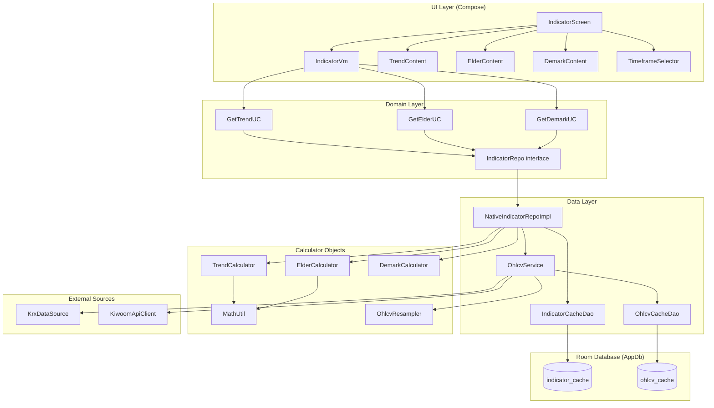

# Technical Indicators Feature — Porting Specification

**Document version**: 1.0
**Date**: 2026-02-23
**Source project**: StockApp (Android / Kotlin / Jetpack Compose)
**Scope**: `feature/indicator` module and all shared infrastructure it depends on

---

## Table of Contents

1. [Feature Overview](#1-feature-overview)
2. [Architecture Diagram](#2-architecture-diagram)
3. [Directory and File Map](#3-directory-and-file-map)
4. [Data Models](#4-data-models)
5. [Database Layer](#5-database-layer)
6. [OHLCV Data Pipeline](#6-ohlcv-data-pipeline)
7. [Indicator Repository and Use Cases](#7-indicator-repository-and-use-cases)
8. [Calculator: Trend Signal](#8-calculator-trend-signal)
9. [Calculator: Elder Impulse](#9-calculator-elder-impulse)
10. [Calculator: DeMark TD Setup](#10-calculator-demark-td-setup)
11. [Math Utilities](#11-math-utilities)
12. [OHLCV Resampler](#12-ohlcv-resampler)
13. [ViewModel and UI State](#13-viewmodel-and-ui-state)
14. [UI Components](#14-ui-components)
15. [Cache Strategy](#15-cache-strategy)
16. [Timeframe and Data Requirements Reference](#16-timeframe-and-data-requirements-reference)
17. [Configuration Constants](#17-configuration-constants)
18. [Sample Data](#18-sample-data)
19. [Edge Cases and Error Handling](#19-edge-cases-and-error-handling)
20. [Dependency Injection Bindings](#20-dependency-injection-bindings)

---

## 1. Feature Overview

The Technical Indicators screen (`feature/indicator`) displays three independent technical analysis indicators for a user-selected stock. The screen is one of the five bottom-navigation tabs in the application (labelled "종목 분석" — Stock Analysis).

### 1.1 Three-Tab Indicator System

| Tab index | Key | Label | Timeframes supported |
|-----------|-----|-------|----------------------|
| 0 | `trend` | Trend Signal | Daily, Weekly |
| 1 | `elder` | Elder Impulse | Daily, Weekly |
| 2 | `demark` | DeMark TD | Daily, Weekly, Monthly |

### 1.2 Timeframe Selector

A pill-style row at the top of the content area lets the user switch timeframe. The default on screen open is **Weekly** (`Timeframe.WEEKLY`), following the original reference documentation that recommends weekly data for Trend and Elder indicators.

```kotlin
enum class Timeframe(val label: String, val apiValue: String) {
    DAILY("일봉", "daily"),
    WEEKLY("주봉", "weekly"),
    MONTHLY("월봉", "monthly")
}
```

Switching timeframe clears all cached in-memory data for the current stock and triggers a fresh calculation.

### 1.3 General Behaviour

- All OHLCV data is fetched via `OhlcvService`, which applies a **KRX-first, Kiwoom-fallback** strategy.
- Weekly and Monthly data are always obtained by fetching daily bars and resampling — the Kiwoom weekly/monthly chart API endpoints are not used for indicator calculations.
- Pull-to-refresh forces `useCache = false` for the active tab.
- Tab switching reuses previously loaded data from in-memory fields in the ViewModel without a network call.
- The default display window is **180 periods** for all indicators and all timeframes.
- All data returned from calculators is in **reverse chronological order** (newest index 0). Charts receive data in **chronological order** after a reversal step (see Section 14.1).

---

## 2. Architecture Diagram



---

## 3. Directory and File Map

All paths are relative to `app/src/main/java/com/stockapp/`.

```
feature/indicator/
  di/
    IndicatorModule.kt          # Hilt: binds NativeIndicatorRepoImpl -> IndicatorRepo
  domain/
    model/
      IndicatorModels.kt        # All domain + DTO models (Trend, Elder, DeMark, IndicatorType)
    repo/
      IndicatorRepo.kt          # Repository interface
    usecase/
      GetTrendUC.kt
      GetElderUC.kt
      GetDemarkUC.kt
  data/
    repo/
      NativeIndicatorRepoImpl.kt  # Cache + calculator orchestration
  ui/
    IndicatorScreen.kt          # Root composable, tab row, pull-to-refresh shell
    IndicatorVm.kt              # ViewModel, state machine, tab/timeframe management
    TrendContentSection.kt      # Trend tab composable
    ElderContentSection.kt      # Elder tab composable
    DemarkContentSection.kt     # DeMark tab composable
    IndicatorComponents.kt      # Shared UI widgets + prepareForChart() helpers

core/stock/
  calc/
    TrendCalculator.kt
    ElderCalculator.kt
    DemarkCalculator.kt
    MathUtil.kt
    OhlcvResampler.kt
  data/
    OhlcvService.kt             # Shared OHLCV fetch service (KRX-first)
  api/
    OhlcvData.kt                # Data class (inline below in Section 4)

core/db/
  AppDb.kt                      # Room database (v14), INDICATOR_CACHE_TTL constant
  entity/StockEntity.kt         # Contains IndicatorCacheEntity definition
  entity/OhlcvCacheEntity.kt
  dao/IndicatorCacheDao.kt
  dao/OhlcvCacheDao.kt

core/config/
  AppConfig.kt                  # All numeric constants (TTL, thresholds, etc.)
```

---

## 4. Data Models

### 4.1 OhlcvData (shared input to all calculators)

```kotlin
data class OhlcvData(
    val ticker: String,
    val dates: List<String>,   // yyyyMMdd, newest-first
    val opens: List<Int>,
    val highs: List<Int>,
    val lows: List<Int>,
    val closes: List<Int>,
    val volumes: List<Long>
)
```

All parallel lists are always the same length. All values are **integer Korean Won** (prices) or **Long** (volumes). The list ordering convention is **newest index 0** throughout the entire codebase unless explicitly reversed for calculation.

### 4.2 IndicatorType Enum

```kotlin
enum class IndicatorType(val key: String, val label: String) {
    TREND("trend", "Trend Signal"),
    ELDER("elder", "Elder Impulse"),
    DEMARK("demark", "DeMark TD")
}
```

### 4.3 TrendSignal (domain model)

```kotlin
data class TrendSignal(
    val ticker: String,
    val timeframe: String,        // "daily" | "weekly"
    val dates: List<String>,      // newest-first, yyyyMMdd
    val maSignal: List<Int>,      // 1=bullish, 0=neutral, -1=bearish
    val cmf: List<Double>,        // typically -1.0 to 1.0
    val fearGreed: List<Double>,  // approximately -1.0 to 1.5
    val trend: List<String>,      // "bullish" | "neutral" | "bearish"
    val ma5: List<Int?>,          // null where insufficient data
    val ma10: List<Int?>,
    val ma20: List<Int?>
)
```

**TrendDataDto** (serialized to/from Room cache as JSON):

```kotlin
@Serializable
data class TrendDataDto(
    val ticker: String,
    val timeframe: String,
    val dates: List<String>,
    @SerialName("ma_signal") val maSignal: List<Int>,
    val cmf: List<Double>,
    @SerialName("fear_greed") val fearGreed: List<Double>,
    val trend: List<String>,
    val ma5: List<Int?>,
    val ma10: List<Int?>,
    val ma20: List<Int?>
)
```

**TrendSummary** (ViewModel projection for UI):

```kotlin
data class TrendSummary(
    val ticker: String,
    val timeframe: String,
    val dates: List<String>,
    val currentTrend: String,           // first element of trend list
    val currentMaSignal: Int,
    val currentCmf: Double,
    val currentFearGreed: Double,
    val cmfHistory: List<Double>,
    val fearGreedHistory: List<Double>,
    val ma5History: List<Int?>,
    val ma10History: List<Int?>,
    val ma20History: List<Int?>,
    val priceHistory: List<Double>,     // MA10 values cast to Double; fallback to MA20
    val maSignalHistory: List<Int>,
    val trendHistory: List<String>
)
```

Computed labels on `TrendSummary`:

| Property | Logic |
|----------|-------|
| `trendLabel` | `"bullish"` -> `"상승 추세"`, `"bearish"` -> `"하락 추세"`, else `"중립"` |
| `cmfLabel` | `cmf > 0.1` -> `"자금 유입"`, `cmf < -0.1` -> `"자금 유출"`, else `"중립"` |
| `fearGreedLabel` | `fg > 0.5` -> `"탐욕 (과열)"`, `fg < -0.5` -> `"공포 (침체)"`, else `"중립"` |

Signal index helpers on `TrendSummary` (operate on `trendHistory` and `maSignalHistory`, all in newest-first order, return indices into those lists):

| Method | Condition |
|--------|-----------|
| `getPrimaryBuySignals()` | `trend == "bullish" && maSignal == 1` |
| `getAdditionalBuySignals()` | `maSignal == 1 && trend != "bullish"` |
| `getPrimarySellSignals()` | `trend == "bearish" && maSignal == -1` |
| `getAdditionalSellSignals()` | `maSignal == -1 && trend != "bearish"` |

Note: The UI layer computes additional signals differently from these helpers — see Section 14.2.

### 4.4 ElderImpulse (domain model)

```kotlin
data class ElderImpulse(
    val ticker: String,
    val timeframe: String,
    val dates: List<String>,        // newest-first
    val color: List<String>,        // "green" | "red" | "blue"
    val ema13: List<Double>,
    val macdLine: List<Double>,
    val signalLine: List<Double>,
    val macdHist: List<Double>,
    val close: List<Double>         // actual close prices as Double
)
```

**ElderDataDto** (cache serialization):

```kotlin
@Serializable
data class ElderDataDto(
    val ticker: String,
    val timeframe: String,
    val dates: List<String>,
    val color: List<String>,
    val ema13: List<Double>,
    @SerialName("macd_line") val macdLine: List<Double>,
    @SerialName("signal_line") val signalLine: List<Double>,
    @SerialName("macd_hist") val macdHist: List<Double>,
    val close: List<Double> = emptyList()
)
```

**ElderSummary** (ViewModel projection):

```kotlin
data class ElderSummary(
    val ticker: String,
    val timeframe: String,
    val dates: List<String>,
    val currentColor: String,
    val currentMacdHist: Double,
    val colorHistory: List<String>,
    val ema13History: List<Double>,
    val macdHistHistory: List<Double>,
    val macdLineHistory: List<Double>,
    val signalLineHistory: List<Double>,
    val mcapHistory: List<Double>,   // actual close prices; fallback to EMA13 if close is empty
    val impulseStates: List<Int>     // 1=green, 0=blue, -1=red (derived from colorHistory)
)
```

Computed labels on `ElderSummary`:

| Property | Logic |
|----------|-------|
| `colorLabel` | `"green"` -> `"상승 (Green)"`, `"red"` -> `"하락 (Red)"`, else `"중립 (Blue)"` |
| `impulseSignal` | `"green"` -> `"매수 유리"`, `"red"` -> `"매도 유리"`, else `"관망"` |

### 4.5 DemarkSetup (domain model)

```kotlin
data class DemarkSetup(
    val ticker: String,
    val timeframe: String,
    val dates: List<String>,    // newest-first
    val close: List<Int>,       // Integer KRW prices
    val sellSetup: List<Int>,   // consecutive count, unlimited upper bound
    val buySetup: List<Int>
)
```

**DemarkDataDto** (cache serialization):

```kotlin
@Serializable
data class DemarkDataDto(
    val ticker: String,
    val timeframe: String,
    val dates: List<String>,
    val close: List<Int>,
    @SerialName("sell_setup") val sellSetup: List<Int>,
    @SerialName("buy_setup") val buySetup: List<Int>
)
```

**DemarkSummary** (ViewModel projection):

```kotlin
data class DemarkSummary(
    val ticker: String,
    val timeframe: String,
    val dates: List<String>,
    val currentSellSetup: Int,
    val currentBuySetup: Int,
    val maxSellSetup: Int,
    val maxBuySetup: Int,
    val sellSetupHistory: List<Int>,
    val buySetupHistory: List<Int>,
    val closeHistory: List<Int>,
    val mcapHistory: List<Double>   // closeHistory cast to Double, used as price overlay on chart
)
```

Computed labels on `DemarkSummary`:

| Property | Logic |
|----------|-------|
| `sellSignal` | `>= 9` -> `"매도 신호 (카운트 N)"`, `>= 5` -> `"매도 대기 (카운트 N)"`, else `"없음"` |
| `buySignal` | `>= 9` -> `"매수 신호 (카운트 N)"`, `>= 5` -> `"매수 대기 (카운트 N)"`, else `"없음"` |
| `hasActiveSetup` | `currentSellSetup >= 5 || currentBuySetup >= 5` |

### 4.6 IndicatorError

```kotlin
@Serializable
data class IndicatorError(val code: String, val msg: String)
```

---

## 5. Database Layer

### 5.1 IndicatorCacheEntity

Defined in `core/db/entity/StockEntity.kt` (multi-entity file).

```kotlin
@Entity(tableName = "indicator_cache")
data class IndicatorCacheEntity(
    @PrimaryKey
    val key: String,       // format: "ticker:type:days"  e.g. "005930:trend:180"
    val ticker: String,
    val type: String,      // "trend" | "elder" | "demark"
    val data: String,      // JSON-serialized DTO (TrendDataDto / ElderDataDto / DemarkDataDto)
    val cachedAt: Long = System.currentTimeMillis()
)
```

### 5.2 IndicatorCacheDao

```kotlin
interface IndicatorCacheDao {
    suspend fun get(key: String): IndicatorCacheEntity?
    suspend fun getByTickerAndType(ticker: String, type: String): IndicatorCacheEntity?
    suspend fun getAllOnce(): List<IndicatorCacheEntity>
    suspend fun getInDateRange(startMs: Long, endMs: Long): List<IndicatorCacheEntity>
    suspend fun insert(cache: IndicatorCacheEntity)          // OnConflict = REPLACE
    suspend fun delete(key: String)
    suspend fun deleteByTicker(ticker: String)
    suspend fun deleteExpired(threshold: Long)
    suspend fun deleteAll()

    companion object {
        fun buildKey(ticker: String, type: String, days: Int): String = "$ticker:$type:$days"
    }
}
```

Cache key examples:

| ticker | type | days | key |
|--------|------|------|-----|
| 005930 | trend | 180 | `005930:trend:180` |
| 035420 | elder | 180 | `035420:elder:180` |
| 000660 | demark | 180 | `000660:demark:180` |

### 5.3 OhlcvCacheEntity (shared)

```kotlin
@Entity(
    tableName = "ohlcv_cache",
    primaryKeys = ["ticker", "date"],
    indices = [Index("ticker"), Index("cachedAt")]
)
data class OhlcvCacheEntity(
    val ticker: String,
    val date: String,      // yyyyMMdd
    val open: Int,
    val high: Int,
    val low: Int,
    val close: Int,
    val volume: Long,
    val cachedAt: Long = System.currentTimeMillis()
)
```

---

## 6. OHLCV Data Pipeline

`OhlcvService` is a `@Singleton` shared across the Analysis, Indicator, and Market features.

### 6.1 Public API

```kotlin
suspend fun getOhlcv(
    ticker: String,
    days: Int = 180,
    period: Period = Period.DAILY
): Result<OhlcvData>
```

**Parameters:**

| Parameter | Type | Description |
|-----------|------|-------------|
| `ticker` | `String` | KRX stock code (e.g. `"005930"`) |
| `days` | `Int` | Number of bars to retrieve (after resampling for weekly/monthly) |
| `period` | `Period` | `DAILY`, `WEEKLY`, or `MONTHLY` |

**Return:** `Result<OhlcvData>` — all lists newest-first.

**Important:** `NativeIndicatorRepoImpl` always passes `Period.DAILY` and handles resampling itself via `ohlcvService.resampleToWeekly()` / `resampleToMonthly()`. The `Period.WEEKLY` and `Period.MONTHLY` enum values exist but are not used by the indicator feature.

### 6.2 Fetch Flow

```
getOhlcv(ticker, days, DAILY)
  |
  v
getOhlcvWithCache(ticker, days)
  |
  +-- Step 1: OhlcvCacheDao.countInRange(ticker, startDate, endDate)
  |     if count >= days * 0.65 (OHLCV_CACHE_SUFFICIENCY_RATIO):
  |       return entitiesToOhlcvData(cached rows)
  |
  +-- Step 2: Acquire per-ticker Mutex (prevents concurrent duplicate calls)
  |
  +-- Step 3: Re-check cache (another coroutine may have populated it)
  |
  +-- Step 4: Determine fetch range (incremental)
  |     latestCached = OhlcvCacheDao.getLatestDate(ticker)
  |     if latestCached >= startDate:
  |       fetchStartDate = latestCached + 1 day
  |     else:
  |       fetchStartDate = today - days - 30 (extra holiday buffer)
  |
  +-- Step 5: fetchDailyFromApi(ticker, fetchStartDate, endDate)
  |     -> Try KrxDataSource.getOhlcvByTicker(startDate, endDate, ticker)
  |     -> On failure/empty: try KiwoomApiClient (ka10081, DAILY_CHART endpoint)
  |
  +-- Step 6: Save new bars to ohlcv_cache
  |
  +-- Step 7: Read full requested range from ohlcv_cache and return
```

**Kiwoom API fallback details:**

| Field | Value |
|-------|-------|
| API ID | `ka10081` |
| Endpoint | `StockApiEndpoints.DAILY_CHART` |
| Sort order of response | Newest-first (filtered and sorted by `sortedByDescending { it.date }`) |
| Invalid rows filtered | `open <= 0 || high <= 0 || low <= 0 || close <= 0` |

### 6.3 Resampling Functions

```kotlin
fun resampleToWeekly(dailyData: OhlcvData): OhlcvData
fun resampleToMonthly(dailyData: OhlcvData): OhlcvData
```

Both functions delegate to `OhlcvResampler` (see Section 12). The returned `OhlcvData` maintains the newest-first ordering convention.

---

## 7. Indicator Repository and Use Cases

### 7.1 IndicatorRepo Interface

```kotlin
interface IndicatorRepo {
    suspend fun getTrend(
        ticker: String,
        days: Int = 180,
        timeframe: String = "daily",
        useCache: Boolean = true
    ): Result<TrendSignal>

    suspend fun getElder(
        ticker: String,
        days: Int = 180,
        timeframe: String = "daily",
        useCache: Boolean = true
    ): Result<ElderImpulse>

    suspend fun getDemark(
        ticker: String,
        days: Int = 180,
        timeframe: String = "daily",
        useCache: Boolean = true
    ): Result<DemarkSetup>

    suspend fun clearCache(ticker: String)
    suspend fun clearExpiredCache()
}
```

### 7.2 Use Case Classes

All three use cases follow the same pattern. Example:

```kotlin
class GetTrendUC @Inject constructor(private val repo: IndicatorRepo) {
    suspend operator fun invoke(
        ticker: String,
        days: Int = 180,
        timeframe: String = "daily",
        useCache: Boolean = true
    ): Result<TrendSignal> {
        if (ticker.isBlank()) {
            return Result.failure(IllegalArgumentException("종목코드가 필요합니다"))
        }
        return repo.getTrend(ticker, days, timeframe, useCache)
    }
}
```

Validation rule: `ticker.isBlank()` returns `Result.failure` with `IllegalArgumentException`. No other pre-validation is performed at this layer.

### 7.3 NativeIndicatorRepoImpl — getTrend

```kotlin
suspend fun getTrend(
    ticker: String,
    days: Int,
    timeframe: String,
    useCache: Boolean
): Result<TrendSignal>
```

**Step-by-step logic:**

```
1. Build cache key: IndicatorCacheDao.buildKey(ticker, "trend", days)
   e.g. "005930:trend:180"

2. If useCache == true:
     Fetch row from indicator_cache by key.
     If found and not expired (cachedAt within 24h):
       Deserialize JSON -> TrendDataDto -> .toDomain() -> return Result.success

3. Determine fetchDays:
   - timeframe == "weekly":  fetchDays = (days + 60) * 7
   - timeframe == "daily":   fetchDays = days + 60
   (60 = TREND_EXTRA_PERIODS for indicator warmup)

4. ohlcvService.getOhlcv(ticker, fetchDays, Period.DAILY)
   On failure: return Result.failure

5. If timeframe == "weekly":
     ohlcvData = ohlcvService.resampleToWeekly(ohlcvData)

6. Validate minimum data:
   - weekly: minPeriods = 52
   - daily:  minPeriods = 60
   If ohlcvData.closes.size < minPeriods:
     return Result.failure(IllegalStateException("데이터가 충분하지 않습니다 (최소 N 필요, 현재 M)"))

7. TrendCalculator.calculate(ticker, dates, closes, highs, lows, volumes, timeframe)
   On null return: return Result.failure(IllegalStateException("Trend calculation failed"))

8. Trim output to requested days:
   trimLen = min(days, trendResult.dates.size - (minPeriods - 1))
   Apply .take(trimLen) to all parallel lists.

9. Serialize to TrendDataDto -> JSON -> IndicatorCacheEntity -> insert into indicator_cache.

10. Return Result.success(trendSignal)
```

### 7.4 NativeIndicatorRepoImpl — getElder

Same pattern with the following differences:

| Detail | Value |
|--------|-------|
| Cache type key | `"elder"` |
| Extra periods constant | `ELDER_EXTRA_PERIODS = 50` |
| fetchDays weekly | `(days + 50) * 7` |
| fetchDays daily | `days + 50` |
| minPeriods | `35` (both daily and weekly) |
| trimLen | `min(days, elderResult.dates.size - 34)` |
| Additional cache validation | Cache hit is rejected and recalculated if `cached.close.isEmpty()` |

### 7.5 NativeIndicatorRepoImpl — getDemark

Same pattern with the following differences:

| Detail | Value |
|--------|-------|
| Cache type key | `"demark"` |
| Extra periods constant | `DEMARK_EXTRA_PERIODS = 10` |
| fetchDays daily | `days + 10` |
| fetchDays weekly | `(days + 10) * 7` |
| fetchDays monthly | `(days + 10) * 22` |
| minPeriods | `5` |
| trimLen | `min(days, demarkResult.dates.size - 4)` |
| Supported timeframes | `"daily"`, `"weekly"`, `"monthly"` |

### 7.6 Cache Expiry Check

```kotlin
private fun isCacheExpired(cachedAt: Long): Boolean {
    return System.currentTimeMillis() - cachedAt > AppDb.INDICATOR_CACHE_TTL
}
// AppDb.INDICATOR_CACHE_TTL = AppConfig.INDICATOR_CACHE_TTL_MS = 24 * 60 * 60 * 1000L
```

On parse failure of cached JSON, the row is deleted and `null` is returned (forcing recalculation).

---

## 8. Calculator: Trend Signal

**Source file:** `core/stock/calc/TrendCalculator.kt`
**Type:** Kotlin `object` (singleton, stateless)

### 8.1 Entry Point

```kotlin
fun calculate(
    ticker: String,
    dates: List<String>,      // newest-first
    closes: List<Int>,        // newest-first, integer KRW
    highs: List<Int>,
    lows: List<Int>,
    volumes: List<Long>,
    timeframe: String = "daily"   // "daily" | "weekly"
): TrendResult?               // null if closes.size < minPeriods
```

Returns `null` if the data is insufficient. The repo layer converts `null` to `Result.failure`.

### 8.2 TrendResult (internal calculator output)

```kotlin
data class TrendResult(
    val ticker: String,
    val timeframe: String,
    val dates: List<String>,
    val maSignal: List<Int>,
    val cmf: List<Double>,
    val fearGreed: List<Double>,
    val trend: List<String>,
    val ma5: List<Int?>,
    val ma10: List<Int?>,
    val ma20: List<Int?>,
    val ma60: List<Int?>?       // populated for daily only; null for weekly
)
```

### 8.3 Step 1 — Moving Averages

```kotlin
fun calcMa(prices: List<Int>, period: Int): List<Int?>
```

- Input: `prices` newest-first, `period` integer.
- For each index `i`: if `i + period > prices.size` return `null`; else return `prices.subList(i, i + period).sum() / period`.
- Output: list of same length as input, nullable where warmup data is insufficient.
- MA5, MA10, MA20 are always calculated.
- MA60 is calculated only for `timeframe == "daily"`.

### 8.4 Step 2 — MA Signal

**Daily timeframe:**

```kotlin
fun calcMaSignal(
    ma5: List<Int?>,
    ma20: List<Int?>,
    ma60: List<Int?>
): List<Int>
```

Logic for each index `i`:

```
if ma5[i] == null || ma20[i] == null || ma60[i] == null -> 0
if ma5[i] > ma20[i] && ma20[i] > ma60[i]               -> 1   (bull: MA5 > MA20 > MA60)
if ma5[i] < ma20[i] && ma20[i] < ma60[i]               -> -1  (bear: MA5 < MA20 < MA60)
else                                                    -> 0
```

**Weekly timeframe:**

```kotlin
fun calcMaSignalWeeklyReference(
    closes: List<Int>,
    highs: List<Int>,
    lows: List<Int>,
    ma10: List<Int?>,
    cmf: List<Double>
): List<Int>
```

Data is in newest-first order; "previous bar" is at `index + 1`.

Logic for each index `i`:

```
if i + 1 >= n || ma10[i] == null -> 0

Buy Signal  (result = 1):  highs[i]  > highs[i+1]   AND closes[i] > ma10[i] AND cmf[i] > 0
Sell Signal (result = -1): lows[i]   < lows[i+1]    AND closes[i] < ma10[i] AND cmf[i] < 0
else                       result = 0
```

### 8.5 Step 3 — CMF (Chaikin Money Flow)

```kotlin
// Delegated to MathUtil.cmf()
MathUtil.cmf(highs, lows, closes, volumes, cmfPeriod)
```

CMF period:

| Timeframe | CMF period |
|-----------|-----------|
| daily | 20 |
| weekly | 4 |

Formula (per bar, inputs newest-first, window slides forward):

```
MFM[i] = ((close[i] - low[i]) - (high[i] - close[i])) / (high[i] - low[i])
          // MFM = 0.0 when high[i] == low[i]
MFV[i] = MFM[i] * volume[i]

CMF[i] = sum(MFV[i..i+period-1]) / sum(volume[i..i+period-1])
          // CMF = 0.0 when sum(volume) == 0
          // CMF = 0.0 when i + period > data.size (insufficient warmup)
```

Output range is theoretically -1.0 to 1.0 but can slightly exceed due to tick data anomalies.

### 8.6 Step 4 — Fear/Greed Index

```kotlin
fun calcFearGreed(closes: List<Int>, volumes: List<Long>): List<Double>
```

This function processes in **chronological order** internally (reverses input, calculates, reverses output back).

**Constants:**

| Constant | Value |
|----------|-------|
| Momentum lookback (`FG_MOMENTUM_LOOKBACK`) | 5 |
| Position lookback (`FG_POSITION_LOOKBACK`) | 52 |
| Volume lookback (`FG_VOLUME_LOOKBACK`) | 20 |
| Momentum smoothing (`FG_MOMENTUM_SMOOTHING_PERIOD`) | 7 |
| Position smoothing (same window as momentum) | 7 |
| Volume smoothing (`FG_VOLUME_SMOOTHING_PERIOD`) | 10 |
| Min calculation period (`FG_MIN_CALC_PERIOD`) | 10 |
| Momentum divisor (`FG_MOMENTUM_DIVISOR`) | 10 |
| Weight: Momentum | 0.45 |
| Weight: Position | 0.45 |
| Weight: Volume Surge | 0.05 |
| Weight: Volume Spike | 0.05 |

**Component calculations (in chronological order, index `i` from oldest):**

```
Momentum5[i]:
  if i >= 5 && closes[i] > 0 && closes[i-5] > 0:
    momentum5[i] = (ln(closes[i]) - ln(closes[i-5])) * 100
  else:
    momentum5[i] = 0.0

Pos52[i]:   // price position within 52-period high/low range
  window = closes[max(0, i-51)..i]
  low52  = min(window)
  high52 = max(window)
  if high52 > low52:
    pos52[i] = (closes[i] - low52) / (high52 - low52)   // 0.0 to 1.0
  else:
    pos52[i] = 0.5

Returns[i]:
  if i >= 1 && closes[i-1] > 0:
    returns[i] = (closes[i] - closes[i-1]) / closes[i-1]

VolSurge[i]:   // recent volume relative to historical volume
  if i >= 20:
    recentVol = mean(volumes[i-4..i])
    pastVol   = mean(volumes[i-19..i])
    volSurge[i] = clamp(recentVol / pastVol, 0.0, 3.0)
  else if i >= 5:
    volSurge[i] = 1.0

VolSpike[i]:   // recent volatility relative to historical volatility
  if i >= 20:
    recentStd = std(returns[i-4..i])
    pastStd   = std(returns[i-19..i])
    volSpike[i] = clamp(recentStd / pastStd, 0.0, 3.0)
  else if i >= 5:
    volSpike[i] = 1.0
```

**Final Fear/Greed assembly (for each i >= FG_MIN_CALC_PERIOD=10):**

```
m  = clamp(rolling_mean(momentum5, 7)[i] / 10,          -1.0,  1.5)
p  = clamp(2 * rolling_mean(pos52,  7)[i] - 1,          -1.0,  1.5)
v  = clamp(rolling_mean(volSurge, 10)[i] - 1,           -0.5,  1.2)
vs = clamp(-(rolling_mean(volSpike, 10)[i] - 1),        -0.5,  1.2)

fearGreed[i] = 0.45*m + 0.45*p + 0.05*v + 0.05*vs
```

Output is reversed back to newest-first before returning.

For `timeframe == "weekly"`, `calcFearGreedWeekly()` is called, which delegates to the identical `calcFearGreed()` function — no weekly-specific adjustments are applied.

### 8.7 Step 5 — Trend Classification

```kotlin
fun calcTrend(
    maSignal: List<Int>,
    cmf: List<Double>,
    fearGreed: List<Double>
): List<String>
```

For each index `i`, count bullish and bearish votes from three indicators:

| Indicator | Bullish vote | Bearish vote |
|-----------|-------------|--------------|
| MA Signal | `maSignal[i] == 1` | `maSignal[i] == -1` |
| CMF | `cmf[i] > 0.05` | `cmf[i] < -0.05` |
| Fear/Greed | `fearGreed[i] > 0.5` | `fearGreed[i] < -0.5` |

```
if bullCount >= 2: "bullish"
if bearCount >= 2: "bearish"
else:              "neutral"
```

---

## 9. Calculator: Elder Impulse

**Source file:** `core/stock/calc/ElderCalculator.kt`
**Type:** Kotlin `object` (singleton, stateless)

### 9.1 Entry Point

```kotlin
fun calculate(
    ticker: String,
    dates: List<String>,      // newest-first
    closes: List<Int>,        // newest-first, integer KRW
    timeframe: String = "daily"
): ElderResult?               // null if closes.size < 35
```

### 9.2 ElderResult (internal calculator output)

```kotlin
data class ElderResult(
    val ticker: String,
    val timeframe: String,
    val dates: List<String>,
    val color: List<String>,        // "green" | "red" | "blue"
    val ema13: List<Double>,
    val macdLine: List<Double>,
    val signalLine: List<Double>,
    val macdHist: List<Double>,
    val ema13Slope: List<Double>,
    val histSlope: List<Double>,
    val close: List<Double>         // closes cast to Double
)
```

### 9.3 Step 1 — EMA13

```kotlin
fun calcEmaNoSma(prices: List<Int>, period: Int): List<Double>
```

This implements `pandas.ewm(alpha=2/(period+1), adjust=False).mean()`.

Algorithm (processes in chronological order internally):

```
pricesChrono = prices.reversed()
alpha = 2.0 / (period + 1)

emaChrono[0] = pricesChrono[0].toDouble()   // seed = oldest value, no SMA initialization

for i in 1 until pricesChrono.size:
    emaChrono[i] = alpha * pricesChrono[i] + (1 - alpha) * emaChrono[i-1]

return emaChrono.reversed()   // back to newest-first
```

For EMA13: `period = 13`, `alpha = 2.0 / 14 ≈ 0.1429`.

A companion function `calcEmaNoSmaDouble(prices: List<Double>, period: Int)` uses the same algorithm for `Double` input — used for the MACD signal line.

### 9.4 Step 2 — MACD

```kotlin
fun calcMacdNoSma(
    prices: List<Int>,
    fastPeriod: Int = 12,
    slowPeriod: Int = 26,
    signalPeriod: Int = 9
): Triple<List<Double>, List<Double>, List<Double>>
// returns (macdLine, signalLine, histogram)
```

```
emaFast   = calcEmaNoSma(prices, 12)
emaSlow   = calcEmaNoSma(prices, 26)
macdLine  = emaFast[i] - emaSlow[i]   (element-wise)
signalLine = calcEmaNoSmaDouble(macdLine, 9)
histogram  = macdLine[i] - signalLine[i]   (element-wise)
```

### 9.5 Step 3 — Slope (Direction)

```kotlin
fun calcSlope(values: List<Double>): List<Double>
```

Data is newest-first, so "previous" value is at `index + 1`.

```
slope[i] = values[i] - values[i+1]   for i in 0 until values.size - 1
slope[last] = 0.0
```

Positive slope = rising (current newer bar is higher than prior bar).
Negative slope = falling.

### 9.6 Step 4 — Impulse Color

```kotlin
fun calcImpulseColorBySlope(
    ema13Slope: List<Double>,
    histSlope: List<Double>
): List<String>
```

For each index `i`:

```
emaSlope = ema13Slope[i]
hSlope   = histSlope[i]

if emaSlope > 0 && hSlope > 0 -> "green"   // both rising: bullish
if emaSlope < 0 && hSlope < 0 -> "red"     // both falling: bearish
else                           -> "blue"    // mixed: neutral
```

---

## 10. Calculator: DeMark TD Setup

**Source file:** `core/stock/calc/DemarkCalculator.kt`
**Type:** Kotlin `object` (singleton, stateless)

### 10.1 Entry Point

```kotlin
fun calculate(
    ticker: String,
    dates: List<String>,    // newest-first
    closes: List<Int>,      // newest-first, integer KRW
    timeframe: String = "daily"    // "daily" | "weekly" | "monthly"
): DemarkResult?            // null if closes.size < 5
```

### 10.2 DemarkResult (internal calculator output)

```kotlin
data class DemarkResult(
    val ticker: String,
    val timeframe: String,
    val dates: List<String>,
    val close: List<Int>,
    val sellSetup: List<Int>,
    val buySetup: List<Int>
)
```

### 10.3 TD Setup Counting Algorithm

```kotlin
fun calcTdSetup(closes: List<Int>): Pair<List<Int>, List<Int>>
```

Processes in **chronological order** internally.

```
closesChrono = closes.reversed()

for i in 0 until n:
    Sell Setup:
      if i >= 4 && closesChrono[i] > closesChrono[i - 4]:
        sellChrono[i] = sellChrono[i-1] + 1
      else:
        sellChrono[i] = 0

    Buy Setup:
      if i >= 4 && closesChrono[i] < closesChrono[i - 4]:
        buyChrono[i] = buyChrono[i-1] + 1
      else:
        buyChrono[i] = 0

return (sellChrono.reversed(), buyChrono.reversed())
```

Key rules:
- Sell and Buy setups are counted **independently**; both can be non-zero simultaneously.
- The count has **no upper cap** — it can exceed 9 without being clamped.
- The comparison lookback is always 4 periods (not configurable).
- Minimum 5 data points required; the first 4 chronological bars always have count = 0 (no prior `i-4` available).

### 10.4 Signal Thresholds (from AppConfig)

| Constant | Value | Meaning |
|----------|-------|---------|
| `DEMARK_ACTIVE_THRESHOLD` | 5 | Setup is "active" — shows warning colour |
| `DEMARK_STRONG_THRESHOLD` | 9 | Exhaustion — reversal is considered likely |

### 10.5 getActiveSetups (utility)

```kotlin
fun getActiveSetups(
    sellSetup: List<Int>,
    buySetup: List<Int>,
    dates: List<String>
): ActiveSetups
```

Returns a summary of the most recent 20 bars where either count > 0. This is a read-only helper used for debugging; it is not called by the indicator UI flow.

---

## 11. Math Utilities

**Source file:** `core/stock/calc/MathUtil.kt`
**Type:** Kotlin `object` (singleton, stateless)

All functions accept data in **newest-first** order unless noted. All windowing functions use `i` = newest index, looking ahead to higher indices (older data).

### 11.1 rollingSum

```kotlin
fun rollingSum(values: List<Long>, window: Int): List<Long>
```

`result[i] = sum(values[max(0, i-window+1)..i])` — uses available elements if window extends beyond list start (`min_periods = 1` behaviour).

### 11.2 sma

```kotlin
fun sma(prices: List<Int>, period: Int): List<Double?>
```

`result[i] = null` if `i + period > prices.size`; else `mean(prices[i..i+period-1])`.

### 11.3 ema

```kotlin
fun ema(prices: List<Double>, period: Int): List<Double>
```

Same algorithm as `ElderCalculator.calcEmaNoSmaDouble()` — starts from oldest value, no SMA seed.

### 11.4 cmf

```kotlin
fun cmf(
    highs: List<Int>,
    lows: List<Int>,
    closes: List<Int>,
    volumes: List<Long>,
    period: Int = 20
): List<Double>
```

Returns `0.0` where `i + period > data.size`. Returns `emptyList()` if input sizes are mismatched. See Section 8.5 for full formula.

### 11.5 std

```kotlin
fun std(values: List<Double>): Double
```

Population standard deviation (divides by `N`, not `N-1`). Returns `0.0` if fewer than 2 values.

### 11.6 rollingStd

```kotlin
fun rollingStd(values: List<Double>, window: Int): List<Double>
```

`result[i] = std(values[i..i+window-1])`; returns `0.0` where `i + window > values.size`.

### 11.7 rollingMean

```kotlin
fun rollingMean(values: List<Double>, window: Int): List<Double>
```

Uses `min_periods = 1` (same as `rollingSum`): `result[i] = mean(values[max(0, i-window+1)..i])`.

### 11.8 rollingMin / rollingMax

```kotlin
fun rollingMin(values: List<Int>, window: Int): List<Int?>
fun rollingMax(values: List<Int>, window: Int): List<Int?>
```

Return `null` where `i + window > values.size`.

### 11.9 pctChange

```kotlin
fun pctChange(values: List<Double>): List<Double>
```

Newest-first. `result[0] = 0.0`; for `i >= 1`: `result[i] = (values[i-1] - values[i]) / values[i]`.

---

## 12. OHLCV Resampler

**Source file:** `core/stock/calc/OhlcvResampler.kt`
**Type:** Kotlin `object` (singleton, stateless)

### 12.1 OhlcvBar

```kotlin
data class OhlcvBar(
    val date: String,   // yyyyMMdd
    val open: Int,
    val high: Int,
    val low: Int,
    val close: Int,
    val volume: Long
)
```

### 12.2 toWeekly

```kotlin
fun toWeekly(dailyBars: List<OhlcvBar>): List<OhlcvBar>
```

**Grouping key:** ISO week identifier using `WeekFields.of(Locale.getDefault())`, formatted as `"$year-W$weekOfYear"`.

**Aggregation per group:**

| Field | Rule |
|-------|------|
| `open` | `sortedBars.first().open` (chronologically first bar's open) |
| `high` | `max(highs)` across all bars in the week |
| `low` | `min(lows)` across all bars in the week |
| `close` | `sortedBars.last().close` (chronologically last bar's close) |
| `volume` | `sum(volumes)` |
| `date` | Friday of that week (`TemporalAdjusters.nextOrSame(DayOfWeek.FRIDAY)`) — or the latest trading day if it falls after Friday |

Output is sorted by date descending (newest-first) to maintain convention.

### 12.3 toMonthly

```kotlin
fun toMonthly(dailyBars: List<OhlcvBar>): List<OhlcvBar>
```

**Grouping key:** `bar.date.substring(0, 6)` (YYYYMM string).

Same OHLCV aggregation rules. Representative `date` = last day of month (`TemporalAdjusters.lastDayOfMonth()`).

### 12.4 Validation

```kotlin
fun isValidBar(bar: OhlcvBar): Boolean
```

Returns `true` when:
- `date.length == 8`
- `open > 0`, `high >= open`, `high >= close`
- `low > 0`, `low <= open`, `low <= close`
- `volume >= 0`

`filterValidBars()` wraps this for list filtering (used by KRX data path).

---

## 13. ViewModel and UI State

### 13.1 IndicatorState

```kotlin
sealed class IndicatorState {
    data object NoStock : IndicatorState()
    data object Loading : IndicatorState()
    data class Success(
        val stockName: String,
        val ticker: String,
        val selectedTab: IndicatorType,
        val trend: TrendSummary? = null,
        val elder: ElderSummary? = null,
        val demark: DemarkSummary? = null
    ) : IndicatorState()
    data class Error(val code: String, val msg: String) : IndicatorState()
}
```

### 13.2 IndicatorVm State Flows

```kotlin
val state: StateFlow<IndicatorState>       // primary UI state
val isRefreshing: StateFlow<Boolean>       // pull-to-refresh indicator
val selectedTab: StateFlow<IndicatorType>  // active tab (default: TREND)
val selectedTimeframe: StateFlow<Timeframe> // active timeframe (default: WEEKLY)
```

### 13.3 In-Memory Cache Fields

```kotlin
private var trendData: TrendSummary? = null
private var elderData: ElderSummary? = null
private var demarkData: DemarkSummary? = null
private var stockName: String = ""
private var currentTicker: String? = null
```

These are cleared when a new stock is selected via `SelectedStockManager`.

### 13.4 Tab and Timeframe Selection Logic

**selectTab(tab):**
1. No-op if `tab == _selectedTab.value`.
2. Update `_selectedTab`.
3. If in-memory data for `tab` already exists: call `updateSuccessState()` immediately (no loading spinner, no network call).
4. If data is absent: call `loadTabData(ticker, tab, useCache = true)`.

**selectTimeframe(timeframe):**
1. Update `_selectedTimeframe`.
2. Call `clearCachedData()` to wipe all three in-memory fields.
3. Call `loadTabData(ticker, currentTab, useCache = false)`.

**refresh():**
1. Set `_isRefreshing = true`.
2. Call `loadTabData(ticker, currentTab, useCache = false)`.
3. `isRefreshing` is set to `false` in the `finally` block regardless of success or failure.

**retry():**
1. Set `state = Loading`.
2. Call `loadTabData(ticker, currentTab, useCache = false)`.

### 13.5 Stock Change Observation

The ViewModel collects from `SelectedStockManager.selectedStock` in `init`. On a new ticker:
1. `clearCachedData()`
2. `stockName = stock.name`
3. `loadInitialData(stock.ticker)` — loads data for the currently selected tab (not always TREND).

### 13.6 Error Handling in ViewModel

```kotlin
private fun handleError(e: Throwable) {
    _state.value = IndicatorState.Error(
        code = "ERROR",
        msg = e.message ?: "알 수 없는 오류가 발생했습니다"
    )
}
```

`CancellationException` is re-thrown in the repository layer and propagates normally through coroutine cancellation. It is not caught by `handleError`.

### 13.7 Days Constant

```kotlin
companion object {
    private const val DAYS = 180
}
```

All three use cases are called with `days = 180`.

---

## 14. UI Components

### 14.1 Chart Data Preparation (prepareForChart)

All chart data must be converted from newest-first to chronological order:

```kotlin
// Generic version (any type T)
internal fun <T> List<T>.prepareForChart(
    maxDays: Int = IndicatorChartConfig.CHART_MAX_DAYS   // 180
): List<T> = take(minOf(maxDays, size)).reversed()

// Nullable Double -> non-null Double (nulls are dropped)
internal fun List<Double?>.prepareNullableForChart(maxDays: Int = 180): List<Double> =
    take(minOf(maxDays, size)).mapNotNull { it }.reversed()

// Nullable Int -> Double (nulls are dropped, Int cast to Double)
internal fun List<Int?>.prepareNullableForChart(maxDays: Int = 180): List<Double> =
    take(minOf(maxDays, size)).mapNotNull { it?.toDouble() }.reversed()
```

This is applied in every content section composable before passing data to chart composables.

### 14.2 Trend Signal Display Logic

The `TrendContent` composable computes buy/sell signal marker indices after `prepareForChart()` has reversed the data to chronological order:

```
For each chronological index i in maSignalHistory:
  signal = maSignalHistory[i]

  case 1  -> primaryBuySignals.add(i)
  case -1 -> primarySellSignals.add(i)
  case 0  ->
    cmf  = cmfHistory[i]
    close = priceHistory[i]
    ma   = ma20History[i]    // may be null (dropped by prepareNullableForChart)

    if ma != null:
      if cmf > 0 && close > ma  -> additionalBuySignals.add(i)
      if cmf < 0 && close < ma  -> additionalSellSignals.add(i)
```

Note: `priceHistory` in `TrendSummary` is populated from `ma10History` cast to `Double` (not actual close prices). This is because weekly data presents MA10 as the closest proxy to a smooth price line.

**Chart components called:**

| Component | Inputs |
|-----------|--------|
| `TrendSignalChart` | `dates`, `priceValues` (MA10), `fearGreedValues`, `ma10Values` (actually MA20 passed here to avoid visual overlap), buy/sell index lists |
| `SimpleLineChart` (CMF) | `dates`, `cmfHistory` |
| `SimpleLineChart` (Fear/Greed) | `dates`, `fearGreedHistory` |

**Metric cards:**

| Card | Value format | Label logic |
|------|-------------|-------------|
| CMF | `"%.3f".format(currentCmf)` | `cmfLabel` computed property |
| Fear/Greed | `"%.3f".format(currentFearGreed)` | `fearGreedLabel` computed property |

### 14.3 Elder Impulse Display Logic

`ElderContent` calls three chart composables:

| Component | Inputs | Condition |
|-----------|--------|-----------|
| `ElderImpulseChart` | `dates`, `priceValues` (`mcapHistory` = close or EMA13 fallback), `ema13Values`, `impulseStates` | `mcapHistory.isNotEmpty() && ema13History.isNotEmpty() && impulseStates.isNotEmpty()` |
| `MacdChart` | `dates`, `macdValues`, `signalValues`, `histogramValues` | `macdLineHistory.isNotEmpty() && signalLineHistory.isNotEmpty() && macdHistHistory.isNotEmpty()` |
| `MacdHistogramChart` (fallback) | `dates`, `histogramValues` | Only if `MacdChart` condition false but `macdHistHistory.isNotEmpty()` |

**Impulse Signal Card:**

| `currentColor` | Text | Background tint |
|----------------|------|-----------------|
| `"green"` | `"매수 유리"` | `ElderGreen` at 10% alpha |
| `"red"` | `"매도 유리"` | `ElderRed` at 10% alpha |
| `"blue"` | `"관망"` | `ElderBlue` at 10% alpha |

### 14.4 DeMark TD Display Logic

`DemarkContent` calls:

| Component | Inputs |
|-----------|--------|
| `DemarkTDChart` | `dates`, `sellSetupValues`, `buySetupValues`, `mcapValues` (close as Double) |

**Current State string** (shown as chart subtitle):

```
currentSellSetup >= 9 -> "매도 피로 (N) - 하락 전환 가능"
currentBuySetup  >= 9 -> "매수 피로 (N) - 상승 전환 가능"
currentSellSetup > currentBuySetup -> "상승 지속 (N)"
currentBuySetup  > currentSellSetup -> "하락 지속 (N)"
else -> "중립"
```

**TD Setup Status Card:**

| Column | Colour |
|--------|--------|
| Sell Setup count | `extendedColors.statusUp` (red family) |
| Buy Setup count | `extendedColors.success` (green family) |

Card background: `extendedColors.activeHighlight` at 20% alpha if `hasActiveSetup == true`; `MaterialTheme.colorScheme.surfaceVariant` otherwise.

**Signal cards:** Two `SignalCard` composables side-by-side, showing `sellSignal` and `buySignal` strings.

### 14.5 Shared UI Components

**MetricCard:**

```kotlin
@Composable
fun MetricCard(title: String, value: String, label: String, color: Color, modifier: Modifier)
```

Layout: vertical column — `title` (label style), `value` (headlineSmall + bold + `color`), `label` (bodySmall).

**SignalCard:**

```kotlin
@Composable
fun SignalCard(title: String, signal: String, color: Color, modifier: Modifier)
```

Background: `color.copy(alpha = 0.1f)`. Title in `color`; signal text in `onSurface`.

**TimeframeSelector:**

Horizontal row of three equal-weight pill buttons. Selected pill: `ChartPrimary` background + white text. Unselected: `surfaceVariant` background + `onSurfaceVariant` text.

**State screens:**

| State | Component |
|-------|-----------|
| `NoStock` | Centered text: `"기술 지표"` + `"검색에서 종목을 선택하세요"` |
| `Loading` | `CircularProgressIndicator` centered |
| `Error` | Error message (red) + `"다시 시도"` TextButton triggering `retry()` |
| Tab data not loaded while in Success state | `LoadingContent` at 200dp height |

### 14.6 IndicatorScreen Structure

```kotlin
Scaffold(
    topBar = TopAppBar(
        title = "${stockName} 기술 지표"  // or "기술 지표" if no stock
        actions = [Refresh IconButton (visible in Success/Error states), ThemeToggleButton]
    )
) {
    when state {
        NoStock  -> NoStockContent
        Loading  -> LoadingContent
        Success  ->
            Column {
                ScrollableTabRow (TREND, ELDER, DEMARK tabs)
                PullToRefreshBox {
                    IndicatorContent {
                        TimeframeSelector
                        TrendContent | ElderContent | DemarkContent
                    }
                }
            }
        Error -> ErrorContent
    }
}
```

The tab row uses `ScrollableTabRow` with 16dp edge padding. Tabs are driven by `IndicatorType.entries` in declaration order.

---

## 15. Cache Strategy

### 15.1 Two-Level Cache

| Level | Storage | TTL | Scope |
|-------|---------|-----|-------|
| In-memory (ViewModel fields) | `trendData`, `elderData`, `demarkData` | Lifetime of ViewModel instance | Per stock, per timeframe selection |
| Persistent (Room DB) | `indicator_cache` table | 24 hours | Per `"ticker:type:days"` key |

### 15.2 Cache Key Format

```
{ticker}:{type}:{days}
```

Examples:
- `005930:trend:180`
- `035420:elder:180`
- `000660:demark:180`

The `days` component is always `180` (the fixed `DAYS` constant in `IndicatorVm`).

### 15.3 Cache Invalidation Rules

| Trigger | Action |
|---------|--------|
| `selectTimeframe()` called | `clearCachedData()` (in-memory only); new DB lookup with `useCache = false` |
| New stock selected | `clearCachedData()` (in-memory); DB lookup with `useCache = true` |
| `refresh()` called | In-memory cleared implicitly (overwritten on success); DB lookup with `useCache = false` |
| `clearCache(ticker)` called on repo | Deletes all DB rows for that ticker |
| `clearExpiredCache()` called on repo | `DELETE FROM indicator_cache WHERE cachedAt < threshold` |

### 15.4 OHLCV Cache (shared layer below indicator cache)

The `ohlcv_cache` table stores individual daily bars with composite primary key `(ticker, date)`. The sufficiency threshold is `days * 0.65` to account for weekends and public holidays. A per-ticker `Mutex` prevents duplicate concurrent API calls for the same ticker.

---

## 16. Timeframe and Data Requirements Reference

| Indicator | Timeframe | fetchDays formula | minPeriods check | trimLen formula |
|-----------|-----------|------------------|-----------------|-----------------|
| Trend | daily | `days + 60` | `60` | `min(days, size - 59)` |
| Trend | weekly | `(days + 60) * 7` | `52` | `min(days, size - 51)` |
| Elder | daily | `days + 50` | `35` | `min(days, size - 34)` |
| Elder | weekly | `(days + 50) * 7` | `35` | `min(days, size - 34)` |
| DeMark | daily | `days + 10` | `5` | `min(days, size - 4)` |
| DeMark | weekly | `(days + 10) * 7` | `5` | `min(days, size - 4)` |
| DeMark | monthly | `(days + 10) * 22` | `5` | `min(days, size - 4)` |

All `days` values come from `IndicatorVm.DAYS = 180`.

`fetchDays` is the number of **daily bars** fetched from `OhlcvService`. For weekly/monthly, the resampling step reduces this to roughly `fetchDays / 7` or `fetchDays / 22` bars. The extra periods (60, 50, 10) serve as warmup data consumed by the indicator calculation and are excluded from the final output by the `trimLen` step.

---

## 17. Configuration Constants

All constants are in `core/config/AppConfig.kt`.

| Constant | Value | Usage |
|----------|-------|-------|
| `INDICATOR_CACHE_TTL_MS` | `86_400_000` (24h) | Expiry check in `isCacheExpired()` |
| `DEFAULT_INDICATOR_DAYS` | `180` | Reference; actual value hardcoded in ViewModel |
| `CHART_MAX_DISPLAY_DAYS` | `180` | `prepareForChart()` default `maxDays` |
| `DEMARK_ACTIVE_THRESHOLD` | `5` | `hasActiveSetup` boundary |
| `DEMARK_STRONG_THRESHOLD` | `9` | Signal label boundary |
| `FEAR_GREED_GREED_THRESHOLD` | `0.5` | `fearGreedLabel` boundary |
| `FEAR_GREED_FEAR_THRESHOLD` | `-0.5` | `fearGreedLabel` boundary |
| `OHLCV_CACHE_SUFFICIENCY_RATIO` | `0.65` | OHLCV cache hit decision |
| `OHLCV_MAX_RETENTION_DAYS` | `365` | OHLCV data retention (cleanup) |

---

## 18. Sample Data

### 18.1 Sample TrendSignal (2 periods shown, newest-first)

```json
{
  "ticker": "005930",
  "timeframe": "weekly",
  "dates": ["20250221", "20250214"],
  "ma_signal": [1, 0],
  "cmf": [0.142, 0.087],
  "fear_greed": [0.612, 0.441],
  "trend": ["bullish", "neutral"],
  "ma5": [73400, 72800],
  "ma10": [72100, 71500],
  "ma20": [70300, 70100]
}
```

Derived `TrendSummary` fields for the above:
- `currentTrend = "bullish"` -> `trendLabel = "상승 추세"`
- `currentCmf = 0.142` -> `cmfLabel = "자금 유입"` (> 0.1)
- `currentFearGreed = 0.612` -> `fearGreedLabel = "탐욕 (과열)"` (> 0.5)

### 18.2 Sample ElderImpulse (2 periods shown, newest-first)

```json
{
  "ticker": "005930",
  "timeframe": "weekly",
  "dates": ["20250221", "20250214"],
  "color": ["green", "blue"],
  "ema13": [73250.4, 72980.1],
  "macd_line": [820.3, 610.7],
  "signal_line": [780.1, 590.2],
  "macd_hist": [40.2, 20.5],
  "close": [74000.0, 73200.0]
}
```

Derived `ElderSummary.impulseStates = [1, 0]` (green=1, blue=0).
`impulseSignal = "매수 유리"` for `currentColor = "green"`.

### 18.3 Sample DemarkSetup (5 periods shown, newest-first)

```json
{
  "ticker": "005930",
  "timeframe": "weekly",
  "dates": ["20250221", "20250214", "20250207", "20250131", "20250124"],
  "close": [74000, 73200, 72400, 71800, 71000],
  "sell_setup": [7, 6, 5, 4, 3],
  "buy_setup": [0, 0, 0, 0, 0]
}
```

Derived `DemarkSummary`:
- `currentSellSetup = 7` -> `sellSignal = "매도 대기 (카운트 7)"` (>= 5, < 9)
- `currentBuySetup = 0` -> `buySignal = "없음"`
- `hasActiveSetup = true` (7 >= 5)

### 18.4 Sample IndicatorCacheEntity

```
key     = "005930:trend:180"
ticker  = "005930"
type    = "trend"
data    = "{\"ticker\":\"005930\",\"timeframe\":\"weekly\",\"dates\":[...],\"ma_signal\":[...],\"cmf\":[...],\"fear_greed\":[...],\"trend\":[...],\"ma5\":[...],\"ma10\":[...],\"ma20\":[...]}"
cachedAt = 1740182400000   (Unix epoch ms)
```

---

## 19. Edge Cases and Error Handling

### 19.1 Insufficient OHLCV Data

| Scenario | Location | Behaviour |
|----------|----------|-----------|
| `closes.size < minPeriods` after resampling | `NativeIndicatorRepoImpl` | Returns `Result.failure(IllegalStateException("데이터가 충분하지 않습니다 (최소 N 필요, 현재 M)"))` |
| Calculator returns `null` | `NativeIndicatorRepoImpl` | Returns `Result.failure(IllegalStateException("X calculation failed"))` |
| `ohlcvService.getOhlcv()` fails | `NativeIndicatorRepoImpl` | Unwraps and propagates the original exception |

### 19.2 Data List Size Mismatches

`validateListSizes()` (private function in `IndicatorModels.kt`) is called in each `toSummary()` extension:
- Computes the minimum size across all parallel lists.
- Logs a warning at level `Log.w` if sizes differ.
- All lists are `.take(minSize)` to enforce uniform length.

This prevents index-out-of-bounds errors in charts and signal computations when a calculator returns ragged lists.

### 19.3 Empty Close Prices in ElderImpulse Cache

The Elder cache hit is rejected if `cached.close.isEmpty()`. This handles older cached entries that were serialized before the `close` field was added to `ElderDataDto`. In that case the feature falls back to a fresh recalculation.

In `ElderImpulse.toSummary()`, if `close` is empty, `mcapHistory` (used as price line in the chart) is populated with `ema13` values instead.

### 19.4 Division by Zero in CMF

The CMF formula guards against `high == low` (returns `MFV = 0.0`) and `sum(volume) == 0` (returns `CMF = 0.0`).

### 19.5 Division by Zero in Fear/Greed Position Component

If `high52 == low52` (constant price over 52 periods), `pos52[i] = 0.5` (neutral position).

### 19.6 Concurrent API Calls for Same Ticker

`OhlcvService` uses a `ConcurrentHashMap<String, Mutex>` keyed by ticker. The mutex is acquired before any API call. A double-check cache read is performed after acquiring the mutex before proceeding to the network.

### 19.7 KRX Network Unavailability

If `KrxDataSource.getOhlcvByTicker()` throws or returns empty, `fetchOhlcvFromKrx()` returns `null`. `fetchDailyFromApi()` then falls back to the Kiwoom API without surfacing the KRX error to callers.

### 19.8 Kiwoom API Key Not Configured

`getApiConfig()` throws `ApiError.NoApiKeyError()` if the API key settings are not valid. This propagates as `Result.failure` all the way to the ViewModel's `handleError()`, which sets `IndicatorState.Error`.

### 19.9 JSON Deserialization Failure on Cache Read

On any parse exception during cache deserialization, the corrupted row is deleted from the database and `null` is returned, causing a fresh calculation on the next call.

### 19.10 Tab Switch with No Stock Selected

`selectTab()` and `selectTimeframe()` both guard with `currentTicker?.let { ... }` — they are no-ops if no stock is selected.

### 19.11 DeMark Count Behaviour Beyond 9

The `sellSetup` and `buySetup` counts are not capped at 9. They continue incrementing as long as the comparison condition holds. The UI signal labels branch only on `>= 9` and `>= 5`; counts above 9 still display as `"매도/매수 신호 (카운트 N)"`.

### 19.12 Weekly Representative Date as Friday

The weekly resampler sets the bar's date to the Friday of its ISO week using `nextOrSame(DayOfWeek.FRIDAY)`. If the latest trading day of the week is already a Friday, it is used as-is. If the week's last trading day is earlier (e.g., Thursday holiday week), the Friday date is used even if no trade occurred on that day — the date is purely a label.

### 19.13 Locale-Dependent ISO Week Numbering

`OhlcvResampler.toWeekly()` uses `WeekFields.of(Locale.getDefault())`. On devices where the locale considers Sunday the first day of the week (e.g., `Locale.US`), week boundaries differ from ISO 8601 (Monday start). The porting implementation should standardise this to `WeekFields.ISO` or `WeekFields.of(Locale.KOREA)` to ensure deterministic grouping regardless of device locale.

---

## 20. Dependency Injection Bindings

**Module:** `feature/indicator/di/IndicatorModule.kt`

```kotlin
@Module
@InstallIn(SingletonComponent::class)
abstract class IndicatorModule {
    @Binds
    @Singleton
    abstract fun bindIndicatorRepo(impl: NativeIndicatorRepoImpl): IndicatorRepo
}
```

`NativeIndicatorRepoImpl` has the following `@Inject` constructor dependencies:

| Dependency | Scope | Provided by |
|------------|-------|-------------|
| `OhlcvService` | `@Singleton` | Core DI module |
| `IndicatorCacheDao` | `@Singleton` | Room DB module |

`OhlcvService` has its own `@Inject` constructor dependencies:

| Dependency | Scope | Provided by |
|------------|-------|-------------|
| `KiwoomApiClient` | `@Singleton` | Core API module |
| `KrxDataSource` | `@Singleton` | KRX module |
| `SettingsRepo` | `@Singleton` | Settings module |
| `Json` (kotlinx) | `@Singleton` | Core DI module |
| `OhlcvCacheDao` | `@Singleton` | Room DB module |

The three use cases (`GetTrendUC`, `GetElderUC`, `GetDemarkUC`) are unscoped; they are created per-ViewModel injection.

`IndicatorVm` is `@HiltViewModel` and receives `SelectedStockManager`, `GetTrendUC`, `GetElderUC`, `GetDemarkUC` via constructor injection.
