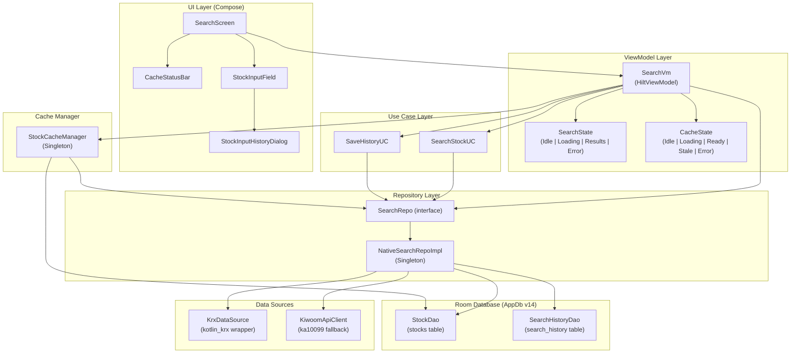

# Search Feature - Porting Specification

**Document Version**: 1.0
**Date**: 2026-02-23
**Feature**: Stock Search (종목 검색)
**Source Module**: `feature/search/`
**Target**: Any Android platform implementing equivalent stock search functionality

---

## Table of Contents

1. [Feature Overview](#1-feature-overview)
2. [Architecture Diagram](#2-architecture-diagram)
3. [Domain Models](#3-domain-models)
4. [Repository Contract](#4-repository-contract)
5. [Use Cases](#5-use-cases)
6. [ViewModel and State Management](#6-viewmodel-and-state-management)
7. [Data Flow](#7-data-flow)
8. [Cache Management](#8-cache-management)
9. [Database Schema](#9-database-schema)
10. [API Reference](#10-api-reference)
11. [UI Component Specification](#11-ui-component-specification)
12. [Configuration Constants](#12-configuration-constants)
13. [Dependency Injection Wiring](#13-dependency-injection-wiring)
14. [Error Handling](#14-error-handling)
15. [Edge Cases](#15-edge-cases)
16. [Sample Data](#16-sample-data)

---

## 1. Feature Overview

The Search feature allows users to find KRX-listed stocks by Korean name or 6-digit ticker code. It is the entry point for all per-stock analysis in the application.

### 1.1 Functional Requirements

| Requirement | Detail |
|---|---|
| Query targets | Stock name (Korean) or ticker code (6-digit numeric string) |
| Debounce | 500 ms after last keystroke before search executes |
| Minimum query length | Queries shorter than 2 characters execute cache-only search; no API call is made |
| Market filter | Results restricted to KOSPI and KOSDAQ; ETN, ETF, and other derivatives are excluded |
| Result limit | Maximum 50 results returned |
| Cache-first | Local Room database is always checked before calling any remote API |
| Search history | Up to 50 entries persisted in Room; most recent 20 displayed in UI |
| Cache status bar | Shows loaded stock count; manual refresh button with 30-second cooldown |
| Data source strategy | KRX direct API is primary; Kiwoom REST API (ka10099) is fallback |

### 1.2 Non-Functional Requirements

| Requirement | Detail |
|---|---|
| Stock cache TTL | 24 hours (`AppConfig.STOCK_CACHE_TTL_MS = 86_400_000 ms`) |
| Max cached stocks | 10,000 (`AppConfig.MAX_STOCK_CACHE_SIZE`) |
| Max search results | 50 (`AppConfig.MAX_SEARCH_RESULTS`) |
| Max history entries | 50 (`AppConfig.MAX_HISTORY_COUNT`) |
| Refresh cooldown | 30 seconds (`REFRESH_COOLDOWN_MS = 30_000 ms` in `StockCacheManager`) |
| Stock list load timeout | 120 seconds (`AppConfig.STOCK_LIST_TIMEOUT_MS`) |
| API rate-limit interval | 500 ms minimum between calls (`AppConfig.API_RATE_LIMIT_MS`) |

---

## 2. Architecture Diagram



---

## 3. Domain Models

### 3.1 `Stock`

**File**: `feature/search/domain/model/Stock.kt`

```kotlin
data class Stock(
    val ticker: String,  // 6-digit KRX ticker, e.g. "005930"
    val name: String,    // Korean company name, e.g. "삼성전자"
    val market: Market   // Enum: KOSPI, KOSDAQ, OTHER
)
```

**Constraints**:
- `ticker` is always a non-null, non-blank string. The KRX format is a zero-padded 6-digit numeric string.
- `name` is non-null and non-blank.
- `market` is never null; unmapped raw market strings resolve to `Market.OTHER`.

### 3.2 `Market`

**File**: `feature/search/domain/model/Stock.kt`

```kotlin
enum class Market {
    KOSPI, KOSDAQ, OTHER;

    companion object {
        fun fromString(value: String): Market = when (value.uppercase()) {
            "KOSPI"  -> KOSPI
            "KOSDAQ" -> KOSDAQ
            else     -> OTHER
        }
    }
}
```

**Note**: `fromString` performs an exact case-insensitive match on the stored enum name. It does NOT handle Korean variants such as "거래소" or "코스닥". Korean-to-enum conversion is performed exclusively inside `NativeSearchRepoImpl.normalizeMarketName()` before values are persisted (see Section 6.3).

### 3.3 `StockDto` (API Transfer Object)

**File**: `feature/search/domain/model/Stock.kt`

```kotlin
@Serializable
data class StockDto(
    val ticker: String,
    val name: String,
    val market: String  // Raw string from API, e.g. "거래소", "코스닥"
) {
    fun toDomain(): Stock = Stock(
        ticker = ticker,
        name   = name,
        market = Market.fromString(market)
    )
}
```

### 3.4 `SearchError`

**File**: `feature/search/domain/model/Stock.kt`

```kotlin
@Serializable
data class SearchError(
    val code: String,
    val msg: String
)
```

### 3.5 `StockEntity` (Room Entity)

**File**: `core/db/entity/StockEntity.kt`

```kotlin
@Entity(
    tableName = "stocks",
    indices = [
        Index(value = ["name"]),
        Index(value = ["market"])
    ]
)
data class StockEntity(
    @PrimaryKey val ticker: String,
    val name: String,
    val market: String,           // Stored as enum name: "KOSPI", "KOSDAQ", "OTHER"
    val updatedAt: Long = System.currentTimeMillis()
)
```

**Conversion**:

| Direction | Expression |
|---|---|
| `StockEntity` -> `Stock` | `Stock(ticker, name, Market.fromString(market))` |
| `Stock` -> `StockEntity` | `StockEntity(ticker, name, market.name, System.currentTimeMillis())` |

### 3.6 `SearchHistoryEntity` (Room Entity)

**File**: `core/db/entity/StockEntity.kt`

```kotlin
@Entity(tableName = "search_history")
data class SearchHistoryEntity(
    @PrimaryKey(autoGenerate = true) val id: Int = 0,
    val ticker: String,
    val name: String,
    val searchedAt: Long = System.currentTimeMillis()
)
```

**Conversion to domain**: History entries are converted to `Stock` with `market = Market.OTHER` because the history table does not store market information.

---

## 4. Repository Contract

**File**: `feature/search/domain/repo/SearchRepo.kt`

```kotlin
interface SearchRepo {

    // Section 5.1 - Primary search. Uses DB cache if populated; calls API otherwise.
    suspend fun search(query: String): Result<List<Stock>>

    // Section 5.2 - Fetches entire stock list from KRX (primary) or Kiwoom (fallback).
    // Persists results to the stocks table.
    suspend fun getAll(): Result<List<Stock>>

    // Section 5.3 - Reactive history stream ordered by searchedAt DESC, limit 20.
    fun getHistory(): Flow<List<Stock>>

    // Section 5.4 - Insert or replace history entry; trim to 50 entries.
    suspend fun saveHistory(stock: Stock)

    // Section 5.5 - Delete all rows from search_history table.
    suspend fun clearHistory()

    // Section 5.6 - Convenience wrapper: search() mapped to empty list on failure.
    suspend fun searchForSuggestions(query: String): List<Stock>

    // Section 5.7 - Returns true when the stocks table contains at least one row.
    suspend fun isCacheAvailable(): Boolean

    // Section 5.8 - Returns COUNT(*) from the stocks table.
    suspend fun getCacheCount(): Int

    // Section 5.9 - DB-only search; never calls any remote API.
    suspend fun searchCacheOnly(query: String): Result<List<Stock>>
}
```

---

## 5. Use Cases

### 5.1 `SearchStockUC`

**File**: `feature/search/domain/usecase/SearchStockUC.kt`

**Signature**:
```kotlin
class SearchStockUC @Inject constructor(private val repo: SearchRepo) {
    suspend operator fun invoke(query: String): Result<List<Stock>>
}
```

**Business Logic**:

1. Trim leading/trailing whitespace from `query`.
2. If `trimmed.isBlank()` -> return `Result.failure(IllegalArgumentException("검색어를 입력하세요"))`.
3. If `trimmed.length < AppConfig.MIN_SEARCH_QUERY_LENGTH` (< 2) -> return `repo.searchCacheOnly(trimmed)`.
4. Otherwise -> return `repo.search(trimmed)`.

**Purpose**: Centralises the minimum-query-length guard so that `SearchVm` does not need to duplicate the logic.

### 5.2 `SaveHistoryUC`

**File**: `feature/search/domain/usecase/SearchStockUC.kt`

**Signature**:
```kotlin
class SaveHistoryUC @Inject constructor(private val repo: SearchRepo) {
    suspend operator fun invoke(stock: Stock)
}
```

**Business Logic**: Delegates directly to `repo.saveHistory(stock)`. The trim-to-50 logic lives in the repository implementation.

---

## 6. Repository Implementation

**File**: `feature/search/data/repo/NativeSearchRepoImpl.kt`
**Scope**: `@Singleton`

### 6.1 `search(query: String): Result<List<Stock>>`

**Inputs**: Non-blank trimmed query string (enforced by `SearchStockUC`).
**Output**: `Result.success(List<Stock>)` - up to 50 matches; or `Result.failure(ApiError)`.

**Algorithm**:

```
count = stockDao.count()
IF count > 0:
    filtered = stockDao.searchByQuery(query, ["KOSPI","KOSDAQ"], limit=50)
    IF filtered.isNotEmpty():
        RETURN Result.success(filtered.map { it.toDomain() })
// Cache miss or empty result: call Kiwoom API
config = getApiConfig()          // throws ApiError.NoApiKeyError if keys missing
apiClient.call(
    apiId  = "ka10099",
    url    = "/api/dostk/stkinfo",
    body   = {"mrkt_tp": "0"},
    ...
) { responseJson ->
    parseStockListResponse(responseJson, query)
}
```

**Note**: Results obtained from the API path in `search()` are NOT persisted to DB. Persistence only happens in `getAll()` (triggered by `StockCacheManager`).

### 6.2 `getAll(): Result<List<Stock>>`

**Output**: `Result.success(List<Stock>)` - filtered to KOSPI/KOSDAQ; or `Result.failure`.

**Algorithm (KRX-First)**:

```
Step 1 - KRX primary:
    today = LocalDate.now().format("yyyyMMdd")
    krxResult = krxDataSource.getTickerList(today, Market.ALL)
    IF krxResult.isSuccess AND stocks.isNotEmpty():
        filter to KOSPI/KOSDAQ via normalizeMarketName()
        stockDao.insertAll(stocks.map { it.toEntity() })
        RETURN Result.success(stocks)

Step 2 - Kiwoom fallback:
    config = getApiConfig()
    apiClient.call(apiId="ka10099", url="/api/dostk/stkinfo", body={"mrkt_tp":"0"}) { json ->
        parseAllStocksResponse(json)   // filters to KOSPI/KOSDAQ, no query filter
    }
    ON SUCCESS: stockDao.insertAll(stocks.map { it.toEntity() })
    RETURN result
```

### 6.3 `normalizeMarketName(marketName: String): Market`

**Purpose**: Converts raw Korean and English market name strings from both KRX and Kiwoom APIs into the `Market` enum. This is the single authoritative mapping function.

**Signature**:
```kotlin
private fun normalizeMarketName(marketName: String): Market
```

**Mapping Table**:

| Input pattern | Output |
|---|---|
| Contains "거래소" | `Market.KOSPI` |
| Contains "코스피" | `Market.KOSPI` |
| Contains "KOSPI" (case-insensitive) | `Market.KOSPI` |
| Contains "코스닥" | `Market.KOSDAQ` |
| Contains "KOSDAQ" (case-insensitive) | `Market.KOSDAQ` |
| Empty string | `Market.OTHER` |
| Anything else (ETN, ETF, KONEX, etc.) | `Market.OTHER` |

**Implementation**:
```kotlin
private fun normalizeMarketName(marketName: String): Market {
    if (marketName.isEmpty()) return Market.OTHER
    val nameUpper = marketName.uppercase()
    return when {
        marketName.contains("거래소") || marketName.contains("코스피") ||
            nameUpper.contains("KOSPI")  -> Market.KOSPI
        marketName.contains("코스닥") ||
            nameUpper.contains("KOSDAQ") -> Market.KOSDAQ
        else                             -> Market.OTHER
    }
}
```

**Critical**: Both `parseStockListResponse` and `parseAllStocksResponse` discard any stock where `market.name !in DEFAULT_MARKETS` (`DEFAULT_MARKETS = setOf("KOSPI", "KOSDAQ")`).

### 6.4 `saveHistory(stock: Stock)`

```
historyDao.deleteByTicker(stock.ticker)   // Remove duplicate if exists
historyDao.insert(SearchHistoryEntity(ticker, name, System.currentTimeMillis()))
historyDao.trimToSize(50)                 // Remove oldest beyond 50
```

### 6.5 `searchCacheOnly(query: String): Result<List<Stock>>`

```
IF stockDao.count() == 0:
    RETURN Result.success(emptyList())
filtered = stockDao.searchByQuery(query, ["KOSPI","KOSDAQ"], limit=AppConfig.MAX_SEARCH_RESULTS)
RETURN Result.success(filtered.map { it.toDomain() })
```

### 6.6 `getApiConfig(): ApiConfig`

Reads API key config from `SettingsRepo`. Throws `ApiError.NoApiKeyError` if `config.isValid()` returns false. Selects base URL based on `InvestmentMode`:

| Mode | Base URL |
|---|---|
| `MOCK` | `https://mockapi.kiwoom.com` |
| `PRODUCTION` | `https://api.kiwoom.com` |

---

## 7. ViewModel and State Management

### 7.1 `SearchState`

**File**: `feature/search/ui/SearchVm.kt`

```kotlin
sealed class SearchState {
    data object Idle    : SearchState()
    data object Loading : SearchState()
    data class Results(val stocks: List<Stock>) : SearchState()
    data class Error(val code: String, val msg: String) : SearchState()
}
```

**State transitions**:

```
Idle
 |-- onQueryChange(blank)            -> Idle
 |-- onQueryChange(non-blank)        -> debounce 500ms -> Loading -> Results | Error
 |-- clearSearch()                   -> Idle

Loading
 |-- searchUC success, stocks > 0   -> Results(stocks)
 |-- searchUC success, stocks == 0  -> Results(emptyList)
 |-- searchUC failure               -> Error(code="SEARCH_ERROR", msg=e.message)

Error
 |-- retry()                        -> Loading (re-executes last query)
```

### 7.2 `CacheState`

**File**: `core/cache/StockCacheManager.kt`

```kotlin
sealed class CacheState {
    data object Idle                     : CacheState()
    data object Loading                  : CacheState()
    data class Ready(val count: Int)     : CacheState()
    data class Stale(val count: Int)     : CacheState()
    data class Error(val message: String): CacheState()
}
```

| State | Condition |
|---|---|
| `Idle` | Initial state; no check performed yet |
| `Loading` | `refreshCache()` is in progress |
| `Ready(count)` | Cache populated and within TTL |
| `Stale(count)` | Cache populated but older than 24-hour TTL |
| `Error(message)` | API call failed; user-friendly message stored |

### 7.3 `SearchVm` StateFlows

**File**: `feature/search/ui/SearchVm.kt`
**Scope**: `@HiltViewModel`

| Flow | Type | Initial Value | Description |
|---|---|---|---|
| `state` | `StateFlow<SearchState>` | `Idle` | Current search operation state |
| `query` | `StateFlow<String>` | `""` | Current text field content |
| `history` | `StateFlow<List<Stock>>` | `emptyList()` | Recent 20 history entries |
| `cacheCount` | `StateFlow<Int>` | `0` | COUNT(*) from stocks table |
| `cacheState` | `StateFlow<CacheState>` | delegated from `StockCacheManager.state` | Cache status for UI bar |
| `isRefreshAvailable` | `StateFlow<Boolean>` | `true` | Whether refresh button is enabled |
| `refreshCooldownSec` | `StateFlow<Int>` | `0` | Seconds remaining in cooldown |

### 7.4 `SearchVm` Public Functions

#### `onQueryChange(newQuery: String)`

```
_query.value = newQuery
IF newQuery.isBlank():
    _state.value = Idle
    RETURN
searchJob?.cancel()
searchJob = launch {
    delay(AppConfig.SEARCH_DEBOUNCE_MS)  // 500ms
    search(newQuery)
}
```

#### `search(query: String = _query.value)`

```
IF query.isBlank():
    _state.value = Idle
    RETURN
_state.value = Loading
searchUC(query)
    .onSuccess { stocks ->
        _state.value = Results(stocks)   // stocks may be empty list
    }
    .onFailure { e ->
        _state.value = Error("SEARCH_ERROR", e.message ?: "검색 실패")
    }
```

#### `onStockSelected(stock: Stock)`

```
selectedStockManager.select(stock)   // Notifies Analysis/Indicator screens
launch { saveHistoryUC(stock) }
```

#### `refreshCache()`

```
IF NOT cacheManager.isRefreshAvailable():
    startCooldownTimer()
    RETURN
cacheManager.refreshCache()
    .onSuccess { _cacheCount.value = repo.getCacheCount(); startCooldownTimer() }
    .onFailure { e ->
        IF e is RefreshCooldownException: startCooldownTimer()
    }
```

#### `startCooldownTimer()`

```
_isRefreshAvailable.value = false
LOOP every 1 second:
    remaining = cacheManager.getRemainingCooldownSec()
    _refreshCooldownSec.value = remaining
    IF remaining <= 0:
        _isRefreshAvailable.value = true
        EXIT LOOP
```

#### `clearSearch()`

```
searchJob?.cancel()
_query.value = ""
_state.value = Idle
```

#### `retry()`

Calls `search()` with the current `_query.value`.

---

## 8. Cache Management

**File**: `core/cache/StockCacheManager.kt`
**Scope**: `@Singleton`

### 8.1 `initializeIfNeeded(): Result<Int>`

Called on app startup when a blocking wait for fresh data is acceptable.

```
count = stockDao.count()
lastUpdated = stockDao.lastUpdated() ?: 0L
cacheAge = now - lastUpdated

IF count > 0 AND cacheAge < STOCK_CACHE_TTL (24h):
    _state.value = Ready(count)
    RETURN Result.success(count)

RETURN refreshCache(bypassCooldown = true)
```

### 8.2 `initializeLazy(): Result<CacheStats>`

Called on app startup when startup latency must be minimised.

```
count = stockDao.count()
isStale = (now - lastUpdated) > STOCK_CACHE_TTL

IF count > 0:
    _state.value = Stale(count) OR Ready(count)
    RETURN Result.success(CacheStats(count, lastUpdated, isStale))

// Only reaches API when NO cache exists at all
RETURN refreshCache(bypassCooldown = true).map { CacheStats(...) }
```

### 8.3 `refreshCache(bypassCooldown: Boolean = false): Result<Int>`

```
IF NOT bypassCooldown:
    elapsed = now - lastRefreshAttempt
    IF elapsed < 30_000ms:
        RETURN Result.failure(RefreshCooldownException("${remaining}초"))
    lastRefreshAttempt = now

_state.value = Loading

stocks = searchRepo.getAll()
ON SUCCESS:
    entities = stocks.map { StockEntity(ticker, name, market.name, now) }
    // Apply size limit (MAX_STOCK_CACHE_SIZE = 10_000)
    IF entities.size > 10_000:
        sort by market priority (KOSPI=0, KOSDAQ=1, OTHER=2), then by name ASC
        take first 10_000
    stockDao.smartSync(limitedStocks)
    count = stockDao.count()
    _state.value = Ready(count)
    RETURN Result.success(count)
ON FAILURE:
    _state.value = Error(mapErrorToUserMessage(e.message))
    RETURN Result.failure(e)
```

### 8.4 `smartSync(stocks: List<StockEntity>)`

**File**: `core/db/dao/StockDao.kt`

Implemented as a `@Transaction` function on the DAO:

```
stockDao.insertAll(stocks)                     // OnConflictStrategy.REPLACE = upsert
activeTickers = stocks.map { it.ticker }.toSet()
allTickers = stockDao.getAllTickers()
inactive = allTickers.filter { it !in activeTickers }
IF inactive.isNotEmpty():
    inactive.chunked(500).forEach { batch ->
        stockDao.deleteByTickers(batch)        // Avoids SQLite IN-clause variable limit
    }
```

**Effect**: Active stocks are upserted; delisted stocks are removed in batches of 500.

### 8.5 Error Message Mapping

`mapErrorToUserMessage(errorMessage: String?): String` in `StockCacheManager`:

| Error pattern | User-facing message (Korean) |
|---|---|
| `AuthError`, `인증에 실패`, `App Key`, `Secret Key` | API 키 인증에 실패했습니다. 설정에서 올바른 API 키를 입력해주세요. |
| `Network error`, `네트워크`, `timeout` | 네트워크 연결에 실패했습니다. 인터넷 연결을 확인해주세요. |
| `not initialized`, `NotInitialized`, `NoApiKey` | API 키가 설정되지 않았습니다. 설정에서 API 키를 입력해주세요. |
| `Rate limit`, `429` | API 호출 한도를 초과했습니다. 잠시 후 다시 시도해주세요. |
| Anything else | Raw error message |
| `null` | 알 수 없는 오류가 발생했습니다. |

---

## 9. Database Schema

**Database**: `AppDb` (Room, version 14, file: `stock_app.db`)

### 9.1 `stocks` Table

```sql
CREATE TABLE IF NOT EXISTS stocks (
    ticker    TEXT    NOT NULL,
    name      TEXT    NOT NULL,
    market    TEXT    NOT NULL,   -- "KOSPI", "KOSDAQ", or "OTHER"
    updatedAt INTEGER NOT NULL,   -- Unix epoch milliseconds
    PRIMARY KEY (ticker)
);

CREATE INDEX IF NOT EXISTS index_stocks_name   ON stocks (name);
CREATE INDEX IF NOT EXISTS index_stocks_market ON stocks (market);
```

**Key queries used by Search**:

```sql
-- Search (Section 6.1, 6.5)
SELECT * FROM stocks
WHERE (name LIKE '%' || :query || '%' OR ticker LIKE '%' || :query || '%')
  AND market IN (:markets)
LIMIT :limit;

-- Count (Section 8.3)
SELECT COUNT(*) FROM stocks;

-- Last updated timestamp (Section 8.1)
SELECT MAX(updatedAt) FROM stocks;

-- All tickers for smartSync diff (Section 8.4)
SELECT ticker FROM stocks;
```

### 9.2 `search_history` Table

```sql
CREATE TABLE IF NOT EXISTS search_history (
    id         INTEGER NOT NULL,
    ticker     TEXT    NOT NULL,
    name       TEXT    NOT NULL,
    searchedAt INTEGER NOT NULL,   -- Unix epoch milliseconds
    PRIMARY KEY (id AUTOINCREMENT)
);
```

**Key queries used by Search**:

```sql
-- Read recent history (Section 4 - getHistory)
SELECT * FROM search_history ORDER BY searchedAt DESC LIMIT 20;

-- Delete existing entry for same ticker before insert (Section 6.4)
DELETE FROM search_history WHERE ticker = :ticker;

-- Trim to most recent 50 entries (Section 6.4)
DELETE FROM search_history
WHERE id NOT IN (
    SELECT id FROM search_history ORDER BY searchedAt DESC LIMIT 50
);
```

---

## 10. API Reference

### 10.1 KRX Direct API (Primary)

**Library**: `kotlin_krx` (Gradle submodule `:krxkt`)
**Wrapper**: `KrxDataSource` (`core/krx/KrxDataSource.kt`)
**Network requirement**: Korean network or VPN access to `data.krx.co.kr`
**Authentication**: None required

**Call used by Search**:

```kotlin
krxDataSource.getTickerList(date: String, market: Market = Market.ALL): Result<List<TickerInfo>>
```

| Parameter | Value | Description |
|---|---|---|
| `date` | `"YYYYMMDD"` (today) | Reference trading date |
| `market` | `Market.ALL` | Returns all markets; filtered to KOSPI/KOSDAQ in repo |

**`TickerInfo` fields used**:

| Field | Type | Example | Notes |
|---|---|---|---|
| `ticker` | `String` | `"005930"` | KRX ticker code |
| `name` | `String` | `"삼성전자"` | Company name |
| `marketName` | `String` | `"거래소"` or `"코스닥"` | Raw market string; passed to `normalizeMarketName()` |

**Error handling**: `KrxError` is caught and wrapped in `Result.failure`. On any failure, `getAll()` falls through to Kiwoom.

### 10.2 Kiwoom REST API (Fallback for `getAll`) and (Fallback for `search`)

**API ID**: `ka10099`
**Endpoint**: `POST /api/dostk/stkinfo`
**Authentication**: `appKey` + `secretKey` headers (set by `KiwoomApiClient`)

**Request body**:

```json
{
  "mrkt_tp": "0"
}
```

| Field | Value | Description |
|---|---|---|
| `mrkt_tp` | `"0"` | Market type: 0 = All markets |

**Response structure**:

```json
{
  "return_code": 0,
  "return_msg": "정상",
  "list": [
    {
      "code": "005930",
      "name": "삼성전자",
      "marketName": "거래소"
    },
    {
      "code": "000660",
      "name": "SK하이닉스",
      "marketName": "거래소"
    },
    {
      "code": "035720",
      "name": "카카오",
      "marketName": "코스닥"
    }
  ]
}
```

**Kotlin model** (`StockListResponse` / `StockListItem`):

```kotlin
@Serializable
data class StockListResponse(
    @SerialName("return_code") val returnCode: Int = 0,
    @SerialName("return_msg")  val returnMsg: String? = null,
    @SerialName("list")        val stkList: List<StockListItem>? = null
)

@Serializable
data class StockListItem(
    @SerialName("code")       val stkCd: String? = null,
    @SerialName("name")       val stkNm: String? = null,
    @SerialName("marketName") val mrktNm: String? = null
)
```

**Error response**:

```json
{
  "return_code": -1,
  "return_msg": "인증에 실패했습니다"
}
```

When `return_code != 0`, the parser throws `ApiError.ApiCallError(returnCode, returnMsg)`.

**Field nullability**: All `StockListItem` fields are nullable. Items where `stkCd` or `stkNm` is null are dropped via `mapNotNull`.

### 10.3 API Endpoint Constants

**File**: `core/stock/api/StockApiModels.kt`

```kotlin
object StockApiIds {
    const val STOCK_LIST = "ka10099"
}

object StockApiEndpoints {
    const val STOCK_LIST = "/api/dostk/stkinfo"
}
```

---

## 11. UI Component Specification

### 11.1 `SearchScreen`

**File**: `feature/search/ui/SearchScreen.kt`
**Composable signature**:

```kotlin
@Composable
fun SearchScreen(
    onStockClick: (String) -> Unit,   // Called with ticker when user selects a stock
    viewModel: SearchVm = hiltViewModel()
)
```

**Layout structure** (Scaffold):

```
TopAppBar
  title = "종목 검색"
  actions = ThemeToggleButton

Column (fillMaxSize, padding 16dp)
  CacheStatusBar
  Spacer(8dp)
  StockInputField
  [CONDITIONAL] Spacer(16dp) + ErrorCard        -- when state is Error
  [CONDITIONAL] Spacer(32dp) + "검색 결과가 없습니다" -- when Results(emptyList) and query.isNotBlank
  [CONDITIONAL] Spacer(32dp) + "종목명 또는 코드를 검색하세요" -- when Idle and history.isEmpty
```

### 11.2 `CacheStatusBar`

**File**: `feature/search/ui/SearchScreen.kt` (private composable)

**Composable signature**:

```kotlin
@Composable
private fun CacheStatusBar(
    cacheState: CacheState,
    cacheCount: Int,
    isRefreshAvailable: Boolean,
    cooldownSec: Int,
    onRefresh: () -> Unit
)
```

**Layout**: `Row(fillMaxWidth, SpaceBetween)`

**Left side** - text based on `CacheState`:

| State | Display Text | Color |
|---|---|---|
| `Idle` + `cacheCount > 0` | "종목 {cacheCount} 개 로드됨" | `onSurfaceVariant` |
| `Idle` + `cacheCount == 0` | "종목 데이터 없음" | `error` |
| `Loading` | CircularProgressIndicator (16dp) + "종목 데이터 로딩 중..." | `onSurfaceVariant` |
| `Ready(count)` | "종목 {count} 개 로드됨" | `primary` |
| `Stale(count)` | "종목 {count} 개 (오래됨)" | `tertiary` |
| `Error(message)` | "로딩 실패: {message}" | `error` |

**Right side** - `OutlinedButton` (height 32dp):
- Hidden while `cacheState is Loading`
- Enabled when `isRefreshAvailable == true`; label text = "새로고침"
- Disabled when `isRefreshAvailable == false`; label text = "{cooldownSec}초"

### 11.3 `StockInputField` (Stateless variant)

**File**: `core/ui/component/stockinput/StockInputField.kt`

**Composable signature**:

```kotlin
@Composable
fun StockInputField(
    value: String,
    onValueChange: (String) -> Unit,
    suggestions: List<Stock>,
    onSelect: (Stock) -> Unit,
    modifier: Modifier = Modifier,
    enabled: Boolean = true,
    isLoading: Boolean = false,
    placeholder: String = "종목명 또는 코드 검색",
    history: List<Stock> = emptyList(),
    onHistorySelect: ((Stock) -> Unit)? = null,
    onHistoryClick: (() -> Unit)? = null,
    colors: StockInputColors = StockInputDefaults.colors(),
    shape: Shape = StockInputDefaults.shape
)
```

**Sub-components**:

1. `OutlinedTextField` (singleLine):
   - Leading icon: `CircularProgressIndicator` (24dp, strokeWidth 2dp) when `isLoading`; otherwise `Icons.Default.Search`
   - Trailing icon: `Icons.Default.Clear` when `value.isNotEmpty()`; `Icons.Default.History` when `value.isEmpty() && history.isNotEmpty()`
   - Tapping History icon triggers `StockInputHistoryDialog` if no `onHistoryClick` override is provided

2. Dropdown `Card` (shown when `suggestions.isNotEmpty() && value.isNotBlank()`):
   - `LazyColumn` with `heightIn(max = 300dp)`
   - Each item: `SuggestionItem` (name, ticker, `MarketBadge`)
   - `HorizontalDivider` between items (not after last item)
   - `testTag("suggestions_dropdown")` applied to the dropdown Card

**`MarketBadge` colour mapping**:

| Market | Text | Container color |
|---|---|---|
| `KOSPI` | "KOSPI" | `primary.copy(alpha = 0.1f)` |
| `KOSDAQ` | "KOSDAQ" | `secondary.copy(alpha = 0.1f)` |
| `OTHER` | "기타" | `tertiary.copy(alpha = 0.1f)` |

### 11.4 `StockInputField` (Stateful variant)

Wraps `StockInputState` to provide a self-contained debounced search component. Primarily used in screens other than `SearchScreen` (e.g., inside `StockAnalysisScreen`).

```kotlin
@Composable
fun StockInputField(
    state: StockInputState,
    onSelect: (Stock) -> Unit,
    ...
)
```

### 11.5 `StockInputState`

**File**: `core/ui/component/stockinput/state/StockInputState.kt`

```kotlin
@Stable
class StockInputState(
    initialValue: String = "",
    private val debounceMs: Long = 300L,   // Note: 300ms in StockInputState vs 500ms in SearchVm
    private val onSearch: suspend (String) -> List<Stock>,
    private val scope: CoroutineScope
)
```

**Important**: `StockInputState` uses a 300 ms debounce independent of `SearchVm`. When `StockInputField` is used inside `SearchVm`, the ViewModel itself applies the 500 ms debounce (via `AppConfig.SEARCH_DEBOUNCE_MS`), not `StockInputState`.

**Public API**:

| Function | Effect |
|---|---|
| `onValueChange(newValue)` | Updates `_value`; cancels prior search job; launches new debounced search |
| `onSelect(stock)` | Sets `_value = stock.name`; clears suggestions; sets `_selectedStock` |
| `clear()` | Resets all state to initial values |

### 11.6 `StockInputHistoryDialog`

**File**: `core/ui/component/stockinput/StockInputHistoryDialog.kt`

`AlertDialog` showing `List<Stock>` history items. Each item displays a history icon, name, and ticker. Tapping an item calls `onSelect(stock)`.

```kotlin
@Composable
fun StockInputHistoryDialog(
    history: List<Stock>,
    onDismiss: () -> Unit,
    onSelect: (Stock) -> Unit,
    title: String = "최근 검색",
    emptyMessage: String = "검색 기록이 없습니다",
    confirmButtonText: String = "닫기"
)
```

### 11.7 `StockInputColors`

**File**: `core/ui/component/stockinput/StockInputDefaults.kt`

```kotlin
@Immutable
data class StockInputColors(
    val containerColor: Color,
    val focusedContainerColor: Color,
    val textColor: Color,
    val placeholderColor: Color,
    val iconColor: Color,
    val focusedBorderColor: Color,
    val unfocusedBorderColor: Color,
    val dropdownContainerColor: Color,
    val dropdownElevation: Dp        // Default: 8.dp
)
```

Default values mirror `MaterialTheme.colorScheme` surface/primary/outline tokens.

---

## 12. Configuration Constants

**File**: `core/config/AppConfig.kt`

| Constant | Value | Used In |
|---|---|---|
| `MAX_STOCK_CACHE_SIZE` | `10_000` | `StockCacheManager.refreshCache()` truncation |
| `MAX_HISTORY_COUNT` | `50` | `SearchHistoryDao.trimToSize()` |
| `DEFAULT_TIMEOUT_MS` | `30_000L` | General API timeout |
| `STOCK_LIST_TIMEOUT_MS` | `120_000L` | `getAll()` timeout |
| `SEARCH_DEBOUNCE_MS` | `500L` | `SearchVm.onQueryChange()` delay |
| `MIN_SEARCH_QUERY_LENGTH` | `2` | `SearchStockUC` cache-only threshold |
| `MAX_SEARCH_RESULTS` | `50` | `StockDao.searchByQuery()` limit |
| `STOCK_CACHE_TTL_MS` | `86_400_000L` (24 h) | `StockCacheManager.initializeIfNeeded()` |
| `API_RATE_LIMIT_MS` | `500L` | `KiwoomApiClient` rate limiting |

**File**: `core/cache/StockCacheManager.kt` (file-level constant)

| Constant | Value | Used In |
|---|---|---|
| `REFRESH_COOLDOWN_MS` | `30_000L` | `refreshCache()` cooldown guard |

**File**: `core/config/FeatureFlags.kt`

| Flag | Default | Effect |
|---|---|---|
| `USE_KRX_DATA_SOURCE` | `true` | Enables KRX-First strategy in `getAll()` |
| `ENABLE_REALTIME_SUPPLY` | `true` | Unrelated to Search; controls realtime supply feature |

---

## 13. Dependency Injection Wiring

**File**: `feature/search/di/SearchModule.kt`

```kotlin
@Module
@InstallIn(SingletonComponent::class)
abstract class SearchModule {
    @Binds @Singleton
    abstract fun bindSearchRepo(impl: NativeSearchRepoImpl): SearchRepo
}
```

`NativeSearchRepoImpl` has the following `@Inject` constructor dependencies:

| Dependency | Scope | Source Module |
|---|---|---|
| `KiwoomApiClient` | Singleton | `core/di/` |
| `KrxDataSource` | Singleton | `core/di/` |
| `SettingsRepo` | Singleton | `feature/settings/di/` |
| `StockDao` | - | Room DAO via `AppDb` |
| `SearchHistoryDao` | - | Room DAO via `AppDb` |
| `Json` (kotlinx.serialization) | Singleton | `core/di/` |

`StockCacheManager` has the following `@Inject` constructor dependencies:

| Dependency | Scope |
|---|---|
| `SearchRepo` | Singleton (bound above) |
| `StockDao` | Room DAO |

`SearchVm` has the following `@Inject` constructor dependencies:

| Dependency |
|---|
| `SearchStockUC` |
| `SaveHistoryUC` |
| `SearchRepo` |
| `StockCacheManager` |
| `SelectedStockManager` |

---

## 14. Error Handling

### 14.1 Error Types

| Error Class | Thrown When | Handled By |
|---|---|---|
| `ApiError.NoApiKeyError` | `getApiConfig()` finds keys missing or invalid | `SearchVm` catches via `Result.failure`; displayed as `SearchState.Error` |
| `ApiError.ApiCallError(code, msg)` | `return_code != 0` in Kiwoom response | Same |
| `RefreshCooldownException` | `refreshCache()` called within 30 s of last attempt | `SearchVm.refreshCache()` starts cooldown timer |
| `KrxError` | KRX HTTP or parsing failure | Caught in `KrxDataSource.safeCall()`; triggers fallback to Kiwoom |
| `CancellationException` | Coroutine cancelled | Always re-thrown; never swallowed |
| `IllegalArgumentException` | Blank query passed to `SearchStockUC` | Returned as `Result.failure` |

### 14.2 Fallback Chain

```
getAll() call sequence:
  1. KrxDataSource.getTickerList(today)
       SUCCESS + non-empty -> persist + return
       FAILURE or empty    -> continue
  2. KiwoomApiClient.call(ka10099)
       SUCCESS             -> persist + return
       FAILURE             -> return Result.failure
```

### 14.3 Error Suppression Policy

- History loading failure in `SearchVm.init` is caught and swallowed; the screen continues with an empty history list. This is intentional because history loading failure is non-critical.
- `searchForSuggestions()` maps any `Result.failure` to an empty list so that the autocomplete dropdown simply shows nothing on error.

---

## 15. Edge Cases

| Scenario | Behaviour |
|---|---|
| Query length exactly 1 character | `SearchStockUC` routes to `searchCacheOnly()`; no API call |
| Query length exactly 2 characters | Full `search()` path executed |
| `search()` called when stocks table is empty | Skips DB step; calls Kiwoom API directly |
| `search()` returns DB rows but none match the query | Falls through to API call (DB check returns empty list) |
| Both KRX and Kiwoom fail in `getAll()` | Returns `Result.failure`; `CacheState.Error` displayed |
| Blank query after debounce fires | `SearchVm.search()` checks blank and sets `Idle` without calling use case |
| User types rapidly within 500 ms window | Each keystroke cancels the prior `searchJob`; only the final character triggers the search |
| `refreshCache()` called twice within 30 s | Second call returns `RefreshCooldownException` immediately; cooldown timer is started/restarted |
| Cache has 11,000 stocks from Kiwoom API | Sorted by market priority (KOSPI first) then name; truncated to 10,000 before `smartSync` |
| Stock previously in cache is delisted | `smartSync` removes its ticker from the stocks table |
| `SearchHistoryEntity` insert for existing ticker | `deleteByTicker` runs first; prevents duplicate history entries |
| History grows beyond 50 entries | `trimToSize(50)` deletes oldest entries after each insert |
| `StockListItem.stkCd` is null | Item dropped by `mapNotNull` in parser |
| `mrktNm` is null | Defaults to `"OTHER"` string before `normalizeMarketName()` |
| KRX network unavailable (no Korean VPN) | `fetchAllFromKrx()` catches exception and returns `Result.failure`; Kiwoom fallback executes |
| `InvestmentMode.MOCK` selected in settings | Base URL switches to `https://mockapi.kiwoom.com`; all Kiwoom calls go to mock server |

---

## 16. Sample Data

### 16.1 Sample `Stock` Domain Objects

```kotlin
Stock(ticker = "005930", name = "삼성전자",      market = Market.KOSPI)
Stock(ticker = "000660", name = "SK하이닉스",    market = Market.KOSPI)
Stock(ticker = "035720", name = "카카오",        market = Market.KOSDAQ)
Stock(ticker = "247540", name = "에코프로비엠",  market = Market.KOSDAQ)
```

### 16.2 Sample `SearchHistoryEntity` Rows

```
id | ticker | name         | searchedAt
---|--------|--------------|--------------------
 1 | 005930 | 삼성전자      | 1740268800000
 2 | 035720 | 카카오        | 1740269100000
 3 | 000660 | SK하이닉스    | 1740269400000
```

### 16.3 Sample `StockEntity` Rows

```
ticker | name        | market | updatedAt
-------|-------------|--------|--------------------
005930 | 삼성전자     | KOSPI  | 1740268800000
000660 | SK하이닉스   | KOSPI  | 1740268800000
035720 | 카카오       | KOSDAQ | 1740268800000
```

### 16.4 Sample Kiwoom API Response (ka10099)

```json
{
  "return_code": 0,
  "return_msg": "정상",
  "list": [
    { "code": "005930", "name": "삼성전자",   "marketName": "거래소" },
    { "code": "000660", "name": "SK하이닉스", "marketName": "거래소" },
    { "code": "035720", "name": "카카오",     "marketName": "코스닥" },
    { "code": "530017", "name": "삼성 레버리지 ETN", "marketName": "ETN" }
  ]
}
```

After `parseAllStocksResponse()`:
- "거래소" -> `Market.KOSPI` (included)
- "코스닥" -> `Market.KOSDAQ` (included)
- "ETN" -> `Market.OTHER` (excluded by `DEFAULT_MARKETS` filter)

### 16.5 Sample `CacheState` Transitions

```
App launch (no cache) -> Idle
refreshCache() starts  -> Loading
API returns 2,847 stocks -> Ready(count=2847)

User presses refresh within 30 s:
  -> RefreshCooldownException
  -> isRefreshAvailable=false, refreshCooldownSec counts down 30..1..0
  -> isRefreshAvailable=true

Cache age exceeds 24 h, initializeLazy() called:
  -> Stale(count=2847)   [existing count shown; no API call made]
```

### 16.6 Sample `SearchState` Transitions

```
User types "삼성":
  -> query = "삼"   -> Idle (blank check passes, debounce cancelled by next keystroke)
  -> query = "삼성" -> debounce 500ms -> Loading
  -> DB returns [삼성전자, 삼성SDI, 삼성바이오로직스, ...]
  -> Results(stocks=[삼성전자, 삼성SDI, ...])

User presses X button:
  -> query = "" -> Idle

User types "X" (1 char, cache is empty):
  -> cache-only search -> Results(emptyList)
  -> UI shows "검색 결과가 없습니다"

API key not configured, user types "삼성":
  -> Loading -> Error(code="SEARCH_ERROR", msg="API 키가 설정되지 않았습니다...")
```

---

## Appendix A: File Manifest

| File Path (relative to `app/src/main/java/com/stockapp/`) | Role |
|---|---|
| `feature/search/domain/model/Stock.kt` | Domain model: `Stock`, `Market`, `StockDto`, `SearchError` |
| `feature/search/domain/repo/SearchRepo.kt` | Repository interface |
| `feature/search/domain/usecase/SearchStockUC.kt` | `SearchStockUC`, `SaveHistoryUC` |
| `feature/search/data/repo/NativeSearchRepoImpl.kt` | Repository implementation (KRX + Kiwoom) |
| `feature/search/ui/SearchVm.kt` | ViewModel + `SearchState` sealed class |
| `feature/search/ui/SearchScreen.kt` | `SearchScreen`, `CacheStatusBar` composables |
| `feature/search/di/SearchModule.kt` | Hilt binding: `SearchRepo` -> `NativeSearchRepoImpl` |
| `core/cache/StockCacheManager.kt` | Cache init, refresh, cooldown, `CacheState` |
| `core/db/dao/StockDao.kt` | Room DAO: stocks table |
| `core/db/dao/SearchHistoryDao.kt` | Room DAO: search_history table |
| `core/db/entity/StockEntity.kt` | `StockEntity`, `SearchHistoryEntity`, `AnalysisCacheEntity`, `IndicatorCacheEntity`, `FinancialCacheEntity` |
| `core/db/AppDb.kt` | Room database definition (v14) and all migrations |
| `core/config/AppConfig.kt` | All numeric constants |
| `core/config/FeatureFlags.kt` | `USE_KRX_DATA_SOURCE`, `ENABLE_REALTIME_SUPPLY` |
| `core/krx/KrxDataSource.kt` | `KrxDataSource` singleton: `kotlin_krx` wrapper |
| `core/krx/DataSourceStrategy.kt` | `DataSourceStrategy` enum (`KRX_FIRST`, `BROKER_FIRST`) |
| `core/stock/api/StockApiModels.kt` | Kiwoom request/response models, `StockApiIds`, `StockApiEndpoints` |
| `core/ui/component/stockinput/StockInputField.kt` | `StockInputField` composable (stateless + stateful) |
| `core/ui/component/stockinput/state/StockInputState.kt` | `StockInputState`, `rememberStockInputState` |
| `core/ui/component/stockinput/StockInputHistoryDialog.kt` | `StockInputHistoryDialog` composable |
| `core/ui/component/stockinput/StockInputDefaults.kt` | `StockInputColors`, `StockInputDefaults` |
