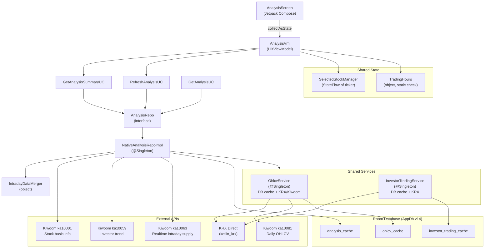

# Supply/Demand Analysis Feature - Porting Specification

**Document version**: 1.0.0
**Source project**: StockApp (Android, Native Kotlin)
**Source branch**: main
**Specification date**: 2026-02-23
**Author**: Technical specification writer (generated from source)

---

## Table of Contents

1. [Feature Overview](#1-feature-overview)
2. [Architecture Diagram](#2-architecture-diagram)
3. [Layer Responsibilities](#3-layer-responsibilities)
4. [Domain Models](#4-domain-models)
5. [Repository Interface](#5-repository-interface)
6. [Data Collection Pipeline](#6-data-collection-pipeline)
7. [Market Cap Calculation](#7-market-cap-calculation)
8. [Rolling Sum Calculation](#8-rolling-sum-calculation)
9. [Intraday Data Integration](#9-intraday-data-integration)
10. [Use Cases](#10-use-cases)
11. [ViewModel and State Management](#11-viewmodel-and-state-management)
12. [Auto-Refresh Logic](#12-auto-refresh-logic)
13. [Oscillator Calculation](#13-oscillator-calculation)
14. [UI Specification](#14-ui-specification)
15. [Chart Specifications](#15-chart-specifications)
16. [Display Formatting](#16-display-formatting)
17. [Unit Conversions](#17-unit-conversions)
18. [Persistence Layer](#18-persistence-layer)
19. [Supporting Services](#19-supporting-services)
20. [Dependency Injection](#20-dependency-injection)
21. [API Contracts](#21-api-contracts)
22. [Error Handling](#22-error-handling)
23. [Configuration Constants](#23-configuration-constants)
24. [Sample Data](#24-sample-data)
25. [Edge Cases](#25-edge-cases)
26. [File Manifest](#26-file-manifest)

---

## 1. Feature Overview

The Supply/Demand Analysis feature displays institutional and foreign investor net-buying data for a selected KRX-listed stock. The screen is navigated to from the Stock Analysis tab (one of four inner tabs inside `StockAnalysisScreen`).

**Core responsibilities**:
- Fetch and display daily supply/demand data for up to 180 trading days.
- Compute a supply ratio and classify it into one of five discrete signals.
- Show a compact metrics card (market cap, foreign net buy, institution net buy, supply ratio).
- Render two charts: a dual-axis Market Cap + Oscillator chart and a grouped bar chart for foreign/institution trends.
- During Korean Stock Exchange (KSE/KRX) trading hours (09:00-15:30 KST), overlay intraday data fetched from the `ka10063` realtime API endpoint.
- Support user-controlled auto-refresh every 60 seconds during trading hours.
- Support pull-to-refresh at any time.
- Cache results for 24 hours in a Room database to minimise repeat network calls.

---

## 2. Architecture Diagram



---

## 3. Layer Responsibilities

| Layer | Class / Object | Package | Responsibility |
|-------|---------------|---------|----------------|
| UI | `AnalysisScreen` | `feature.analysis.ui` | Compose rendering, state consumption, chart display |
| ViewModel | `AnalysisVm` | `feature.analysis.ui` | State machine, auto-refresh timer, trading-hours poll |
| Use Case | `GetAnalysisSummaryUC` | `feature.analysis.domain.usecase` | Orchestrates intraday decision, maps to `AnalysisSummary` |
| Use Case | `GetAnalysisUC` | `feature.analysis.domain.usecase` | Delegates to repo, validates ticker |
| Use Case | `RefreshAnalysisUC` | `feature.analysis.domain.usecase` | Clears cache, then calls `getAnalysis` |
| Repository Interface | `AnalysisRepo` | `feature.analysis.domain.repo` | Contract for data access |
| Repository Impl | `NativeAnalysisRepoImpl` | `feature.analysis.data.repo` | API calls, cache, StockData assembly |
| Merger | `IntradayDataMerger` | `feature.analysis.data.repo` | Prepend / replace today's intraday row |
| Service | `OhlcvService` | `core.stock.data` | OHLCV data with DB cache + KRX-first strategy |
| Service | `InvestorTradingService` | `core.stock.data` | Investor trading data with DB cache + KRX |
| Cache | `AnalysisCacheDao` | `core.db.dao` | CRUD for `analysis_cache` Room table |
| Math | `MathUtil` | `core.stock.calc` | Rolling sum, EMA, SMA utilities |

---

## 4. Domain Models

### 4.1 StockData

Source file: `D:/android_2025/mini_stock/StockApp/app/src/main/java/com/stockapp/feature/analysis/domain/model/StockData.kt`

```kotlin
data class StockData(
    val ticker: String,
    val name: String,
    val dates: List<String>,   // Newest-first. Format "YYYYMMDD"
    val mcap: List<Long>,      // Market cap in 원 (won). Newest-first.
    val for5d: List<Long>,     // 5-day rolling sum of foreign net buying in 백만원. Newest-first.
    val ins5d: List<Long>      // 5-day rolling sum of institution net buying in 백만원. Newest-first.
) {
    // Computed properties (all read from index 0 = latest/newest)

    val latestMcapTrillion: Double
        get() = mcap.firstOrNull()?.let { it / 1_000_000_000_000.0 } ?: 0.0

    val latestFor5dBillion: Double
        get() = for5d.firstOrNull()?.let { it / 100.0 } ?: 0.0  // 백만원 -> 억원

    val latestIns5dBillion: Double
        get() = ins5d.firstOrNull()?.let { it / 100.0 } ?: 0.0  // 백만원 -> 억원

    val latestTotalSupply: Long
        get() = (for5d.firstOrNull() ?: 0L) + (ins5d.firstOrNull() ?: 0L)

    val latestSupplyRatio: Double
        get() {
            val m = mcap.firstOrNull() ?: return 0.0
            if (m == 0L) return 0.0
            return (latestTotalSupply.toDouble() * 1_000_000) / m
            // Multiply by 1_000_000 because for5d/ins5d are in 백만원, mcap is in 원
        }
}
```

**Key invariants**:
- All lists in `StockData` are parallel arrays of the same length.
- Index 0 is the most recent trading day; last index is the oldest.
- An empty `dates` list is valid and represents a stock for which no investor data was found.
- `for5d` and `ins5d` store 백만원 (million KRW); conversion to 억원 (hundred million KRW) is division by 100.
- `mcap` stores raw 원 (KRW).

### 4.2 AnalysisSummary

Source file: same as 4.1.

```kotlin
data class AnalysisSummary(
    val ticker: String,
    val name: String,
    val mcapTrillion: Double,       // 조원. Display unit.
    val for5dBillion: Double,       // 억원. Display unit.
    val ins5dBillion: Double,       // 억원. Display unit.
    val supplyRatio: Double,        // Raw ratio (0.005 = 0.5%). Used for signal and percent display.
    val supplySignal: SupplySignal,
    val dates: List<String>,        // Newest-first. Same as StockData.dates.
    val mcapHistory: List<Double>,  // 조원. Same order as dates.
    val for5dHistory: List<Double>, // 억원. Same order as dates.
    val ins5dHistory: List<Double>, // 억원. Same order as dates.
    val isTradingHours: Boolean = false,
    val lastUpdatedAt: Long = System.currentTimeMillis()  // Epoch ms
)
```

**Conversion from StockData** (via extension function `StockData.toSummary(isTradingHours: Boolean)`):

```kotlin
fun StockData.toSummary(isTradingHours: Boolean = false): AnalysisSummary = AnalysisSummary(
    ticker         = ticker,
    name           = name,
    mcapTrillion   = latestMcapTrillion,
    for5dBillion   = latestFor5dBillion,
    ins5dBillion   = latestIns5dBillion,
    supplyRatio    = latestSupplyRatio,
    supplySignal   = SupplySignal.fromRatio(latestSupplyRatio),
    dates          = dates,
    mcapHistory    = mcap.map { it / 1_000_000_000_000.0 },
    for5dHistory   = for5d.map { it / 100.0 },
    ins5dHistory   = ins5d.map { it / 100.0 },
    isTradingHours = isTradingHours,
    lastUpdatedAt  = System.currentTimeMillis()
)
```

### 4.3 SupplySignal

Source file: same as 4.1.

```kotlin
enum class SupplySignal {
    STRONG_BUY,   // latestSupplyRatio > 0.005  (> 0.5%)
    BUY,          // latestSupplyRatio > 0.002  (> 0.2%)
    NEUTRAL,      // -0.002 <= ratio <= 0.002
    SELL,         // latestSupplyRatio < -0.002 (< -0.2%)
    STRONG_SELL;  // latestSupplyRatio < -0.005 (< -0.5%)

    companion object {
        fun fromRatio(ratio: Double): SupplySignal = when {
            ratio > 0.005  -> STRONG_BUY
            ratio > 0.002  -> BUY
            ratio < -0.005 -> STRONG_SELL
            ratio < -0.002 -> SELL
            else           -> NEUTRAL
        }
    }
}
```

**Signal thresholds** (NEUTRAL is symmetric):

| Signal | Condition |
|--------|-----------|
| STRONG_BUY | ratio > 0.005 |
| BUY | 0.002 < ratio <= 0.005 |
| NEUTRAL | -0.002 <= ratio <= 0.002 |
| SELL | -0.005 <= ratio < -0.002 |
| STRONG_SELL | ratio < -0.005 |

### 4.4 AnalysisState

Source file: `D:/android_2025/mini_stock/StockApp/app/src/main/java/com/stockapp/feature/analysis/ui/AnalysisVm.kt`

```kotlin
sealed class AnalysisState {
    data object NoStock    : AnalysisState()   // No ticker selected
    data object Loading    : AnalysisState()   // Fetching in progress
    data class  Success(val summary: AnalysisSummary) : AnalysisState()
    data class  Error(val code: String, val msg: String) : AnalysisState()
}
```

**Valid state transitions**:

```
NoStock  --[ticker selected]--> Loading
Loading  --[success]----------> Success
Loading  --[failure]----------> Error
Success  --[ticker changed]---> Loading
Success  --[refresh]----------> (isRefreshing=true, state unchanged) -> Success | Error
Error    --[retry]------------> Loading
Success  --[ticker cleared]---> NoStock
```

### 4.5 IntradayInvestorData

Source file: `D:/android_2025/mini_stock/StockApp/app/src/main/java/com/stockapp/feature/analysis/data/repo/IntradayDataMerger.kt`

```kotlin
data class IntradayInvestorData(
    val foreignNetBuy: Long,      // 외국인 순매수 in 백만원
    val institutionNetBuy: Long,  // 기관 순매수 in 백만원
    val timestamp: Long           // System.currentTimeMillis()
)
```

### 4.6 CachedStockData (Serialization DTO)

Source file: `D:/android_2025/mini_stock/StockApp/app/src/main/java/com/stockapp/feature/analysis/data/repo/CachedStockData.kt`

```kotlin
@Serializable
internal data class CachedStockData(
    val ticker: String,
    val name: String,
    val dates: List<String>,
    val mcap: List<Long>,
    val for5d: List<Long>,
    val ins5d: List<Long>
) {
    fun toDomain(): StockData = StockData(ticker, name, dates, mcap, for5d, ins5d)

    companion object {
        fun fromDomain(data: StockData): CachedStockData =
            CachedStockData(data.ticker, data.name, data.dates, data.mcap, data.for5d, data.ins5d)
    }
}
```

This DTO is serialized to JSON (via `kotlinx.serialization`) and stored in the `analysis_cache.data` column.

---

## 5. Repository Interface

Source file: `D:/android_2025/mini_stock/StockApp/app/src/main/java/com/stockapp/feature/analysis/domain/repo/AnalysisRepo.kt`

```kotlin
interface AnalysisRepo {

    /**
     * Get historical supply/demand analysis.
     *
     * Signature  : suspend fun getAnalysis(ticker, days, useCache): Result<StockData>
     * Input      : ticker   - 6-digit KRX stock code (e.g., "005930")
     *              days     - number of calendar days to look back (default 180)
     *              useCache - if true, return cached data when available
     * Output     : Result.success(StockData) on success
     *              Result.failure(ApiError.*) on network/auth failure
     * Business   : Cache-first. If cache miss or useCache=false, executes the full
     *              3-step pipeline (see Section 6). Caches result for 24 h.
     */
    suspend fun getAnalysis(
        ticker: String,
        days: Int = 180,
        useCache: Boolean = true
    ): Result<StockData>

    /**
     * Get analysis with intraday data merged if currently in trading hours.
     *
     * Signature  : suspend fun getAnalysisWithIntraday(ticker, days, useCache): Result<StockData>
     * Input      : same as getAnalysis
     * Output     : Result<StockData> - same as getAnalysis but with today's row
     *              overwritten/prepended using ka10063 data during trading hours
     * Business   : Calls getAnalysis() first. If TradingHours.isTradingHours() is true,
     *              additionally calls ka10063 for foreign and institution intraday data in
     *              parallel, then delegates to IntradayDataMerger.merge(). If the intraday
     *              fetch fails for any reason, returns base data without error propagation
     *              (graceful degradation).
     */
    suspend fun getAnalysisWithIntraday(
        ticker: String,
        days: Int = 180,
        useCache: Boolean = true
    ): Result<StockData>

    /**
     * Read cached StockData for ticker. Returns null if absent or expired (>24 h).
     *
     * Signature  : suspend fun getCachedAnalysis(ticker): StockData?
     */
    suspend fun getCachedAnalysis(ticker: String): StockData?

    /** Delete cache row for ticker. */
    suspend fun clearCache(ticker: String)

    /** Delete all rows from analysis_cache. */
    suspend fun clearAllCache()
}
```

The sole implementation is `NativeAnalysisRepoImpl` (bound by Hilt, `@Singleton`).

---

## 6. Data Collection Pipeline

Source file: `D:/android_2025/mini_stock/StockApp/app/src/main/java/com/stockapp/feature/analysis/data/repo/NativeAnalysisRepoImpl.kt`

The pipeline executes sequentially inside `getAnalysis()`. All steps run inside a single `try/catch` block; a `CancellationException` is re-thrown, all other exceptions become `Result.failure`.

### Step 1: Resolve API Config

```
getApiConfig()
  - reads SettingsRepo.getApiKeyConfig().first()
  - throws ApiError.NoApiKeyError() if appKey or secretKey is blank
  - maps InvestmentMode.MOCK  -> baseUrl = "https://mockapi.kiwoom.com"
  - maps InvestmentMode.PRODUCTION -> baseUrl = "https://api.kiwoom.com"
```

### Step 2: Fetch Stock Basic Info (ka10001)

```
fetchStockInfo(ticker, config)
  Endpoint  : POST {baseUrl}/api/dostk/stkinfo
  API-ID    : ka10001
  Request   : { "stk_cd": ticker }
  Response  : StockInfoResponse
               .stkNm   -> stock name (String, nullable)
               .mac     -> market cap in 억원 (String, may have "+" prefix)
               .floStk  -> floating shares in 천주 (String)

  Mapping:
    name           = stkNm ?: ticker
    marketCap      = mac.toLongSafe()          // strips "+" prefix; unit: 억원
    floatingShares = floStk.toLongSafe() * 1000 // 천주 -> actual shares
```

`toLongSafe()` is a private extension:

```kotlin
private fun String?.toLongSafe(): Long =
    this?.removePrefix("+")?.toLongOrNull() ?: 0L
```

### Step 3: Fetch Investor Trend (KRX-first)

```
Primary path: InvestorTradingService.getInvestorTrading(ticker, days)
  - Returns List<InvestorTradingData> sorted descending by date
  - Values are in 백만원 (million KRW)
  - Data comes from KRX via kotlin_krx library (see Section 19.2)

Fallback path (used when primary returns null or empty):
  fetchInvestorTrend(ticker, days, config)
  Endpoint  : POST {baseUrl}/api/dostk/stkinfo
  API-ID    : ka10059
  Request   : {
                "dt"         : "YYYYMMDD" (today),
                "stk_cd"     : ticker,
                "amt_qty_tp" : "1",    // 금액
                "trde_tp"    : "0",    // 순매수
                "unit_tp"    : "1000"
              }
  Response  : InvestorTrendResponse
               .data (stk_invsr_orgn) -> List<InvestorTrendItem>
                  .dt           -> date "YYYYMMDD"
                  .frgnr_invsr  -> foreignNet Long (백만원)
                  .orgn         -> institutionNet Long (백만원)
                  .ind_invsr    -> individualNet Long (백만원)
                  .mrkt_tot_amt -> marketCap Long (백만원)

  Processing:
    - Filter items where dt is not null
    - Sort descending by date
    - Take first `days` items
```

### Step 4: Fetch OHLCV (KRX-first, optional)

```
OhlcvService.getOhlcv(ticker, days, Period.DAILY)
  - Returns OhlcvData or null on failure
  - Null is acceptable; market cap falls back to API values (see Section 7)
```

### Step 5: Assemble StockData

```
buildStockData(ticker, stockInfo, investorTrend, ohlcvData)
  - See Section 7 for market cap logic
  - See Section 8 for rolling sum logic
```

### Step 6: Cache Result

```
cacheAnalysis(ticker, stockData)
  - Serializes to CachedStockData JSON
  - Inserts AnalysisCacheEntity (REPLACE on conflict)
  - Failure here is logged as warning; does not fail the overall result
```

---

## 7. Market Cap Calculation

Source file: `NativeAnalysisRepoImpl.kt`, method `buildStockData()`.

For each trading date in the investor trend data, market cap is resolved in priority order:

```kotlin
val mcapForDate: Long = when {
    // Priority 1: floatingShares x close price from OHLCV (most accurate)
    shares > 0 && closePrice != null && closePrice > 0 -> {
        val closeLong = closePrice.toLong()
        if (closeLong != 0L && shares > Long.MAX_VALUE / closeLong)
            Long.MAX_VALUE           // Overflow protection
        else
            shares * closeLong
    }

    // Priority 2: mrkt_tot_amt from ka10059 (in 백만원 -> 원)
    trendItem.marketCap > 0 -> {
        if (trendItem.marketCap > Long.MAX_VALUE / 1_000_000)
            Long.MAX_VALUE
        else
            trendItem.marketCap * 1_000_000
    }

    // Priority 3: mac from ka10001 (in 억원 -> 원)
    else -> {
        if (stockInfo.marketCap > Long.MAX_VALUE / 100_000_000)
            Long.MAX_VALUE
        else
            stockInfo.marketCap * 100_000_000
    }
}
```

**Overflow guard rule**: before computing `a * b`, check `a > Long.MAX_VALUE / b`. If so, use `Long.MAX_VALUE` as a sentinel.

**OHLCV date lookup**: The OHLCV data (`OhlcvData`) provides a `dates` list (newest-first) that is zipped with `closes` into a `Map<String, Int>`. For each investor trend date, the close price is retrieved via `dateToClose[date]`.

---

## 8. Rolling Sum Calculation

Source file: `D:/android_2025/mini_stock/StockApp/app/src/main/java/com/stockapp/core/stock/calc/MathUtil.kt`, method `rollingSum()`.

```kotlin
/**
 * For each position i, computes the sum of elements from index
 * max(0, i - window + 1) through i (inclusive).
 * This is equivalent to pandas rolling(window, min_periods=1).sum().
 *
 * Input  : values - List<Long> in newest-first order
 *          window - integer window size (5 for the 5-day sum)
 * Output : List<Long> of same length in newest-first order
 */
fun rollingSum(values: List<Long>, window: Int): List<Long> {
    if (values.isEmpty() || window <= 0) return emptyList()
    return values.indices.map { i ->
        val start = maxOf(0, i - window + 1)
        values.subList(start, i + 1).sum()
    }
}
```

Applied to produce `for5d` and `ins5d`:

```kotlin
val for5d = MathUtil.rollingSum(foreignNet, 5)  // foreignNet = per-day values, newest-first
val ins5d = MathUtil.rollingSum(institutionNet, 5)
```

**Example** (newest-first, window=5):

| Index | Daily foreign net (백만원) | for5d (백만원) |
|-------|--------------------------|----------------|
| 0 (newest) | 100 | 100+80+60+40+20 = 300 |
| 1 | 80 | 80+60+40+20+10 = 210 |
| 2 | 60 | 60+40+20+10 = 130 |
| 3 | 40 | 40+20+10 = 70 |
| 4 | 20 | 20+10 = 30 |
| 5 | 10 | 10 |

Note that for indices 0-3 in this example, fewer than 5 antecedent items exist; min_periods=1 means the sum is taken over whatever is available.

---

## 9. Intraday Data Integration

Source files: `NativeAnalysisRepoImpl.kt`, `IntradayDataMerger.kt`.

### 9.1 Entry Point

`getAnalysisWithIntraday()` only proceeds past the base data fetch when `TradingHours.isTradingHours()` returns `true`.

Trading hours check:

```
Korean Standard Time (KST = UTC+9)
Trading hours: 09:00:00 to 15:30:00
```

The `TradingHours` object performs this check using the device clock.

### 9.2 Parallel ka10063 Calls

Two calls are made concurrently (using `coroutineScope` + `async`):

```kotlin
val foreignDeferred     = async { fetchRealtimeSupply(ticker, config, stexTp, "2") }
val institutionDeferred = async { fetchRealtimeSupply(ticker, config, stexTp, "3") }
```

`stexTp` is determined by `InvestmentMode`:
- `MOCK` -> `"3"` (KRX 모의)
- `PRODUCTION` -> `"1"` (KRX 실전)

If either call fails, the entire intraday fetch fails and `getAnalysisWithIntraday()` returns the base data unchanged (graceful degradation).

### 9.3 ka10063 API Detail

```
Endpoint   : POST {baseUrl}/api/dostk/mrkcond
API-ID     : ka10063
Request body:
  {
    "stk_cd"          : "<ticker>",
    "mrkt_tp"         : "000",     // 전체
    "invsr"           : "<type>",  // "2" = 외국인, "3" = 기관
    "stex_tp"         : "<mode>",  // "1" = 실전, "3" = 모의
    "amt_qty_tp"      : "1",       // 금액
    "frgn_all"        : "0",
    "smtm_netprps_tp" : "0"
  }

Response (RealtimeSupplyResponse):
  {
    "return_code"    : 0,
    "return_msg"     : "...",
    "opmr_invsr_trde": [
      {
        "stk_cd"      : "<ticker>",
        "stk_nm"      : "<name>",
        "cur_prc"     : "...",
        "netprps_amt" : "<net_buy_amount>"  // 백만원, may have sign prefix
      },
      ...
    ]
  }
```

Parsing: find the item matching `stkCd == ticker`; if not found, use `firstOrNull()`. Parse `netprps_amt` via `parseSignedLong()`:

```kotlin
private fun parseSignedLong(value: String?): Long =
    value?.replace(",", "")?.trim()?.toLongOrNull() ?: 0L
```

### 9.4 Merge Strategy

Source: `IntradayDataMerger.merge()`.

```kotlin
val today = LocalDate.now().format(DateTimeFormatter.ofPattern("yyyyMMdd"))
val latestDate = baseData.dates.firstOrNull()

return when {
    latestDate == today -> replaceLatestWithIntraday(baseData, intradayData)
    else               -> prependIntradayData(baseData, intradayData, today)
}
```

**Case A - Replace** (base already has today's date):
- `for5d[0]` is replaced with `intradayData.foreignNetBuy`
- `ins5d[0]` is replaced with `intradayData.institutionNetBuy`
- `dates` and `mcap` arrays are not modified

**Case B - Prepend** (base data is from a previous day, e.g. fetched yesterday):
- A new row is prepended at index 0:
  - `dates[0]` = today
  - `mcap[0]` = `baseData.mcap.firstOrNull() ?: 0L` (reuse most recent available value as approximation)
  - `for5d[0]` = `intradayData.foreignNetBuy`
  - `ins5d[0]` = `intradayData.institutionNetBuy`
- All existing rows shift to index 1+

**Important**: the intraday values in both cases represent the cumulative intraday net buy for that day (not a 5-day rolling sum). They directly replace or provide the index-0 position in the `for5d`/`ins5d` arrays for consistency with the display layer's treatment of these arrays.

---

## 10. Use Cases

Source file: `D:/android_2025/mini_stock/StockApp/app/src/main/java/com/stockapp/feature/analysis/domain/usecase/GetAnalysisUC.kt`

### 10.1 GetAnalysisUC

```kotlin
class GetAnalysisUC @Inject constructor(private val repo: AnalysisRepo) {

    /**
     * Signature : suspend operator fun invoke(ticker, days, useCache): Result<StockData>
     * Input     : ticker   - must not be blank; trimmed before use
     *             days     - default 180
     *             useCache - default true
     * Output    : Result.failure(IllegalArgumentException) if ticker is blank
     *             Result<StockData> from repo otherwise
     */
    suspend operator fun invoke(
        ticker: String,
        days: Int = DEFAULT_DAYS,
        useCache: Boolean = true
    ): Result<StockData>

    companion object {
        const val DEFAULT_DAYS = 180
    }
}
```

### 10.2 GetAnalysisSummaryUC

```kotlin
class GetAnalysisSummaryUC @Inject constructor(private val repo: AnalysisRepo) {

    /**
     * Signature : suspend operator fun invoke(ticker, days, useCache): Result<AnalysisSummary>
     * Input     : same as GetAnalysisUC
     * Output    : Result<AnalysisSummary> - maps StockData via toSummary(isTradingHours)
     * Business  : Calls repo.getAnalysisWithIntraday() (which integrates intraday data
     *             automatically during trading hours). isTradingHours is evaluated once
     *             at call time from TradingHours.isTradingHours().
     */
    suspend operator fun invoke(
        ticker: String,
        days: Int = GetAnalysisUC.DEFAULT_DAYS,
        useCache: Boolean = true
    ): Result<AnalysisSummary>
}
```

### 10.3 RefreshAnalysisUC

```kotlin
class RefreshAnalysisUC @Inject constructor(private val repo: AnalysisRepo) {

    /**
     * Signature : suspend operator fun invoke(ticker): Result<StockData>
     * Business  : Clears cache for ticker, then calls repo.getAnalysis(useCache=false).
     *             Does NOT use intraday path; intended for manual refresh flows only.
     */
    suspend operator fun invoke(ticker: String): Result<StockData>
}
```

---

## 11. ViewModel and State Management

Source file: `D:/android_2025/mini_stock/StockApp/app/src/main/java/com/stockapp/feature/analysis/ui/AnalysisVm.kt`

```kotlin
@HiltViewModel
class AnalysisVm @Inject constructor(
    private val selectedStockManager: SelectedStockManager,
    private val getAnalysisSummaryUC: GetAnalysisSummaryUC,
    private val refreshAnalysisUC: RefreshAnalysisUC
) : ViewModel()
```

### 11.1 Exposed StateFlows

| Property | Type | Initial Value | Description |
|----------|------|--------------|-------------|
| `state` | `StateFlow<AnalysisState>` | `NoStock` | Primary UI state |
| `isRefreshing` | `StateFlow<Boolean>` | `false` | Pull-to-refresh indicator |
| `isTradingHours` | `StateFlow<Boolean>` | `TradingHours.isTradingHours()` | Evaluated at init |
| `autoRefreshEnabled` | `StateFlow<Boolean>` | `false` | User toggle |

### 11.2 Private State

| Property | Type | Description |
|----------|------|-------------|
| `currentTicker` | `String?` | Ticker currently being displayed |
| `autoRefreshJob` | `Job?` | Coroutine for periodic silent refresh |
| `tradingHoursCheckJob` | `Job?` | Coroutine polling trading hours status |

### 11.3 Public Methods

```kotlin
fun getTicker(): String?
// Returns currentTicker. Used by the navigation layer.

fun selectTickerFromDeepLink(ticker: String)
// Validates ticker matches TICKER_REGEX = Regex("^\d{6}$")
// If valid, calls selectedStockManager.selectTicker(ticker)
// If invalid, logs a warning and returns without action

fun setAutoRefreshEnabled(enabled: Boolean)
// Starts autoRefreshJob if enabled=true AND isTradingHours AND currentTicker != null
// Cancels autoRefreshJob if enabled=false

fun refresh()
// Manual refresh: sets isRefreshing=true, calls getAnalysisSummaryUC(useCache=false)
// On success: updates state to Success; isRefreshing=false
// On failure: updates state to Error; isRefreshing=false

fun retry()
// Calls loadAnalysis(currentTicker) if currentTicker is not null
```

### 11.4 init Block

```kotlin
init {
    // 1. Observe SelectedStockManager.selectedTicker
    viewModelScope.launch {
        selectedStockManager.selectedTicker.collect { ticker ->
            if (ticker != null && ticker != currentTicker) {
                currentTicker = ticker
                loadAnalysis(ticker)
                if (_autoRefreshEnabled.value && _isTradingHours.value) startAutoRefresh()
            } else if (ticker == null) {
                currentTicker = null
                _state.value = AnalysisState.NoStock
                stopAutoRefresh()
            }
        }
    }

    // 2. Start periodic trading hours check
    startTradingHoursCheck()
}
```

---

## 12. Auto-Refresh Logic

Source file: `AnalysisVm.kt`.

### 12.1 Constants

```kotlin
private const val AUTO_REFRESH_INTERVAL_MS       = 60_000L  // 1 minute
private const val TRADING_HOURS_CHECK_INTERVAL_MS = 60_000L  // 1 minute
```

### 12.2 Trading Hours Check Loop

```
Every 60 seconds:
  1. Evaluate TradingHours.isTradingHours() -> nowTradingHours
  2. Compare with previous _isTradingHours.value

  If wasTradingHours=true AND nowTradingHours=false (market just closed):
    - stopAutoRefresh()
    - Trigger one-shot silent refresh via getAnalysisSummaryUC(useCache=false)
      to capture closing data

  If wasTradingHours=false AND nowTradingHours=true (market just opened):
    - If autoRefreshEnabled=true AND currentTicker != null:
        startAutoRefresh()
```

### 12.3 Auto-Refresh Loop

```
startAutoRefresh():
  - Cancels any existing autoRefreshJob
  - Launches new coroutine:
    while (isActive && isTradingHours.value):
      delay(60_000 ms)
      if (isTradingHours.value && currentTicker != null):
        getAnalysisSummaryUC(ticker, useCache=false)
        on success: _state.value = Success(summary)
        on failure: state is NOT updated (silent failure)
```

The refresh inside the auto-refresh loop is silent: the loading indicator (`isRefreshing`) is NOT set to `true`. The screen does not show a spinner; data just updates.

### 12.4 Auto-Refresh UI Control

The `StockHeader` composable contains a `Switch` for "장중 자동 새로고침" (intraday auto-refresh):

```
Switch.checked = autoRefreshEnabled
Switch.enabled = isTradingHours        // Disabled outside trading hours
Switch.onCheckedChange -> vm.setAutoRefreshEnabled(enabled)
```

---

## 13. Oscillator Calculation

Source file: `D:/android_2025/mini_stock/StockApp/app/src/main/java/com/stockapp/feature/analysis/ui/AnalysisScreen.kt`, composable `AnalysisContent`.

The oscillator is computed entirely in the UI layer from `AnalysisSummary` data. It is memoized with `remember(summary)`.

### 13.1 Input Preparation

Data is in newest-first order inside `AnalysisSummary`. Before calculation, the data is converted to chronological (oldest-first) order:

```kotlin
val displayCount  = minOf(120, summary.dates.size)  // OSCILLATOR_CHART_MAX_DAYS = 120
val dates         = summary.dates.take(displayCount).reversed()         // oldest-first
val mcapHistory   = summary.mcapHistory.take(displayCount).reversed()   // 조원, oldest-first
val for5dHistory  = summary.for5dHistory.take(displayCount).reversed()  // 억원, oldest-first
val ins5dHistory  = summary.ins5dHistory.take(displayCount).reversed()  // 억원, oldest-first
```

### 13.2 Supply Ratio per Day

```kotlin
// Units: for5d and ins5d are in 억원; mcap is in 조원
// TRILLION_TO_BILLION = 10_000.0  (1 조원 = 10,000 억원)
// supply_ratio = (for5d + ins5d) [억원] / (mcap [조원] * 10000 [억원/조원])
//              = (for5d + ins5d) / (mcap * TRILLION_TO_BILLION)

val supplyRatioList: List<Double> = mcapHistory.mapIndexed { index, mcap ->
    if (mcap > 0 && index < for5dHistory.size && index < ins5dHistory.size) {
        (for5dHistory[index] + ins5dHistory[index]) / (mcap * 10_000.0)
    } else {
        0.0
    }
}
```

### 13.3 EMA Computation

```kotlin
private fun calcEma(values: List<Double>, period: Int): List<Double> {
    // Signature  : calcEma(values, period): List<Double>
    // Input      : values - chronological order (oldest-first)
    //              period - EMA span
    // Output     : List<Double> same length, same order
    // Business   : alpha = 2.0 / (period + 1)
    //              ema[0] = values[0]
    //              ema[i] = alpha * values[i] + (1 - alpha) * ema[i-1]
    if (values.isEmpty()) return emptyList()
    val alpha = 2.0 / (period + 1)
    val ema = mutableListOf(values.first())
    for (i in 1 until values.size) {
        ema.add(alpha * values[i] + (1 - alpha) * ema[i - 1])
    }
    return ema
}
```

Note: this is a different (simpler) implementation from `MathUtil.ema()` which expects newest-first input. The `calcEma` used in the UI is a local private function that expects oldest-first input (matching chart ordering).

### 13.4 MACD-Style Oscillator

```kotlin
val ema12          = calcEma(supplyRatioList, 12)
val ema26          = calcEma(supplyRatioList, 26)
val macdLine       = ema12.zip(ema26) { e12, e26 -> e12 - e26 }
val signalLine     = calcEma(macdLine, 9)
val oscillatorValues = macdLine.zip(signalLine) { m, s -> m - s }
// oscillatorValues is the histogram (MACD - Signal)
```

### 13.5 Chart Rendering Note

When passed to `MarketCapOscillatorChart`, oscillator values are scaled by `* 100` for display as a percentage:

```kotlin
val oscillatorEntries = oscillatorValues.mapIndexed { index, value ->
    Entry(index.toFloat(), (value * 100).toFloat())
}
```

The right Y-axis formatter then appends a `%` sign.

---

## 14. UI Specification

Source file: `D:/android_2025/mini_stock/StockApp/app/src/main/java/com/stockapp/feature/analysis/ui/AnalysisScreen.kt`

### 14.1 Screen Structure

```
AnalysisScreen
  Scaffold
    TopAppBar
      title: stock name (from Success state) or "수급 분석"
      actions:
        TradingStatusBadge   (visible only: isTradingHours=true AND state=Success)
        Refresh IconButton   (visible: state=Success or Error; disabled if isRefreshing)
        ThemeToggleButton    (always visible)

    Content area (state-driven):
      NoStock  -> NoStockContent
      Loading  -> LoadingContent (CircularProgressIndicator centered)
      Success  -> PullToRefreshBox wrapping AnalysisContent
      Error    -> ErrorContent (message + "다시 시도" TextButton)
```

### 14.2 TradingStatusBadge

A rounded-corner container with:
- 8 dp green dot (Color `#4CAF50`)
- Label: "장중"
- Visible only when `isTradingHours && state is Success`

### 14.3 AnalysisContent (Scrollable Column)

Inside `PullToRefreshBox`, a vertically scrollable `Column` with 16 dp padding and 16 dp spacing between items:

1. `StockHeader` card
2. `CompactSummaryCard`
3. `ChartCard` - "시가총액 & 수급 오실레이터" (rendered if `mcapHistory.isNotEmpty()`)
4. `ChartCard` - "외국인/기관 순매수 추이" (rendered if `for5dHistory.isNotEmpty()`)
5. Date range text footer

### 14.4 StockHeader Card

```
Card (containerColor = primaryContainer)
  Row (fillMaxWidth, padding 16dp)
    Column (weight 1f)  -- left side
      Text: summary.name  (headlineSmall, Bold, onPrimaryContainer)
      Text: summary.ticker (bodyMedium, onPrimaryContainer @ 70% alpha)
    Column (horizontalAlignment = End)  -- right side
      Text: "장중 자동 새로고침"  (labelLarge, onPrimaryContainer @ 70% alpha)
      Switch (checked=autoRefreshEnabled, enabled=isTradingHours)
      Text: "최근 업데이트 HH:mm:ss"  (labelMedium, onPrimaryContainer @ 70% alpha)
```

`lastUpdatedAt` is formatted with `SimpleDateFormat("HH:mm:ss")` at composition time.

### 14.5 CompactSummaryCard

```
Card (elevation 2dp)
  Column (padding 16dp)
    -- Signal row --
    Row (fillMaxWidth)
      Icon (signal icon, tint=signalColor, 20dp)
      Spacer (8dp)
      Text: "수급 신호" (labelMedium, 70% alpha)
      Spacer (weight 1)
      Text: signalLabel (titleMedium, Bold, signalColor)

    HorizontalDivider (vertical padding 12dp)

    SummaryMetricRow("시가총액",      "${formatTrillion(mcapTrillion)} 조원")
    HorizontalDivider (vertical padding 8dp)
    SummaryMetricRow("외국인 순매수", "${formatBillion(for5dBillion)} 억원", valueColor)
    HorizontalDivider (vertical padding 8dp)
    SummaryMetricRow("기관 순매수",   "${formatBillion(ins5dBillion)} 억원", valueColor)
    HorizontalDivider (vertical padding 8dp)
    SummaryMetricRow("수급 비율",     "${formatPercent(supplyRatio * 100)} %", valueColor)
```

`SummaryMetricRow` is a `Row` with `SpaceBetween`:
- Left: label (bodyMedium, onSurfaceVariant)
- Right: value (bodyLarge, Bold, valueColor)

### 14.6 Signal Display Mapping

| SupplySignal | Icon | Label |
|-------------|------|-------|
| STRONG_BUY | `TrendingUp` | "강력 매수" |
| BUY | `TrendingUp` | "매수" |
| NEUTRAL | `TrendingFlat` | "중립" |
| SELL | `TrendingDown` | "매도" |
| STRONG_SELL | `TrendingDown` | "강력 매도" |

Colors are sourced from `LocalExtendedColors`:

| Signal | Color key |
|--------|-----------|
| STRONG_BUY | `signalStrongBuy` |
| BUY | `signalBuy` |
| NEUTRAL | `signalNeutral` |
| SELL | `signalSell` |
| STRONG_SELL | `signalStrongSell` |

### 14.7 Value Color

```kotlin
// Korean market convention: positive = red, negative = blue
fun getValueColor(value: Double): Color = when {
    value > 0 -> extendedColors.statusUp    // Red
    value < 0 -> extendedColors.statusDown  // Blue
    else      -> MaterialTheme.colorScheme.onSurface
}
```

### 14.8 Date Range Footer

```
Text: "기간: {dates.first()} ~ {dates.last()} ({dates.size}일)"
style: bodySmall, onSurfaceVariant, TextAlign.End
```

Note: `dates` at this point is in chronological order (oldest-first, after the `.reversed()` transform for chart display). So `dates.first()` is the oldest date and `dates.last()` is the newest.

---

## 15. Chart Specifications

Source file: `D:/android_2025/mini_stock/StockApp/app/src/main/java/com/stockapp/core/ui/component/chart/AnalysisCharts.kt`

### 15.1 MarketCapOscillatorChart

```
Composable: MarketCapOscillatorChart(
  dates           : List<String>,   // Chronological (oldest-first)
  mcapValues      : List<Double>,   // 억원 (mcapHistory * TRILLION_TO_BILLION)
  oscillatorValues: List<Double>    // Raw ratio values (will be * 100 for % display)
)
```

| Property | Value |
|----------|-------|
| Chart type | `CombinedChart` (MPAndroidChart) |
| Height | 350 dp |
| Touch / drag / pinch-zoom | Enabled |
| Draw order | `LINE` only (no bars) |

**Market Cap dataset** (left axis):

| Property | Value |
|----------|-------|
| Label | "Market Cap" |
| Color | `OscillatorBlue` (#1976D2) |
| Line width | 2f |
| Circles | Disabled |
| Values | Disabled |
| Mode | LINEAR |
| Fill | Enabled, fillColor = OscillatorBlue, fillAlpha = 50 (20%) |
| Axis | LEFT |

**Oscillator dataset** (right axis):

| Property | Value |
|----------|-------|
| Label | "Oscillator (%)" |
| Color | `OscillatorOrange` (#FF5722) |
| Line width | 2f |
| Circles | Disabled |
| Values | Disabled |
| Mode | LINEAR |
| Axis | RIGHT |

**Left Y-axis formatter** (`formatMarketCapForChart`):
- >= 10,000 억: `"{value/10000}조"`
- >= 1,000 억: `"{value/10000}조"` (1 decimal)
- < 1,000 억: `"{value}억"`

**Right Y-axis formatter**: `"%.2f%%"` of the oscillator value (already multiplied by 100).

**X-axis**: Date-based, computed by `ChartLabelCalculator.calculateOptimalLabelCount(dataCount)`.

### 15.2 SupplyDemandBarChart

```
Composable: SupplyDemandBarChart(
  dates             : List<String>,   // Chronological (oldest-first)
  foreignValues     : List<Double>,   // 억원
  institutionValues : List<Double>    // 억원
)
```

The chart takes the last 60 items from the prepared chronological data:

```kotlin
SupplyDemandBarChart(
    dates             = dates.takeLast(60),      // SUPPLY_DEMAND_CHART_DAYS = 60
    foreignValues     = for5dHistory.takeLast(60),
    institutionValues = ins5dHistory.takeLast(60)
)
```

| Property | Value |
|----------|-------|
| Chart type | `CombinedChart` (bar data only) |
| Height | 300 dp |
| Touch / drag / pinch-zoom | Enabled |

**Foreign dataset**:

| Property | Value |
|----------|-------|
| Label | "외국인" |
| Color | `ChartRed` |
| Draw values | Disabled |

**Institution dataset**:

| Property | Value |
|----------|-------|
| Label | "기관" |
| Color | `TabBlue` |
| Draw values | Disabled |

**Bar grouping**:
```kotlin
barWidth    = 0.4f
groupSpace  = 0.1f
barSpace    = 0.05f
chart.barData.groupBars(-0.5f, groupSpace, barSpace)
```

**Left Y-axis formatter**:
```
abs(value) >= 10,000 -> "%.0f만" (value / 10,000)
abs(value) >= 1,000  -> "%.1f천" (value / 1,000)
else                 -> "%.0f억"
```

**Right Y-axis**: Disabled.

### 15.3 ChartCard Container

Charts are wrapped in a `ChartCard` composable:

```
Card (elevation 3dp, shape = large)
  Column (padding 20dp, spacing 16dp)
    Text: title  (titleLarge, Bold, Black)
    Text: subtitle (bodySmall, onSurfaceVariant)  -- if not null
    content()
```

Subtitle text changes based on `isTradingHours`:
- Trading hours: "시가총액(좌축), 오실레이터(우축) - 실시간 데이터 포함"
- After hours: "시가총액(좌축), 오실레이터(우축)"

---

## 16. Display Formatting

Source file: `AnalysisScreen.kt` (private top-level functions).

```kotlin
private val trillionFormat = DecimalFormat("#,##0.0")
private val billionFormat  = DecimalFormat("#,##0")
private val percentFormat  = DecimalFormat("#,##0.000")

fun formatTrillion(value: Double): String =
    trillionFormat.format(value)
    // Example: 456.7 -> "456.7"  (no sign prefix, always positive)

fun formatBillion(value: Double): String =
    if (value >= 0) "+${billionFormat.format(value)}"
    else billionFormat.format(value)
    // Example: 1234.0 -> "+1,234"
    // Example: -567.0 -> "-567"

fun formatPercent(value: Double): String =
    if (value >= 0) "+${percentFormat.format(value)}"
    else percentFormat.format(value)
    // Input: supplyRatio * 100 (e.g., 0.005 * 100 = 0.5)
    // Example: 0.5 -> "+0.500"
    // Example: -1.234 -> "-1.234"
```

---

## 17. Unit Conversions

Critical unit conversions used throughout the feature:

| Data point | API / storage unit | Display unit | Conversion factor | Notes |
|------------|-------------------|-------------|------------------|-------|
| `StockData.mcap[i]` | 원 (KRW) | 조원 | / 1,000,000,000,000 | Internal: 원; display: 조 |
| `StockData.for5d[i]` | 백만원 | 억원 | / 100 | 5-day rolling sum |
| `StockData.ins5d[i]` | 백만원 | 억원 | / 100 | 5-day rolling sum |
| `ka10001.mac` | 억원 | 원 (internal) | x 100,000,000 | Used for mcap fallback 2 |
| `ka10059.mrkt_tot_amt` | 백만원 | 원 (internal) | x 1,000,000 | Used for mcap fallback 1 |
| `ka10063.netprps_amt` | 백만원 | 백만원 (internal) | none | Direct parse to Long |
| `ka10001.floStk` | 천주 | shares | x 1,000 | Floating shares for mcap calc |
| `mcapHistory[i]` | 조원 | 억원 (for chart) | x 10,000 | Only for chart left axis |
| `for5dHistory[i]` | 억원 | 억원 | 1 (no conversion) | Already in display unit |
| `supplyRatio` | dimensionless | percent | x 100 | Only for formatPercent |

**Common pitfall**: `AnalysisSummary.mcapHistory` is in 조원. When passed to `MarketCapOscillatorChart` the ViewModel multiplies by `TRILLION_TO_BILLION = 10,000.0` to convert to 억원 for the chart Y-axis:

```kotlin
mcapValues = mcapHistory.map { it * ChartConfig.TRILLION_TO_BILLION }
```

---

## 18. Persistence Layer

### 18.1 analysis_cache Table

Source: `AnalysisCacheDao.kt`, `AppDb.kt`.

```sql
CREATE TABLE IF NOT EXISTS analysis_cache (
    ticker   TEXT    NOT NULL,
    data     TEXT    NOT NULL,   -- JSON of CachedStockData (kotlinx.serialization)
    startDate TEXT   NOT NULL,   -- Oldest date in data.dates ("YYYYMMDD")
    endDate   TEXT   NOT NULL,   -- Newest date in data.dates ("YYYYMMDD")
    cachedAt  INTEGER NOT NULL,  -- System.currentTimeMillis()
    PRIMARY KEY (ticker)
);
```

**TTL**: 86,400,000 ms (24 hours). Checked in `NativeAnalysisRepoImpl.getCachedAnalysis()`:

```kotlin
val now = System.currentTimeMillis()
if (now - cached.cachedAt > AppDb.ANALYSIS_CACHE_TTL) {
    cacheDao.delete(ticker)
    return null
}
```

`AppDb.ANALYSIS_CACHE_TTL` references `AppConfig.ANALYSIS_CACHE_TTL_MS = 24 * 60 * 60 * 1000L`.

**DAO operations**:

| Method | SQL | Purpose |
|--------|-----|---------|
| `get(ticker)` | SELECT WHERE ticker = ? | Cache read |
| `insert(entity)` | INSERT OR REPLACE | Cache write |
| `delete(ticker)` | DELETE WHERE ticker = ? | Single eviction |
| `deleteExpired(threshold)` | DELETE WHERE cachedAt < ? | Periodic cleanup |
| `deleteAll()` | DELETE FROM analysis_cache | Full wipe |
| `getAllOnce()` | SELECT * | Backup / inspection |
| `getInDateRange(startMs, endMs)` | SELECT WHERE cachedAt BETWEEN ? AND ? | Range queries |

### 18.2 ohlcv_cache Table

```sql
CREATE TABLE IF NOT EXISTS ohlcv_cache (
    ticker   TEXT    NOT NULL,
    date     TEXT    NOT NULL,  -- "YYYYMMDD"
    open     INTEGER NOT NULL,
    high     INTEGER NOT NULL,
    low      INTEGER NOT NULL,
    close    INTEGER NOT NULL,
    volume   INTEGER NOT NULL,
    cachedAt INTEGER NOT NULL,
    PRIMARY KEY (ticker, date)
);
CREATE INDEX index_ohlcv_cache_ticker   ON ohlcv_cache (ticker);
CREATE INDEX index_ohlcv_cache_cachedAt ON ohlcv_cache (cachedAt);
```

TTL: 24 hours (`AppConfig.OHLCV_CACHE_TTL_MS`).
Cache sufficiency threshold: 65% of `days` (`AppConfig.OHLCV_CACHE_SUFFICIENCY_RATIO = 0.65`).

### 18.3 investor_trading_cache Table

```sql
CREATE TABLE IF NOT EXISTS investor_trading_cache (
    ticker         TEXT    NOT NULL,
    date           TEXT    NOT NULL,  -- "YYYYMMDD"
    foreignNet     INTEGER NOT NULL,  -- 백만원
    institutionNet INTEGER NOT NULL,  -- 백만원
    individualNet  INTEGER NOT NULL,  -- 백만원
    totalTrading   INTEGER NOT NULL,  -- 백만원
    cachedAt       INTEGER NOT NULL,
    PRIMARY KEY (ticker, date)
);
```

**Important**: DB version 14 migration (`MIGRATION_13_14`) clears all rows from this table because unit changed from 원 to 백만원 between versions 13 and 14.

For per-stock queries, `ticker` is the 6-digit stock code (e.g., `"005930"`).
For market-wide queries, `ticker` is one of `"MARKET_KOSPI"`, `"MARKET_KOSDAQ"`, `"MARKET_ALL"`.

### 18.4 Database Version

Room database `AppDb` is at **version 14** as of this specification.

---

## 19. Supporting Services

### 19.1 OhlcvService

Source file: `D:/android_2025/mini_stock/StockApp/app/src/main/java/com/stockapp/core/stock/data/OhlcvService.kt`

```kotlin
@Singleton
class OhlcvService {

    /**
     * Signature : suspend fun getOhlcv(ticker, days, period): Result<OhlcvData>
     * Input     : ticker - stock code
     *             days   - number of calendar days
     *             period - DAILY | WEEKLY | MONTHLY
     * Output    : Result<OhlcvData>
     * Business  :
     *   1. Check ohlcv_cache for date range [today-days-30, today]
     *   2. If cache sufficiency >= 65% of days -> return from cache
     *   3. Acquire per-ticker mutex (prevents duplicate concurrent fetches)
     *   4. Re-check cache (another coroutine may have populated it)
     *   5. Determine incremental fetch range (only missing dates)
     *   6. Try KRX via krxDataSource.getOhlcvByTicker()
     *   7. If KRX fails -> Kiwoom ka10081 (daily), ka10082 (weekly), ka10083 (monthly)
     *   8. Save new records to ohlcv_cache
     *   9. Return full range from DB
     */
    suspend fun getOhlcv(ticker: String, days: Int = 180, period: Period = Period.DAILY): Result<OhlcvData>
}
```

`OhlcvData` (from `StockApiModels.kt`):

```kotlin
data class OhlcvData(
    val ticker : String,
    val dates  : List<String>,  // "YYYYMMDD", newest-first
    val opens  : List<Int>,
    val highs  : List<Int>,
    val lows   : List<Int>,
    val closes : List<Int>,
    val volumes: List<Long>
)
```

### 19.2 InvestorTradingService

Source file: `D:/android_2025/mini_stock/StockApp/app/src/main/java/com/stockapp/core/stock/data/InvestorTradingService.kt`

```kotlin
@Singleton
class InvestorTradingService {

    /**
     * Signature : suspend fun getInvestorTrading(ticker, days): Result<List<InvestorTradingData>>
     * Input     : ticker - stock code
     *             days   - look-back calendar days
     * Output    : Result<List<InvestorTradingData>> sorted descending by date (newest-first)
     * Business  :
     *   1. Check investor_trading_cache for date range [today-days-10, today]
     *   2. If cachedCount >= 65% of days -> return from cache
     *   3. Acquire per-ticker mutex
     *   4. Re-check after mutex
     *   5. Determine incremental start date (from day after latestCached)
     *   6. Fetch from KRX: krxDataSource.getTradingByInvestor(startDate, endDate, ticker)
     *      KRX values are in 원; divide by 1,000,000 before storage to get 백만원
     *   7. Save to cache; return full range from DB
     */
    suspend fun getInvestorTrading(ticker: String, days: Int): Result<List<InvestorTradingData>>
}

data class InvestorTradingData(
    val date          : String,  // "YYYYMMDD"
    val foreignNet    : Long,    // 백만원
    val institutionNet: Long,    // 백만원
    val individualNet : Long,    // 백만원
    val totalTrading  : Long     // 백만원
)
```

### 19.3 SelectedStockManager

Source file: `D:/android_2025/mini_stock/StockApp/app/src/main/java/com/stockapp/core/state/SelectedStockManager.kt`

A `@Singleton` that holds a `StateFlow<String?>` of the currently selected ticker. The analysis ViewModel subscribes to this flow in its `init` block.

---

## 20. Dependency Injection

Source file: `D:/android_2025/mini_stock/StockApp/app/src/main/java/com/stockapp/feature/analysis/di/AnalysisModule.kt`

```kotlin
@Module
@InstallIn(SingletonComponent::class)
abstract class AnalysisModule {
    @Binds
    @Singleton
    abstract fun bindAnalysisRepo(impl: NativeAnalysisRepoImpl): AnalysisRepo
}
```

`NativeAnalysisRepoImpl` declares its own `@Inject constructor` dependencies:

| Dependency | Type | Scope |
|------------|------|-------|
| `apiClient` | `KiwoomApiClient` | Singleton |
| `krxDataSource` | `KrxDataSource` | Singleton |
| `settingsRepo` | `SettingsRepo` | Singleton |
| `cacheDao` | `AnalysisCacheDao` | Singleton (via AppDb) |
| `ohlcvService` | `OhlcvService` | Singleton |
| `investorTradingService` | `InvestorTradingService` | Singleton |
| `json` | `Json` (kotlinx.serialization) | Singleton |

---

## 21. API Contracts

### 21.1 ka10001 - Stock Basic Info

```
Method  : POST
URL     : {baseUrl}/api/dostk/stkinfo
Headers : api-id: ka10001
          appkey: {appKey}
          secretkey: {secretKey}
          Content-Type: application/json

Request body:
  { "stk_cd": "005930" }

Response (StockInfoResponse):
  {
    "return_code" : 0,
    "return_msg"  : "정상",
    "stk_nm"      : "삼성전자",   // Stock name
    "cur_prc"     : "+63400",    // Current price (may have "+" prefix)
    "mac"         : "+471617",   // Market cap in 억원 (may have "+" prefix)
    "flo_stk"     : "5969783"    // Floating shares in 천주
  }

Error:
  { "return_code": <non-zero>, "return_msg": "<error description>" }
```

### 21.2 ka10059 - Investor Trend

```
Method  : POST
URL     : {baseUrl}/api/dostk/stkinfo
Headers : api-id: ka10059

Request body:
  {
    "dt"         : "20250223",  // Today's date YYYYMMDD
    "stk_cd"     : "005930",
    "amt_qty_tp" : "1",         // 금액
    "trde_tp"    : "0",         // 순매수
    "unit_tp"    : "1000"
  }

Response (InvestorTrendResponse):
  {
    "return_code"   : 0,
    "stk_invsr_orgn": [
      {
        "dt"         : "20250223",
        "frgnr_invsr": 12345,     // Foreign net buying (백만원)
        "orgn"       : -6789,     // Institution net buying (백만원)
        "ind_invsr"  : -5556,     // Individual net buying (백만원)
        "mrkt_tot_amt": 471617000 // Market cap (백만원)
      },
      { ... }  // Older days follow, newest-first
    ]
  }
```

### 21.3 ka10063 - Realtime Intraday Supply

```
Method  : POST
URL     : {baseUrl}/api/dostk/mrkcond
Headers : api-id: ka10063

Request body (foreign call, invsr="2"):
  {
    "stk_cd"          : "005930",
    "mrkt_tp"         : "000",
    "invsr"           : "2",   // 2=외국인, 3=기관
    "stex_tp"         : "1",   // 1=실전KRX, 3=모의KRX
    "amt_qty_tp"      : "1",
    "frgn_all"        : "0",
    "smtm_netprps_tp" : "0"
  }

Response (RealtimeSupplyResponse):
  {
    "return_code"    : 0,
    "opmr_invsr_trde": [
      {
        "stk_cd"      : "005930",
        "stk_nm"      : "삼성전자",
        "netprps_amt" : "+12345"  // Net buy amount (백만원), may have "+" prefix
      }
    ]
  }
```

Matching logic: find item where `stkCd == ticker`; fall back to `firstOrNull()`.

### 21.4 ka10081 - Daily OHLCV (Kiwoom fallback)

```
Method  : POST
URL     : {baseUrl}/api/dostk/chart
Headers : api-id: ka10081

Request body:
  {
    "stk_cd"      : "005930",
    "base_dt"     : "20250223",  // End date; API returns backwards from here
    "upd_stkpc_tp": "1"          // Adjusted price
  }

Response (DailyOhlcvResponse):
  {
    "stk_dt_pole_chart_qry": [
      {
        "dt"       : "20250223",
        "open_pric": 63000,
        "high_pric": 64000,
        "low_pric" : 62500,
        "cur_prc"  : 63400,  // Close price
        "trde_qty" : 15000000
      },
      { ... }
    ]
  }
```

---

## 22. Error Handling

### 22.1 Error Types

```kotlin
// core.api.ApiError
sealed class ApiError : Exception() {
    class NoApiKeyError  : ApiError()           // Missing or invalid API credentials
    class ApiCallError(val code: Int, override val message: String) : ApiError()
}
```

### 22.2 ViewModel Error Code Extraction

```kotlin
private fun extractErrorCode(e: Throwable): String {
    val message = e.message ?: return "UNKNOWN"
    // Format: "[ERROR_CODE] some description"
    BRACKET_ERROR_REGEX.find(message)?.groupValues?.getOrNull(1)?.let { return it }
    return when (e) {
        is java.net.SocketTimeoutException          -> "TIMEOUT"
        is java.net.UnknownHostException            -> "NETWORK_ERROR"
        is kotlinx.coroutines.TimeoutCancellationException -> "TIMEOUT"
        else                                        -> "UNKNOWN"
    }
}
// BRACKET_ERROR_REGEX = """\[([A-Z_]+)]""".toRegex()
```

### 22.3 Graceful Degradation Points

| Scenario | Behaviour |
|----------|-----------|
| `OhlcvService` returns null | Market cap falls back to ka10059 or ka10001 value |
| `InvestorTradingService` returns null/empty | Fall back to ka10059 |
| ka10063 call fails (either investor type) | Return base data unchanged; no error state |
| ka10063 both succeed but item not found | `netBuyAmount = 0L` (parseSignedLong returns 0) |
| Cache serialization error | Log warning, delete corrupt cache row, return null (triggers fresh fetch) |
| `buildStockData` receives empty investorTrend | Return `StockData` with all empty lists |

### 22.4 CancellationException Propagation

All `catch` blocks in the repository re-throw `CancellationException` before logging:

```kotlin
} catch (e: CancellationException) {
    throw e
} catch (e: Exception) {
    // handle / log
}
```

This is mandatory in Kotlin coroutines to allow cooperative cancellation.

---

## 23. Configuration Constants

Source files: `AppConfig.kt`, `AnalysisVm.kt`, `AnalysisScreen.kt`.

| Constant | Value | Location | Description |
|----------|-------|----------|-------------|
| `DEFAULT_DAYS` | 180 | `GetAnalysisUC` | Look-back window for historical data |
| `AUTO_REFRESH_INTERVAL_MS` | 60,000 | `AnalysisVm` | Period of intraday auto-refresh |
| `TRADING_HOURS_CHECK_INTERVAL_MS` | 60,000 | `AnalysisVm` | Period of trading-hours poll |
| `ANALYSIS_CACHE_TTL_MS` | 86,400,000 | `AppConfig` | 24-hour cache TTL |
| `OSCILLATOR_CHART_MAX_DAYS` | 120 | `ChartConfig` | Max days shown in Market Cap chart |
| `SUPPLY_DEMAND_CHART_DAYS` | 60 | `ChartConfig` | Days shown in net-buying bar chart |
| `TRILLION_TO_BILLION` | 10,000.0 | `ChartConfig` | 조원 -> 억원 for chart axis |
| `OHLCV_CACHE_SUFFICIENCY_RATIO` | 0.65 | `AppConfig` | Min trading-day ratio for cache hit |
| `ANALYSIS_TIMEOUT_MS` | 60,000 | `AppConfig` | API timeout for analysis calls |
| `TICKER_REGEX` | `^\d{6}$` | `AnalysisVm` | Korean stock code validation |

---

## 24. Sample Data

### 24.1 Sample StockData (Samsung Electronics, 005930)

```kotlin
StockData(
    ticker = "005930",
    name   = "삼성전자",
    dates  = listOf("20250223", "20250220", "20250219", "20250218", "20250217"), // newest-first
    mcap   = listOf(
        378_500_000_000_000L,  // 2025-02-23: 378.5조원 -> 378,500,000,000,000 원
        375_200_000_000_000L,
        380_100_000_000_000L,
        377_800_000_000_000L,
        382_400_000_000_000L
    ),
    for5d  = listOf(
         123_400L,   // 5-day sum ending 2025-02-23, in 백만원 (1,234억원)
          98_700L,
         110_200L,
          85_300L,
          92_100L
    ),
    ins5d  = listOf(
         -45_600L,   // negative = net selling
         -38_200L,
         -52_100L,
         -41_900L,
         -48_300L
    )
)
```

Derived values for the latest row (index 0):

```
latestMcapTrillion  = 378,500,000,000,000 / 1,000,000,000,000 = 378.5 조원
latestFor5dBillion  = 123,400 / 100 = 1,234.0 억원
latestIns5dBillion  = -45,600 / 100 = -456.0 억원
latestTotalSupply   = 123,400 + (-45,600) = 77,800 백만원
latestSupplyRatio   = (77,800 * 1,000,000) / 378,500,000,000,000 = 0.0002056... (~0.021%)
                      -> SupplySignal.NEUTRAL
```

### 24.2 Sample AnalysisSummary

```kotlin
AnalysisSummary(
    ticker       = "005930",
    name         = "삼성전자",
    mcapTrillion = 378.5,
    for5dBillion = 1234.0,
    ins5dBillion = -456.0,
    supplyRatio  = 0.000206,
    supplySignal = SupplySignal.NEUTRAL,
    dates        = listOf("20250223", "20250220", "20250219", ...),  // newest-first
    mcapHistory  = listOf(378.5, 375.2, 380.1, ...),   // 조원, newest-first
    for5dHistory = listOf(1234.0, 987.0, 1102.0, ...), // 억원, newest-first
    ins5dHistory = listOf(-456.0, -382.0, -521.0, ...), // 억원, newest-first
    isTradingHours = false,
    lastUpdatedAt  = 1740291600000L
)
```

### 24.3 Sample Cache JSON (analysis_cache.data)

```json
{
  "ticker": "005930",
  "name": "삼성전자",
  "dates": ["20250223", "20250220", "20250219"],
  "mcap":  [378500000000000, 375200000000000, 380100000000000],
  "for5d": [123400, 98700, 110200],
  "ins5d": [-45600, -38200, -52100]
}
```

---

## 25. Edge Cases

### 25.1 Empty investorTrend

If the investor trend API returns zero rows (or all rows lack a `dt` field), `buildStockData()` returns a `StockData` with all lists empty:

```kotlin
if (investorTrend.isEmpty()) {
    return StockData(ticker, name, emptyList(), emptyList(), emptyList(), emptyList())
}
```

The UI handles this silently: charts are hidden because `mcapHistory.isNotEmpty()` and `for5dHistory.isNotEmpty()` will both be false.

### 25.2 Floating Shares of Zero

If `ka10001.floStk` is null, blank, or non-numeric, `floatingShares = 0L`. In this case, the market cap Priority 1 calculation is skipped (guarded by `shares > 0`), and the pipeline falls through to Priority 2 or 3.

### 25.3 Long Overflow in Market Cap

When computing `shares * closePrice`, both values can be very large. The explicit guard is:

```kotlin
if (closeLong != 0L && shares > Long.MAX_VALUE / closeLong) Long.MAX_VALUE
else shares * closeLong
```

Similarly for `marketCap * 1_000_000` and `stockInfo.marketCap * 100_000_000`.

`Long.MAX_VALUE = 9,223,372,036,854,775,807` (~9.2 x 10^18). For reference, Samsung Electronics' market cap is ~378 조원 = 3.785 x 10^14 won, well within `Long` range.

### 25.4 Intraday Merge When Base Has No Dates

If `baseData.dates.isEmpty()` is true:
- `replaceLatestWithIntraday()` returns `baseData` unchanged immediately.
- `prependIntradayData()` prepends today's row with `mcap = 0L`.

### 25.5 Trading Hours During Weekends or Holidays

`TradingHours.isTradingHours()` uses the device clock. It does not consult a holiday calendar. If a market holiday falls on a weekday, the function may return `true` even though the market is closed. In that case, ka10063 will return empty data or zero values, which are merged without error.

### 25.6 Deep Link Ticker Validation

```kotlin
private val TICKER_REGEX = Regex("^\\d{6}$")

fun selectTickerFromDeepLink(ticker: String) {
    if (!ticker.matches(TICKER_REGEX)) {
        Log.w(TAG, "Invalid deep link ticker rejected: $ticker")
        return
    }
    selectedStockManager.selectTicker(ticker)
}
```

Only exactly 6-digit numeric strings are accepted.

### 25.7 Auto-Refresh When Market Closes Mid-Refresh

The auto-refresh loop checks `_isTradingHours.value` before each refresh. If the market closes between the delay and the check, the loop exits without making an API call. The `startTradingHoursCheck` loop handles the close transition separately by triggering one final data fetch.

### 25.8 Corrupt Cache Deserialization

If the JSON in `analysis_cache.data` cannot be deserialized (e.g., schema changed), the catch block deletes the corrupt row and returns `null`, causing a fresh API fetch on the next call:

```kotlin
return try {
    json.decodeFromString<CachedStockData>(cached.data).toDomain()
} catch (e: Exception) {
    Log.w(TAG, "Failed to parse cached analysis for ticker=$ticker", e)
    cacheDao.delete(ticker)
    null
}
```

### 25.9 Concurrent Fetches for the Same Ticker

`OhlcvService` and `InvestorTradingService` both use per-key `Mutex` (`ConcurrentHashMap<String, Mutex>`) to prevent duplicate simultaneous API calls. `NativeAnalysisRepoImpl` does not add its own mutex but relies on these services.

### 25.10 Chart Data with Fewer Than 26 Points

The MACD/oscillator calculation requires at least 26 data points to produce meaningful EMA26 values. With fewer points:
- `calcEma()` still executes (seeded from the first value).
- The early oscillator values will reflect only partial history and may be visually misleading.
- No runtime error occurs.

---

## 26. File Manifest

The following source files are directly relevant to this feature.

| Absolute path | Role |
|---------------|------|
| `D:/android_2025/mini_stock/StockApp/app/src/main/java/com/stockapp/feature/analysis/domain/model/StockData.kt` | Core domain models: `StockData`, `AnalysisSummary`, `SupplySignal`, `toSummary()` |
| `D:/android_2025/mini_stock/StockApp/app/src/main/java/com/stockapp/feature/analysis/domain/repo/AnalysisRepo.kt` | Repository interface |
| `D:/android_2025/mini_stock/StockApp/app/src/main/java/com/stockapp/feature/analysis/domain/usecase/GetAnalysisUC.kt` | Three use cases: `GetAnalysisUC`, `GetAnalysisSummaryUC`, `RefreshAnalysisUC` |
| `D:/android_2025/mini_stock/StockApp/app/src/main/java/com/stockapp/feature/analysis/data/repo/NativeAnalysisRepoImpl.kt` | Full repository implementation: API calls, pipeline, caching |
| `D:/android_2025/mini_stock/StockApp/app/src/main/java/com/stockapp/feature/analysis/data/repo/IntradayDataMerger.kt` | `IntradayInvestorData`, `IntradayDataMerger.merge()` |
| `D:/android_2025/mini_stock/StockApp/app/src/main/java/com/stockapp/feature/analysis/data/repo/CachedStockData.kt` | Cache serialization DTO |
| `D:/android_2025/mini_stock/StockApp/app/src/main/java/com/stockapp/feature/analysis/ui/AnalysisVm.kt` | `AnalysisState`, `AnalysisVm` |
| `D:/android_2025/mini_stock/StockApp/app/src/main/java/com/stockapp/feature/analysis/ui/AnalysisScreen.kt` | All Compose UI, `calcEma()`, chart data preparation, formatting |
| `D:/android_2025/mini_stock/StockApp/app/src/main/java/com/stockapp/feature/analysis/di/AnalysisModule.kt` | Hilt binding |
| `D:/android_2025/mini_stock/StockApp/app/src/main/java/com/stockapp/core/stock/api/StockApiModels.kt` | API request/response models for ka10001, ka10059, ka10063, ka10081 |
| `D:/android_2025/mini_stock/StockApp/app/src/main/java/com/stockapp/core/stock/calc/MathUtil.kt` | `rollingSum()`, `ema()`, and other math utilities |
| `D:/android_2025/mini_stock/StockApp/app/src/main/java/com/stockapp/core/stock/data/OhlcvService.kt` | OHLCV shared service |
| `D:/android_2025/mini_stock/StockApp/app/src/main/java/com/stockapp/core/stock/data/InvestorTradingService.kt` | Investor trading shared service |
| `D:/android_2025/mini_stock/StockApp/app/src/main/java/com/stockapp/core/db/AppDb.kt` | Room database, migrations, TTL constants |
| `D:/android_2025/mini_stock/StockApp/app/src/main/java/com/stockapp/core/db/dao/AnalysisCacheDao.kt` | DAO for `analysis_cache` |
| `D:/android_2025/mini_stock/StockApp/app/src/main/java/com/stockapp/core/db/entity/InvestorTradingCacheEntity.kt` | Entity for `investor_trading_cache` |
| `D:/android_2025/mini_stock/StockApp/app/src/main/java/com/stockapp/core/config/AppConfig.kt` | Centralized configuration constants |
| `D:/android_2025/mini_stock/StockApp/app/src/main/java/com/stockapp/core/ui/component/chart/AnalysisCharts.kt` | `MarketCapOscillatorChart`, `SupplyDemandBarChart` |
| `D:/android_2025/mini_stock/StockApp/app/src/main/java/com/stockapp/core/ui/component/chart/ChartUtils.kt` | `ChartCard`, `ChartHeights`, `DateFormatter`, `ChartLabelCalculator`, `formatMarketCapForChart` |
